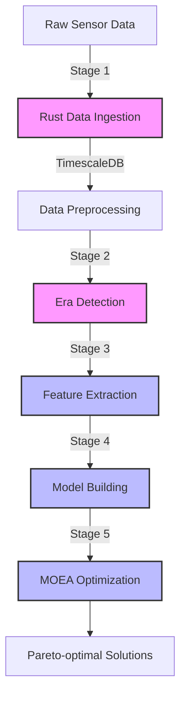

# Greenhouse Data Pipeline & Optimization Flow

## Overview

This document describes the complete data pipeline from raw sensor data to multi-objective optimization results.

## Pipeline Stages



Pink = Rust-based, Blue = GPU-accelerated

## Running the Pipeline

### Full Pipeline (All Stages)

```bash
# Start infrastructure
docker compose -f docker-compose-clean.yml up -d db redis pgadmin

# Run complete pipeline
docker compose -f docker-compose-clean.yml up --build
```

### Individual Stages

```bash
# Stage 1: Data Ingestion only
docker compose -f docker-compose-clean.yml up rust_pipeline

# Stage 2: Preprocessing only
docker compose -f docker-compose-clean.yml up preprocessing

# Stage 3: Era Detection only
docker compose -f docker-compose-clean.yml up era_detector

# Stage 4: Feature Extraction only
docker compose -f docker-compose-clean.yml up feature_extraction

# Stage 5: Model Building only
docker compose -f docker-compose-clean.yml up model_builder

# Stage 6: MOEA Optimization (choose one)
docker compose -f docker-compose-clean.yml up moea_optimizer_cpu  # CPU version
docker compose -f docker-compose-clean.yml up moea_optimizer_gpu  # GPU version
```

### Alternative Model Training

```bash
# Train only LSTM surrogate
docker compose -f docker-compose-clean.yml --profile lstm up model_builder_lstm

# Train only LightGBM for single objective
docker compose -f docker-compose-clean.yml --profile lightgbm up model_builder_lightgbm
```

## Stage Details

### Stage 1: Rust Data Ingestion
- **Purpose**: High-performance parsing and ingestion of CSV/JSON sensor data
- **Technology**: Rust with async Tokio and SQLx
- **Output**: Raw sensor data in TimescaleDB

### Stage 2: Data Preprocessing
- **Purpose**: Clean, regularize, and enrich sensor data
- **Technology**: Python with GPU-accelerated pandas/numpy
- **Features**:
  - Time regularization (5-minute intervals)
  - Missing value imputation
  - External data integration (weather, energy prices)
  - Phenotype data loading

### Stage 3: Era Detection
- **Purpose**: Segment time series into operational periods
- **Technology**: Rust with GPU kernels (planned)
- **Algorithms**: PELT, BOCPD, HMM
- **Output**: Era labels at multiple granularity levels

### Stage 4: Feature Extraction
- **Purpose**: Extract time-series features for ML models
- **Technology**: Python with GPU-accelerated tsfresh
- **Features**: Statistical, temporal, and frequency domain features
- **Output**: Feature vectors per era

### Stage 5: Model Building
- **Purpose**: Train surrogate models for optimization objectives
- **Technology**: PyTorch (LSTM) and LightGBM with GPU
- **Objectives**:
  - Plant growth (biomass, quality)
  - Energy consumption
  - Resource efficiency
  - Climate stability

### Stage 6: MOEA Optimization
- **Purpose**: Find Pareto-optimal control strategies
- **Technology**: 
  - CPU: pymoo (NSGA-III)
  - GPU: EvoX (TensorNSGA-III)
- **Output**: Pareto front of optimal solutions

## GPU Services

Services with GPU support:
- `preprocessing` - Optional GPU acceleration for data operations
- `feature_extraction` - GPU-accelerated feature computation
- `model_builder` - GPU training for neural networks and LightGBM
- `moea_optimizer_gpu` - GPU-accelerated evolutionary algorithms

## Configuration

### Environment Variables

```bash
# Database
DB_USER=postgres
DB_PASSWORD=postgres
DB_HOST=db
DB_PORT=5432
DB_NAME=postgres

# GPU
USE_GPU=true
GPU_TAG=rtx3090  # or your GPU model
CUDA_DEVICE_ID=0

# Feature Extraction
FEATURE_SET=efficient
FEATURE_BATCH_SIZE=1000
ERA_LEVEL=B

# MOEA
DEVICE=cuda  # or cpu
```

### Monitoring

- **Database**: pgAdmin at http://localhost:5050
- **MLflow** (if enabled): http://localhost:5000
- **Logs**: Check service logs with `docker compose logs -f <service_name>`

## Troubleshooting

### GPU Issues
```bash
# Check GPU availability
docker run --rm --gpus all nvidia/cuda:12.0-base nvidia-smi

# Check service GPU access
docker compose -f docker-compose-clean.yml exec feature_extraction nvidia-smi
```

### Memory Issues
- Reduce batch sizes in environment variables
- Enable mixed precision for GPU services
- Use CPU versions for testing

### Pipeline Failures
- Check dependencies are healthy: `docker compose ps`
- Review logs: `docker compose logs <failed_service>`
- Ensure data volumes are properly mounted