# Architecture Diagrams

## High-Level System Architecture

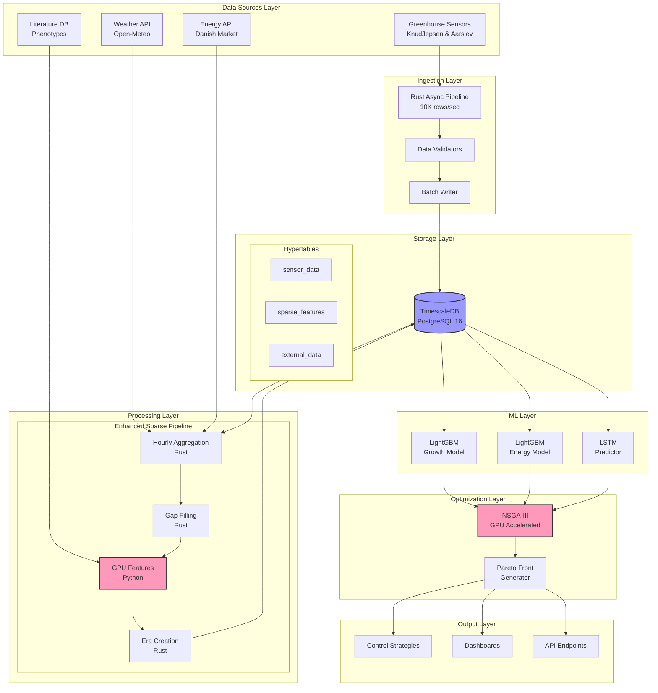

## Detailed Pipeline Flow

```mermaid
flowchart LR
    subgraph "Stage 1: Ingestion"
        A1[CSV Files] --> A2[Parser]
        A3[JSON Files] --> A2
        A2 --> A4[Validator]
        A4 --> A5[Batch Queue]
        A5 --> A6[Async Insert]
    end
    
    subgraph "Stages 2-4: Enhanced Processing"
        B1[Raw Data] --> B2{Coverage Check}
        B2 -->|>10%| B3[Process Window]
        B2 -->|<10%| B4[Skip Window]
        
        B3 --> B5[Aggregate Hourly]
        B5 --> B6{Gap Size?}
        B6 -->|≤2h| B7[Fill Gap]
        B6 -->|>2h| B8[Keep NULL]
        
        B7 --> B9[GPU Extract]
        B8 --> B9
        B9 --> B10[Create Era]
    end
    
    subgraph "Stage 5: Modeling"
        C1[Features] --> C2[Train/Val Split]
        C2 --> C3[LightGBM GPU]
        C3 --> C4[Model Validation]
        C4 --> C5[Save Models]
    end
    
    subgraph "Stage 6: Optimization"
        D1[Load Models] --> D2[Init Population]
        D2 --> D3[GPU Evaluate]
        D3 --> D4{Converged?}
        D4 -->|No| D5[Evolve]
        D5 --> D3
        D4 -->|Yes| D6[Pareto Front]
    end
    
    A6 --> B1
    B10 --> C1
    C5 --> D1
```

## Hybrid Rust-Python Architecture

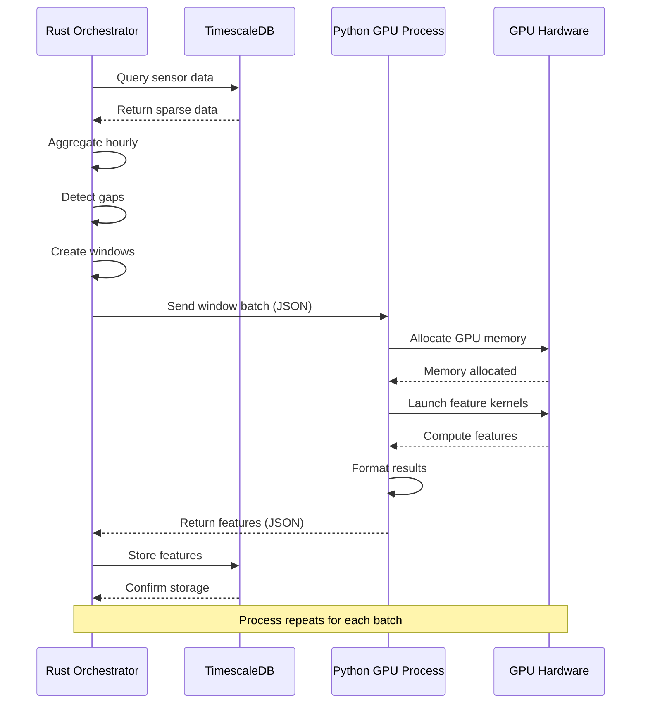

## GPU Memory Management

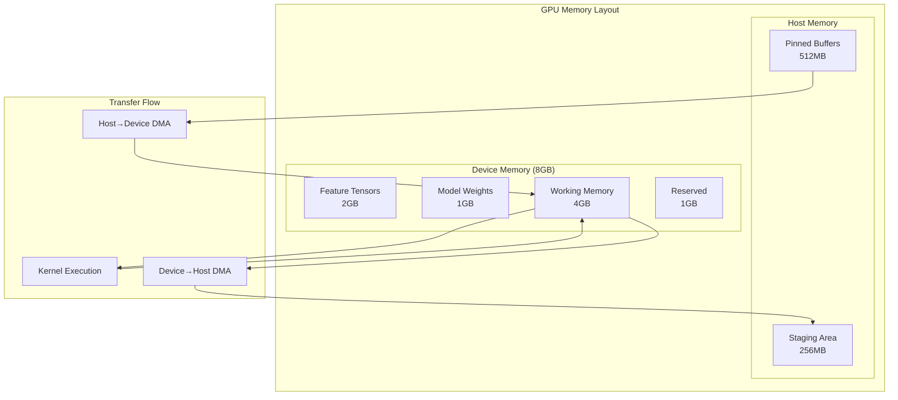

## Data Sparsity Handling

```mermaid
flowchart TB
    subgraph "Traditional Approach (Fails)"
        TA1[5-min Data] --> TA2[Time Regularization]
        TA2 --> TA3[91.3% NULLs]
        TA3 --> TA4[Interpolation]
        TA4 --> TA5[Synthetic Data]
        TA5 --> TA6[False Patterns]
        TA6 --> TA7[❌ Bad Models]
    end
    
    subgraph "Our Approach (Works)"
        OA1[5-min Data] --> OA2[Hourly Aggregation]
        OA2 --> OA3[Coverage Filter]
        OA3 --> OA4[Conservative Fill]
        OA4 --> OA5[Real Patterns]
        OA5 --> OA6[Sparse Features]
        OA6 --> OA7[✅ Good Models]
    end
    
    style TA7 fill:#f96
    style OA7 fill:#9f9
```

## Docker Service Dependencies

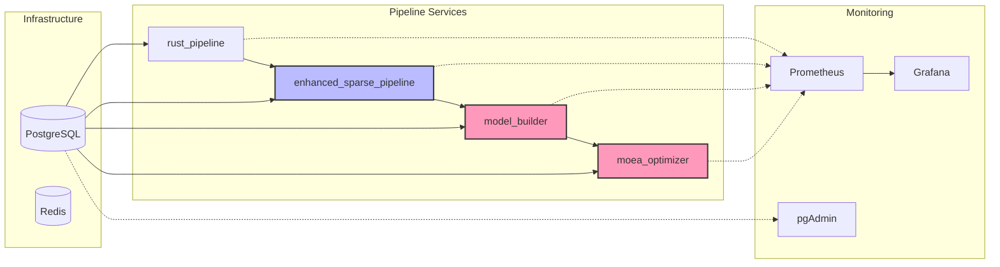

## Feature Extraction Pipeline

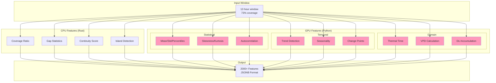

## MOEA Optimization Flow

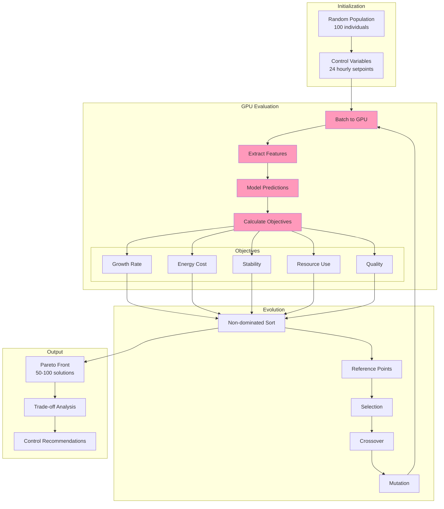

## Performance Metrics Flow

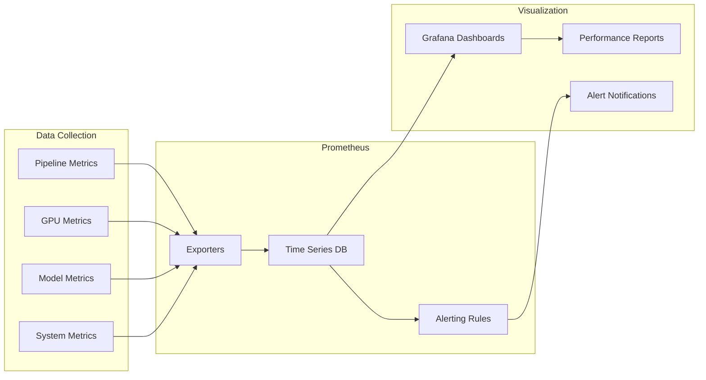

## Error Handling Flow

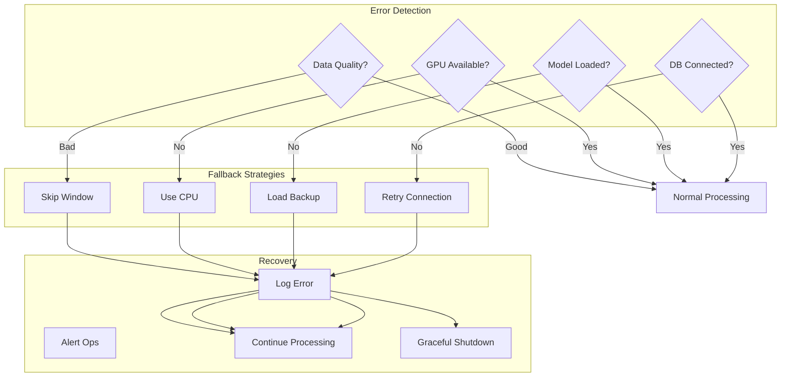

## Deployment Architecture

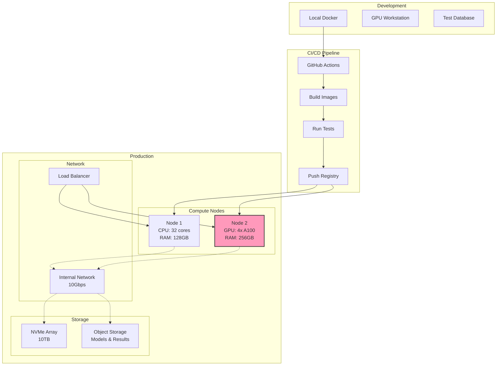

## Data Flow Summary

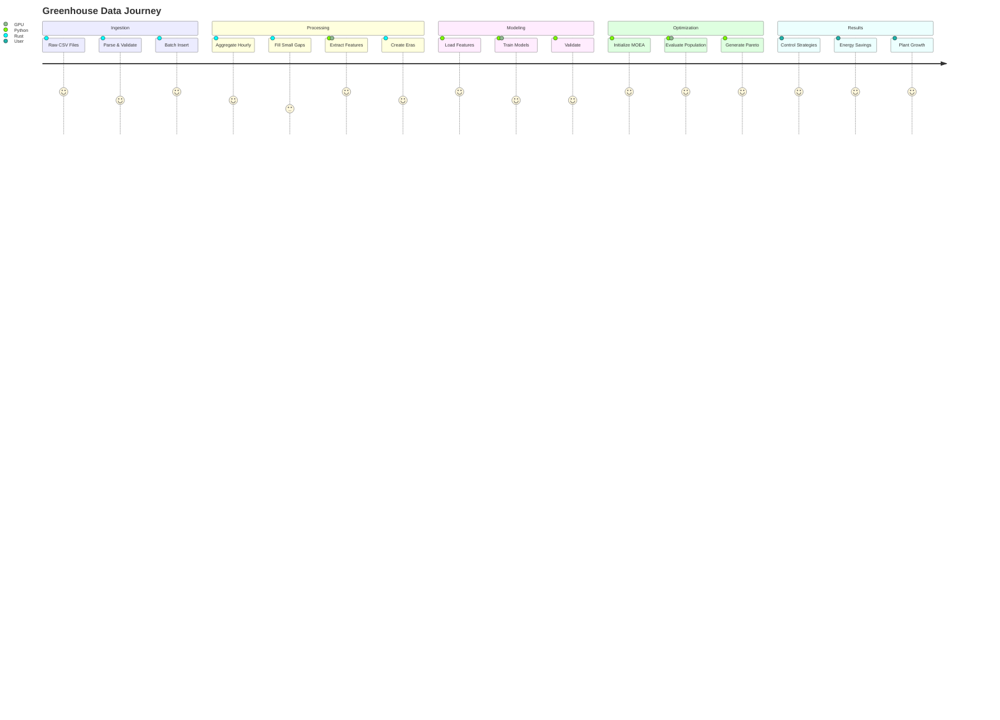