# Enhanced Pipeline Implementation Epics

This document outlines the 5 major epics required to complete the full greenhouse optimization pipeline with GPU acceleration, external data integration, and multi-objective optimization.

## 🎯 Overall Goal
Create a complete **GPU-accelerated sparse data pipeline** for greenhouse climate control optimization that integrates sensor data, external weather/energy data, and plant phenotypes to generate Pareto-optimal control strategies.

---

## EPIC 1: External Data Integration 🌍
**Connect weather, energy prices, and phenotype data to enhanced sparse pipeline**

### Epic Goal
Enable the enhanced sparse pipeline to fetch and integrate external data sources as designed in `enhanced_sparse_pipeline.rs`.

### Tasks

#### 1.1: Weather Data Integration ☁️
**File**: `src/enhanced_sparse_pipeline.rs` → `stage1_enhanced_aggregation()`

**Implementation**:
```rust
// In stage1_enhanced_aggregation()
let weather_data = self.external_fetcher
    .fetch_weather_data(55.6761, 12.5683, start_time, end_time) // Copenhagen coords
    .await?;
```

**Requirements**:
- Connect to existing `pre_process/external/fetch_external_weather.py` 
- Use Open-Meteo API for Danish weather data
- Store in `external_weather_data` table
- Fields: temperature_2m, humidity_2m, precipitation, solar_radiation, wind_speed

**Acceptance Criteria**:
- Weather data fetched for 2013-2016 period
- Data properly joined with sensor data by timestamp
- Missing weather data handled gracefully

#### 1.2: Energy Price Integration ⚡
**File**: `src/enhanced_sparse_pipeline.rs` → `stage1_enhanced_aggregation()`

**Implementation**:
```rust
// In stage1_enhanced_aggregation()
let energy_data = self.external_fetcher
    .fetch_energy_prices("DK1", start_time, end_time) // Danish price area
    .await?;
```

**Requirements**:
- Connect to existing `pre_process/external/fetch_energy.py`
- Use Danish energy API for spot prices (DK1/DK2)
- Store in `energy_prices` table
- Fields: timestamp, price_area, spot_price_dkk

**Acceptance Criteria**:
- Energy prices fetched for 2013-2016 period
- Hourly price data aligned with sensor timestamps
- Both DK1 and DK2 price areas supported

#### 1.3: Phenotype Data Integration 🌱
**File**: `src/enhanced_sparse_pipeline.rs` → `stage1_enhanced_aggregation()`

**Implementation**:
```rust
// Load Kalanchoe blossfeldiana phenotype data
let phenotype_data = self.external_fetcher
    .load_phenotype_data("Kalanchoe blossfeldiana")
    .await?;
```

**Requirements**:
- Load from `pre_process/phenotype.json`
- Use existing phenotype schema
- Fields: base_temperature_c, optimal_temperature_c, photoperiod_critical_h, dli_optimal_mol_m2_d

**Acceptance Criteria**:
- Phenotype data loaded and validated
- Plant-specific parameters available for feature extraction
- Thermal time calculations use correct base temperature

---

## EPIC 2: Complete Enhanced Sparse Pipeline 🚀
**Full Rust+GPU hybrid with comprehensive features**

### Epic Goal
Validate and complete the enhanced sparse pipeline to generate thousands of features using the Rust+GPU hybrid architecture.

### Tasks

#### 2.1: Pipeline Validation ✅ (IN PROGRESS)
**Current Status**: Compilation fixed, testing needed

**Test Command**:
```bash
docker compose -f docker-compose.enhanced.yml up enhanced_sparse_pipeline
```

**Expected Results**:
- **Features Generated**: 2,000-10,000+ features (vs 60 basic)
- **Processing Time**: 2-3 minutes (vs 7-8 minutes Python workaround)
- **Data Coverage**: 535,072 rows from 2013-12-01 to 2016-09-08

**Acceptance Criteria**:
- Enhanced mode flags work correctly
- Features stored in `enhanced_sparse_features` table with JSONB format
- No compilation or runtime errors

#### 2.2: GPU Acceleration Verification 🎮
**File**: `src/python_bridge.rs` → calls to `sparse_gpu_features.py`

**Validation Points**:
- Python GPU scripts are called correctly
- CUDA operations execute successfully
- GPU memory usage is monitored
- Fallback to CPU when GPU unavailable

**Test Commands**:
```bash
# Monitor GPU usage during feature extraction
nvidia-smi -l 1
# Check GPU feature extraction logs
docker logs enhanced_sparse_pipeline | grep -i "gpu\|cuda"
```

**Acceptance Criteria**:
- GPU utilization visible during feature extraction
- Python bridge communication works correctly
- GPU features significantly faster than CPU equivalents

#### 2.3: Sparse Data Handling Validation 📊
**File**: `src/enhanced_sparse_pipeline.rs` → `stage2_conservative_fill()`

**Validation Points**:
- 91.3% missing data handled correctly
- Adaptive window sizing based on data density
- Island detection for contiguous data segments
- Conservative gap filling with configurable limits

**Acceptance Criteria**:
- No excessive interpolation (max 3-hour gaps)
- Island detection identifies valid data segments
- Feature quality metrics show good coverage ratios

---

## EPIC 3: Enhanced Model Building 🧠
**LightGBM models using sensor + external + phenotype data**

### Epic Goal
Build comprehensive LightGBM surrogate models that use the enhanced feature set for both plant growth and energy consumption predictions.

### Tasks

#### 3.1: LightGBM Integration Enhancement 📈
**File**: `model_builder/src/training/train_enhanced_sparse.py`

**Required Changes**:
```python
# Load enhanced features with external data
features_df = load_enhanced_features(
    table='enhanced_sparse_features',
    include_weather=True,
    include_energy=True,
    include_phenotype=True
)

# Target variables
growth_targets = create_growth_targets(phenotype_data)
energy_targets = create_energy_targets(energy_price_data)
```

**Feature Categories to Include**:
- **Sensor Features**: Temperature, humidity, CO2, light (2000+ features)
- **Weather Features**: External temp, solar radiation, wind (200+ features)
- **Energy Features**: Spot prices, demand predictions (50+ features)
- **Phenotype Features**: Thermal time, photoperiod, VPD stress (100+ features)

**Acceptance Criteria**:
- Model trains on 2000+ features successfully
- Separate models for growth and energy objectives
- Cross-validation shows improved performance vs basic features

#### 3.2: Surrogate Model Architecture 🏗️
**File**: `model_builder/src/training/train_lightgbm_surrogate.py`

**Model Structure**:
```python
# Plant Growth Model
growth_model = LGBMRegressor(
    objective='regression',
    n_estimators=1000,
    feature_fraction=0.8,  # Handle large feature set
    bagging_fraction=0.8,
    device='gpu'  # GPU acceleration
)

# Energy Consumption Model  
energy_model = LGBMRegressor(
    objective='regression',
    n_estimators=1000,
    device='gpu'
)
```

**Acceptance Criteria**:
- Models achieve R² > 0.8 on validation set
- GPU training significantly faster than CPU
- Models saved and ready for MOEA integration

#### 3.3: Model Validation Framework 🔬
**File**: `model_builder/src/utils/enhanced_validation.py`

**Validation Metrics**:
- **Growth Prediction**: Biomass accumulation, flowering time
- **Energy Prediction**: Daily consumption, peak demand
- **Feature Importance**: Weather vs sensor vs phenotype contributions

**Acceptance Criteria**:
- Validation pipeline runs automatically
- Feature importance analysis completed
- Models ready for production deployment

---

## EPIC 4: MOEA Optimization Integration 🎯
**GPU/CPU multi-objective optimization**

### Epic Goal
Integrate the enhanced LightGBM models with the existing MOEA framework to optimize greenhouse control strategies.

### Tasks

#### 4.1: MOEA GPU Testing 🔧
**File**: `moea_optimizer/src/objectives/surrogate.py`

**Current MOEA Features**:
- ✅ GPU tensor operations via PyTorch
- ✅ CPU fallback with pymoo
- ✅ NSGA-III algorithm implementation

**Integration Points**:
```python
# Load enhanced LightGBM models
growth_model = joblib.load('models/enhanced_growth_model.pkl')
energy_model = joblib.load('models/enhanced_energy_model.pkl')

# GPU-accelerated objective evaluation
def evaluate_objectives_gpu(control_actions):
    features = extract_features_gpu(control_actions)
    growth_score = growth_model.predict(features)
    energy_score = energy_model.predict(features)
    return torch.tensor([growth_score, energy_score])
```

**Test Configuration**:
```bash
docker run --gpus all moea_optimizer \
  python -m src.cli run --config /app/config/moea_config_gpu.toml
```

**Acceptance Criteria**:
- MOEA runs successfully with enhanced models
- GPU acceleration provides 5-10x speedup over CPU
- Pareto front generation works correctly

#### 4.2: Objective Function Configuration ⚖️
**File**: `moea_optimizer/config/enhanced_objectives.toml`

**Objective Configuration**:
```toml
[objectives]
growth_weight = 1.0          # Maximize plant growth
energy_weight = -1.0         # Minimize energy consumption
constraints = [
    "temperature_min = 18.0",
    "temperature_max = 26.0",
    "humidity_min = 0.6",
    "humidity_max = 0.8"
]

[optimization]
population_size = 100
generations = 500
device = "gpu"
```

**Acceptance Criteria**:
- Trade-off between growth and energy properly configured
- Greenhouse constraints enforced
- Multiple scenarios testable (winter/summer)

#### 4.3: Pareto Front Generation 📊
**File**: `moea_optimizer/src/core/enhanced_optimization.py`

**Expected Outputs**:
- Pareto front with 50-100 optimal solutions
- Control strategy recommendations
- Performance visualization and analysis

**Acceptance Criteria**:
- Complete optimization run finishes successfully
- Diverse control strategies on Pareto front
- Results demonstrate clear growth vs energy trade-offs

---

## EPIC 5: End-to-End Pipeline Validation 🧪
**Complete greenhouse optimization pipeline**

### Epic Goal
Validate the complete pipeline performance and research hypothesis about GPU acceleration benefits.

### Tasks

#### 5.1: Performance Benchmarking ⏱️
**Benchmark Target**:
- **Enhanced Pipeline**: 2-3 minutes total
- **Python Workaround**: 7-8 minutes total
- **Feature Count**: 2000+ vs 60 basic features

**Benchmark Script**:
```bash
# Run comprehensive benchmark
./run_performance_benchmark.sh
```

**Acceptance Criteria**:
- 50%+ improvement in processing time
- 30x+ improvement in feature count
- Maintained or improved model accuracy

#### 5.2: GPU vs CPU Performance Analysis 📈
**Comparison Points**:
- Feature extraction: GPU vs CPU
- Model training: LightGBM GPU vs CPU
- MOEA optimization: PyTorch GPU vs pymoo CPU

**Expected Results**:
- Feature extraction: 5-10x GPU speedup
- Model training: 3-5x GPU speedup  
- MOEA optimization: 5-10x GPU speedup

**Acceptance Criteria**:
- Comprehensive performance report generated
- Clear ROI demonstrated for GPU infrastructure
- Scaling characteristics documented

#### 5.3: Research Validation 🔬
**Research Hypothesis**: 
> "GPU acceleration of sparse data processing and plant simulation optimization enables real-time greenhouse control optimization for improved energy efficiency and plant growth."

**Validation Criteria**:
- End-to-end pipeline runs in under 5 minutes
- Models achieve production-ready accuracy
- Control strategies show measurable improvements
- System scales to larger greenhouse operations

**Deliverables**:
- Technical performance report
- Research findings documentation
- Production deployment recommendations

---

## 📋 Epic Dependencies and Timeline

```mermaid
gantt
    title Enhanced Pipeline Implementation Timeline
    dateFormat X
    axisFormat %d

    section Epic 1: External Data
    Weather Integration    :epic1-1, 0, 2d
    Energy Integration     :epic1-2, 0, 2d  
    Phenotype Integration  :epic1-3, 0, 1d

    section Epic 2: Pipeline  
    Pipeline Validation    :epic2-1, 0, 1d
    GPU Verification      :epic2-2, after epic2-1, 2d
    Sparse Validation     :epic2-3, after epic2-1, 2d

    section Epic 3: Models
    LightGBM Integration  :epic3-1, after epic1-1, 3d
    Surrogate Models      :epic3-2, after epic3-1, 2d
    Model Validation      :epic3-3, after epic3-2, 2d

    section Epic 4: MOEA
    MOEA GPU Testing      :epic4-1, after epic3-2, 2d
    Objective Config      :epic4-2, after epic4-1, 1d
    Pareto Generation     :epic4-3, after epic4-2, 2d

    section Epic 5: Validation
    Performance Benchmark :epic5-1, after epic4-3, 2d
    GPU vs CPU Analysis   :epic5-2, after epic5-1, 2d
    Research Validation   :epic5-3, after epic5-2, 3d
```



## 🚀 Getting Started

**Immediate Next Steps**:
1. **Epic 2.1**: Test enhanced sparse pipeline: `docker compose -f docker-compose.enhanced.yml up`
2. **Epic 1.1**: Integrate weather data fetching
3. **Epic 3.1**: Update LightGBM training to use enhanced features

**Success Metrics**:
- ✅ 2000+ features generated vs 60 basic
- ✅ 2-3 minute processing time vs 7-8 minutes  
- ✅ GPU acceleration provides 5-10x speedup
- ✅ Pareto front optimization produces viable control strategies
- ✅ Research demonstrates real-world applicability

This epic structure provides a clear roadmap from the current working enhanced pipeline to a complete GPU-accelerated greenhouse optimization system.