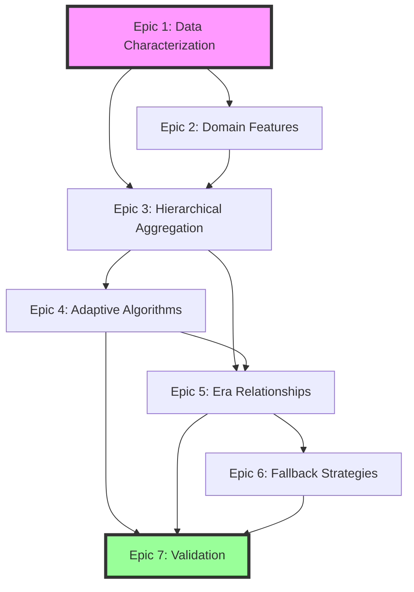

# Era Detection Enhancement - Visual Summary

## Epic Flow Diagram



## Data We Actually Have

### ✅ Available for Feature Engineering

| Data Type | Columns | Derived Features Possible |
|-----------|---------|--------------------------|
| **Lighting** | `lamp_grp[1-4]_no[3-4]_status`, `dli_sum`, `light_intensity_umol` | ✅ Photoperiod hours<br>✅ Light supplementation strategy<br>✅ Daily light integral patterns |
| **Temperature** | `air_temp_c`, `outside_temp_c`, `heating_setpoint_c`, `pipe_temp_[1-2]_c` | ✅ Heating degree minutes<br>✅ Night temperature drop<br>✅ Temperature ramp rates |
| **Humidity/VPD** | `relative_humidity_percent`, `vpd_hpa`, `humidity_deficit_g_m3` | ✅ VPD stress periods<br>✅ Humidity control efficiency |
| **CO2** | `co2_measured_ppm`, `co2_required_ppm`, `co2_dosing_status` | ✅ CO2 enrichment periods<br>✅ Control responsiveness |
| **Actuators** | `vent_pos_[1-2]_percent`, `curtain_[1-4]_percent` | ✅ Ventilation strategy<br>✅ Shade management patterns |
| **External** | Weather data (hourly), Energy prices (hourly) | ✅ Weather response patterns<br>✅ Economic optimization signals |

### ❌ Not Available (Assumptions to Avoid)
- Direct energy consumption measurements
- Water usage/irrigation data  
- Plant growth measurements
- CO2 generator runtime

## Quick Win Features We Can Create Today

```python
# 1. Photoperiod (we have lamp status!)
df['lamp_active'] = (
    df['lamp_grp1_no3_status'] | df['lamp_grp1_no4_status'] |
    df['lamp_grp2_no3_status'] | df['lamp_grp2_no4_status'] |
    df['lamp_grp3_no3_status'] | df['lamp_grp3_no4_status'] |
    df['lamp_grp4_no3_status'] | df['lamp_grp4_no4_status']
).astype(int)

df['photoperiod_hours'] = df['lamp_active'].rolling('24H').sum() / 60

# 2. Heating intensity proxy
df['heating_demand'] = (df['heating_setpoint_c'] - df['air_temp_c']).clip(lower=0)
df['heating_intensity'] = df['heating_demand'] * df['pipe_temp_1_c']

# 3. Light supplementation efficiency  
df['supplemental_light_needed'] = (df['outside_light_w_m2'] < 100).astype(int)
df['light_efficiency'] = df['dli_sum'] / (df['lamp_active'].rolling('24H').sum() + 1)

# 4. Climate stability score
df['temp_stability'] = df['air_temp_c'].rolling('1H').std()
df['co2_stability'] = df['co2_measured_ppm'].rolling('1H').std()
df['climate_stability'] = 1 / (df['temp_stability'] + df['co2_stability'] + 1)
```

## Expected Outcomes by Epic

| Epic | Current State | Target State | Success Metric |
|------|--------------|--------------|----------------|
| **E1: Characterization** | Unknown patterns | Documented cycles | Pattern catalog complete |
| **E2: Domain Features** | Basic sensors only | 20+ derived features | Features improve era detection by 50% |
| **E3: Aggregation** | 1-minute data only | 3 time resolutions | 100x data reduction for Level A |
| **E4: Adaptive Algos** | Fixed parameters | Signal-aware params | 90% reduction in false changepoints |
| **E5: Hierarchy** | Independent levels | Parent-child linked | Zero boundary violations |
| **E6: Fallback** | Algorithms only | Hybrid approach | 100% era coverage guaranteed |
| **E7: Validation** | No quality metrics | Automated validation | < 5% manual intervention needed |

## Implementation Complexity

```
Epic 1: ████░░░░░░ 40% (Mostly SQL/Python analysis)
Epic 2: ██████░░░░ 60% (Feature engineering + testing)
Epic 3: ███████░░░ 70% (TimescaleDB + performance)
Epic 4: █████████░ 90% (Rust algorithm modifications)
Epic 5: ███████░░░ 70% (Database constraints + logic)
Epic 6: █████░░░░░ 50% (Simple time-based logic)
Epic 7: ██████░░░░ 60% (Metrics + monitoring setup)
```

## Recommended Starting Point

**Start with Epic 1 + Epic 2 (partial)** because:
1. Low risk - analysis only
2. Immediate value - understand the data
3. Informs all other epics
4. Can create photoperiod and other features TODAY
5. No infrastructure changes needed

## Next Steps
1. Run Epic 1 analysis queries
2. Implement photoperiod calculation
3. Test domain features on sample data
4. Validate that features capture operational patterns
5. Use findings to configure Epic 4 parameters