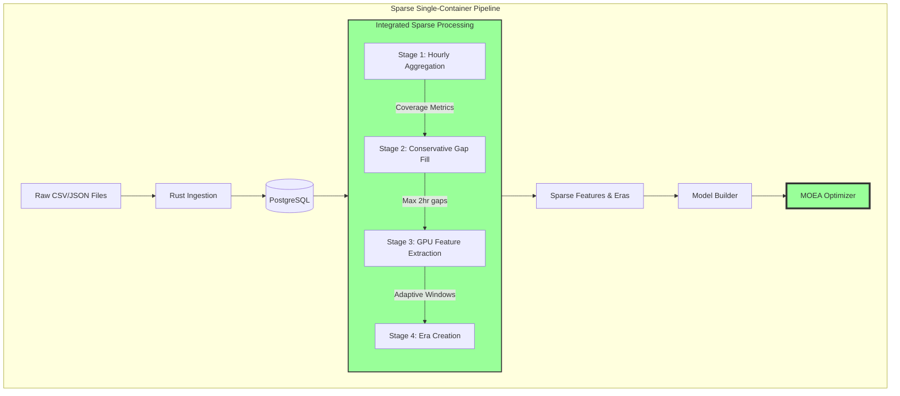
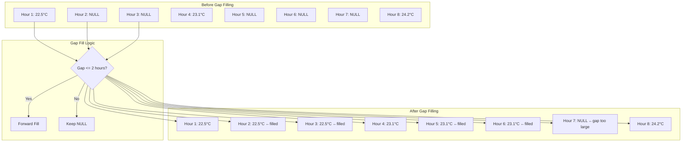
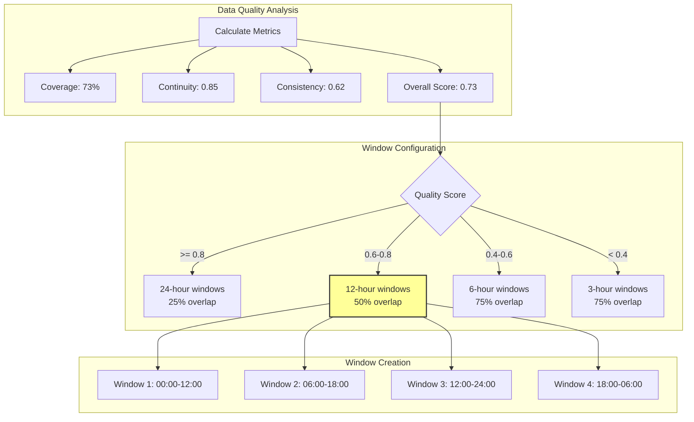
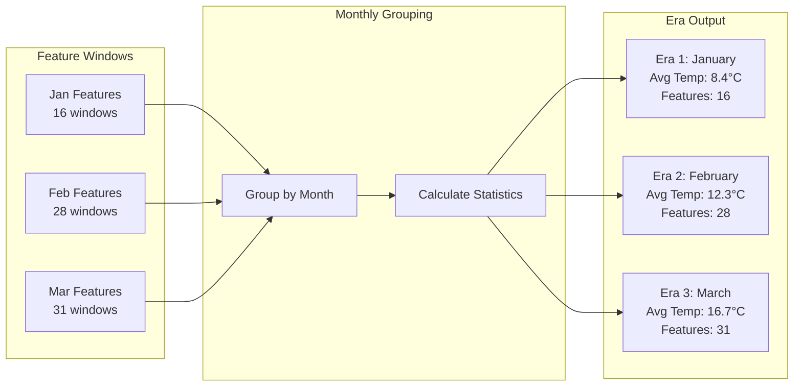
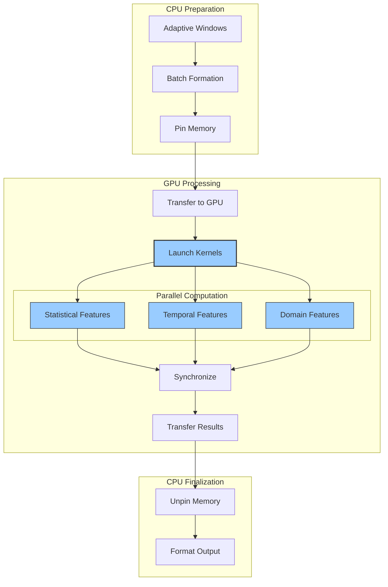
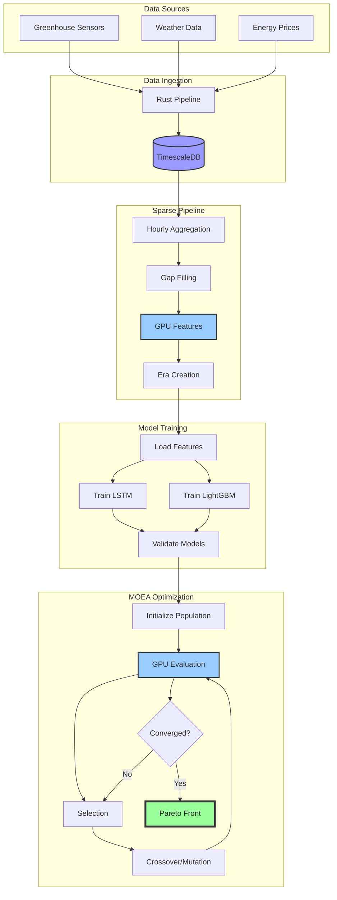

# Pipeline Flow Diagrams

## Traditional Pipeline vs Sparse Pipeline

### Traditional Pipeline Flow (Failed Approach)

```mermaid
flowchart TB
    subgraph "Traditional Multi-Container Pipeline"
        A[Raw CSV/JSON Files] --> B[Rust Ingestion Container]
        B --> C[(PostgreSQL)]
        C --> D[Python Preprocessing Container]
        
        D --> E{Time Regularization}
        E -->|5-min intervals| F[91.3% NULL values!]
        F --> G{Imputation}
        G -->|Forward Fill| H[Stale Data]
        G -->|Interpolation| I[Synthetic Data]
        
        H --> J[Rust Era Detection Container]
        I --> J
        
        J --> K{PELT Algorithm}
        K -->|Every gap is changepoint| L[850,000 False Eras]
        
        L --> M[Python Feature Extraction]
        M -->|Out of Memory| N[FAILURE]
        
        style N fill:#f96,stroke:#333,stroke-width:4px
        style F fill:#ff9,stroke:#333,stroke-width:2px
        style L fill:#ff9,stroke:#333,stroke-width:2px
    end
```



### Sparse Pipeline Flow (Working Solution)



## Detailed Stage Flow

### Stage 1: Intelligent Aggregation

```mermaid
flowchart LR
    subgraph "Input Data Pattern"
        A1[00:00 - Temp: 22.5]
        A2[00:05 - NULL]
        A3[00:10 - NULL]
        A4[00:15 - CO2: 450]
        A5[00:20 - NULL]
        A6[00:25 - Humidity: 65%]
    end
    
    subgraph "Hourly Aggregation"
        B[SQL GROUP BY hour]
        B --> C{Coverage >= 10%?}
        C -->|Yes| D[Keep Hour]
        C -->|No| E[Discard Hour]
    end
    
    subgraph "Output"
        F[Hour: 00:00<br/>Temp: 22.5 (1 sample)<br/>CO2: 450 (1 sample)<br/>Humidity: 65% (1 sample)<br/>Coverage: OK]
    end
    
    A1 --> B
    A4 --> B
    A6 --> B
    D --> F
```

### Stage 2: Conservative Gap Filling



### Stage 3: Adaptive Windowing



### Stage 4: Era Creation Flow



## GPU Acceleration Flow



## Complete System Flow



## Data Sparsity Visualization

```mermaid
gantt
    title Data Availability Timeline (January 2014)
    dateFormat HH:mm
    axisFormat %H:%M
    
    section Temperature
    Available :done, temp1, 00:00, 2h
    Missing   :crit, temp2, 02:00, 4h
    Available :done, temp3, 06:00, 3h
    Missing   :crit, temp4, 09:00, 6h
    Available :done, temp5, 15:00, 1h
    Missing   :crit, temp6, 16:00, 8h
    
    section CO2
    Missing   :crit, co21, 00:00, 3h
    Available :done, co22, 03:00, 1h
    Missing   :crit, co23, 04:00, 5h
    Available :done, co24, 09:00, 2h
    Missing   :crit, co25, 11:00, 13h
    
    section Humidity
    Available :done, hum1, 00:00, 1h
    Missing   :crit, hum2, 01:00, 7h
    Available :done, hum3, 08:00, 4h
    Missing   :crit, hum4, 12:00, 12h
```



This visualization shows why traditional approaches fail - the data has more gaps than values!