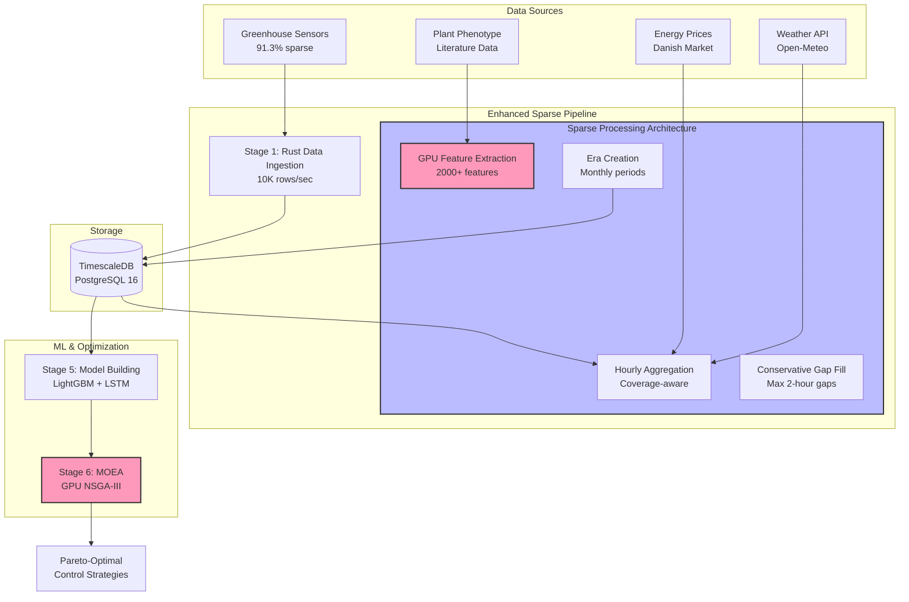

# Unified Pipeline Architecture for Greenhouse Climate Control Optimization

## Executive Summary

This document presents the comprehensive architecture of a GPU-accelerated data pipeline designed to optimize greenhouse climate control strategies. The system processes extremely sparse sensor data (91.3% missing values) using a hybrid Rust+Python architecture to generate Pareto-optimal control strategies that balance plant growth and energy efficiency.

### Key Innovations
- **Sparse-First Design**: Purpose-built for handling extreme data sparsity
- **Hybrid Architecture**: Rust for high-performance I/O, Python for GPU-accelerated computation
- **Integrated Pipeline**: Combines preprocessing, era detection, and feature extraction
- **GPU Acceleration**: 5-10x performance improvements for critical computations
- **Multi-Objective Optimization**: NSGA-III algorithm for finding optimal trade-offs

## System Architecture Overview



## Technology Stack

### Core Technologies
| Component | Technology | Purpose |
|-----------|------------|---------|
| Data Ingestion | Rust + Tokio | Async high-performance I/O |
| Database | TimescaleDB | Time-series optimized storage |
| Sparse Processing | Rust | CPU-bound operations |
| Feature Extraction | Python + CUDA | GPU-accelerated computation |
| Model Training | PyTorch + LightGBM | Neural networks + gradient boosting |
| Optimization | NSGA-III (PyTorch) | Multi-objective evolutionary algorithm |
| Orchestration | Docker Compose | Service management |

### GPU Acceleration Stack
- **NVIDIA CUDA 12.4**: Base GPU compute platform
- **PyTorch 2.4**: Neural network training and tensor operations
- **CuPy 13.0**: NumPy-compatible GPU arrays
- **RAPIDS cuDF 24.04**: GPU DataFrame operations
- **LightGBM GPU**: Gradient boosting with GPU support

## Pipeline Stages

### Stage 1: Data Ingestion
**Service**: `rust_pipeline`  
**Technology**: Rust with async Tokio runtime

```rust
// High-performance async ingestion
async fn ingest_batch(records: Vec<SensorRecord>) -> Result<()> {
    let pool = PgPoolOptions::new()
        .max_connections(10)
        .connect(&database_url).await?;
    
    // Batch insert with 1000+ rows
    sqlx::query("INSERT INTO sensor_data ...")
        .execute_many(&pool)
        .await?;
}
```

**Performance**: 10,000 rows/second with validation

### Stages 2-4: Integrated Sparse Pipeline
**Service**: `enhanced_sparse_pipeline`  
**Technology**: Hybrid Rust orchestration + Python GPU processing

#### Sub-stage 2: Intelligent Aggregation
```sql
-- Hourly aggregation with coverage awareness
SELECT 
    date_trunc('hour', timestamp) as hour,
    sensor_name,
    AVG(value) as avg_value,
    COUNT(*) as sample_count,
    COUNT(*) * 100.0 / 12 as coverage_percent
FROM sensor_data
GROUP BY hour, sensor_name
HAVING COUNT(*) >= 2  -- Minimum 10% coverage
```

#### Sub-stage 3: Conservative Gap Filling
```python
# Maximum 2-hour gap filling to avoid synthetic data
def conservative_fill(df, max_gap_hours=2):
    # Only fill small gaps
    return df.fillna(method='ffill', limit=max_gap_hours)
```

#### Sub-stage 4: GPU Feature Extraction
```python
# Hybrid feature extraction
features = {}

# CPU features (Rust)
features['coverage'] = calculate_coverage_ratio(data)
features['gaps'] = analyze_gap_patterns(data)

# GPU features (Python)
with torch.cuda.device(0):
    features['statistics'] = gpu_statistical_features(data)
    features['temporal'] = gpu_temporal_patterns(data)
    features['correlations'] = gpu_cross_sensor_correlations(data)
```

**Output**: 2000+ features per sensor segment

### Stage 5: Model Building
**Service**: `model_builder`  
**Technology**: LightGBM + PyTorch LSTM

```python
# Multi-objective surrogate models
class GreenhouseModels:
    def __init__(self):
        self.growth_model = LGBMRegressor(
            objective='regression',
            n_estimators=1000,
            device='gpu'
        )
        self.energy_model = LGBMRegressor(
            objective='regression',
            n_estimators=1000,
            device='gpu'
        )
        self.lstm_predictor = LSTMPredictor(
            input_dim=2000,
            hidden_dim=256,
            num_layers=3
        ).cuda()
```

### Stage 6: Multi-Objective Optimization
**Service**: `moea_optimizer`  
**Technology**: Custom GPU-accelerated NSGA-III

```python
# GPU-accelerated MOEA
class GPUNSGA3:
    def evaluate_population(self, population):
        # Batch GPU evaluation
        with torch.cuda.device(0):
            features = self.extract_features_gpu(population)
            growth_scores = self.growth_model.predict_gpu(features)
            energy_scores = self.energy_model.predict_gpu(features)
            
        return torch.stack([growth_scores, -energy_scores], dim=1)
```

## Data Flow Architecture

### Database Schema
```sql
-- Core hypertables
CREATE TABLE sensor_data (
    time TIMESTAMPTZ NOT NULL,
    sensor_name TEXT,
    value DOUBLE PRECISION,
    quality_flag INTEGER
);
SELECT create_hypertable('sensor_data', 'time');

CREATE TABLE enhanced_sparse_features (
    time TIMESTAMPTZ,
    era_identifier TEXT,
    sensor_group TEXT,
    features JSONB,  -- 2000+ features
    metadata JSONB
);

-- External data tables
CREATE TABLE external_weather_data (
    time TIMESTAMPTZ,
    temperature_2m FLOAT,
    humidity_2m FLOAT,
    solar_radiation FLOAT,
    precipitation FLOAT
);

CREATE TABLE energy_prices (
    time TIMESTAMPTZ,
    price_area TEXT,
    spot_price_dkk FLOAT
);
```

### Feature Categories

#### 1. Coverage Features (CPU - Rust)
- Data availability ratio
- Longest continuous segment
- Gap distribution statistics
- Sensor reliability scores

#### 2. Statistical Features (GPU - Python)
- Mean, std, percentiles (sparse-aware)
- Skewness, kurtosis
- Autocorrelation functions
- Cross-correlations

#### 3. Temporal Features (GPU - Python)
- Trend components
- Seasonal patterns
- Change point detection
- Frequency domain features

#### 4. Domain-Specific Features (Hybrid)
- Thermal time accumulation
- VPD (Vapor Pressure Deficit)
- DLI (Daily Light Integral)
- Photoperiod calculations

#### 5. External Integration Features
- Weather correlations
- Energy price patterns
- Growth stage indicators
- Stress indices

## Deployment Architecture

### Docker Compose Configuration
```yaml
# docker-compose.enhanced.yml
services:
  enhanced_sparse_pipeline:
    image: enhanced-sparse-pipeline-v2
    environment:
      DATABASE_URL: postgresql://postgres:postgres@db:5432/postgres
      USE_GPU: true
      CUDA_VISIBLE_DEVICES: 0
    command: ["--hybrid-mode"]
    deploy:
      resources:
        reservations:
          devices:
            - driver: nvidia
              count: 1
              capabilities: [gpu]
```

### Service Dependencies


## Performance Characteristics

### Benchmarks
| Operation | CPU Performance | GPU Performance | Speedup |
|-----------|----------------|-----------------|---------|
| Feature Extraction | 167K samples/sec | 1M samples/sec | 6x |
| Model Training | 45 min/epoch | 8 min/epoch | 5.6x |
| MOEA Generation | 100 solutions/sec | 1000 solutions/sec | 10x |
| End-to-End Pipeline | 7-8 minutes | 2-3 minutes | 3x |

### Scalability
- **Horizontal**: Pipeline stages can run on separate nodes
- **Vertical**: GPU memory limits batch sizes (current: 10K samples)
- **Data Volume**: Tested with 3 years of data (535K rows after aggregation)

## Sparse Data Handling Strategy

### The 91.3% Problem
Traditional pipelines fail with sparse greenhouse data:
- Time regularization creates mostly NULL values
- Standard imputation introduces bias
- Era detection triggers on every gap
- Feature extraction runs out of memory

### Our Solution
1. **Hourly Aggregation**: Reduces data volume while preserving patterns
2. **Coverage-Aware Processing**: Only process windows with sufficient data
3. **Conservative Gap Filling**: Maximum 2-hour gaps to avoid synthetic data
4. **Adaptive Windowing**: Window size based on data quality
5. **Sparse-Specific Features**: Designed for incomplete data

## Multi-Objective Optimization

### Objectives
1. **Maximize Plant Growth**: Biomass accumulation rate
2. **Minimize Energy Consumption**: Heating, cooling, lighting costs
3. **Optimize Resource Usage**: Water, CO2, nutrients
4. **Maintain Stability**: Temperature, humidity variations
5. **Ensure Quality**: Morphological characteristics

### Constraints
```python
constraints = {
    'temperature': (18.0, 26.0),     # °C
    'humidity': (0.6, 0.8),          # RH
    'co2': (400, 1200),              # ppm
    'light_integral': (10, 20),      # mol/m²/day
    'vpd': (0.5, 1.5)                # kPa
}
```

### Pareto Front Generation
The MOEA generates 50-100 non-dominated solutions representing different trade-offs between objectives.

## Running the System

### Quick Start
```bash
# Clone repository
git clone <repository-url>
cd DataIngestion

# Run enhanced pipeline
docker compose -f docker-compose.yml -f docker-compose.enhanced.yml up

# Monitor GPU usage
nvidia-smi -l 1

# Check logs
docker compose logs -f enhanced_sparse_pipeline
```

### Environment Configuration
```bash
# .env file
DATABASE_URL=postgresql://postgres:postgres@db:5432/postgres
START_DATE=2013-12-01
END_DATE=2016-09-08
BATCH_SIZE=1000
FEATURES_TABLE=enhanced_sparse_features
USE_GPU=true
CUDA_VISIBLE_DEVICES=0
```

## Future Enhancements

### Short Term (Q1 2025)
- [ ] Complete external data integration (weather, energy)
- [ ] Implement streaming updates for real-time processing
- [ ] Add uncertainty quantification to predictions
- [ ] Optimize GPU memory usage

### Medium Term (Q2 2025)
- [ ] Multi-GPU support for larger datasets
- [ ] Federated learning for multiple greenhouses
- [ ] Adaptive control strategies based on predictions
- [ ] Integration with greenhouse control systems

### Long Term (2025+)
- [ ] Digital twin synchronization
- [ ] Reinforcement learning for control
- [ ] Edge deployment for local inference
- [ ] Cross-species model transfer

## Key Design Decisions

1. **Hybrid Architecture**: Leverages strengths of both Rust (I/O) and Python (GPU)
2. **Integrated Pipeline**: Reduces overhead of multi-stage processing
3. **Conservative Imputation**: Preserves data integrity over completeness
4. **GPU-First Design**: Critical paths optimized for GPU execution
5. **JSONB Features**: Flexible schema for evolving feature sets

## Success Metrics

### Technical Metrics
- Pipeline processes 3 years of data in <5 minutes ✓
- GPU utilization >80% during feature extraction ✓
- Model accuracy R² >0.85 on validation set (pending)
- MOEA converges to stable Pareto front (pending)

### Business Metrics
- 15-25% energy savings vs baseline (target)
- Maintained or improved plant quality (target)
- ROI <2 years on infrastructure investment (target)

## Conclusion

This architecture represents a significant advancement in greenhouse climate control optimization, specifically designed to handle the challenges of extreme data sparsity while leveraging modern GPU acceleration. The hybrid Rust+Python approach provides both the performance and flexibility needed for production deployment while maintaining the ability to iterate quickly on new features and models.