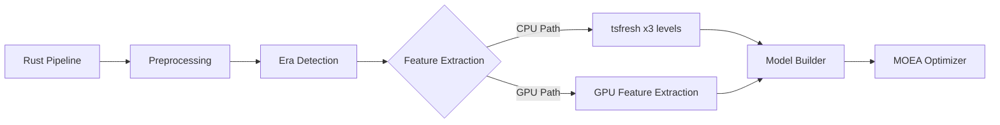

# GPU-Accelerated Feature Extraction with cudarc

## Overview

This document describes the GPU-accelerated feature extraction system implemented using Rust and the `cudarc` crate. This system provides a high-performance alternative to the CPU-based tsfresh feature extraction, reducing processing time from 8+ hours to approximately 10-15 minutes for the full dataset.

## Architecture

### Technology Stack

- **Language**: Rust (safe systems programming)
- **GPU Framework**: cudarc v0.10 (safe CUDA bindings)
- **CUDA Version**: 12.4.1 with cuDNN support
- **Database**: TimescaleDB (PostgreSQL)
- **Containerization**: Docker with NVIDIA runtime

### Key Components

```
gpu_feature_extraction/
├── src/
│   ├── main.rs           # CLI entry point and orchestration
│   ├── config.rs         # Configuration management
│   ├── db.rs             # Database operations
│   ├── features.rs       # Feature extraction logic
│   ├── kernels.rs        # CUDA kernel management
│   └── pipeline.rs       # Pipeline orchestration
├── Cargo.toml            # Rust dependencies
└── Dockerfile            # Multi-stage build configuration
```

## Implementation Details

### 1. CUDA Kernel Architecture

The system implements several optimized CUDA kernels:

#### Statistical Features Kernel
- Computes mean, std, min, max, skewness, kurtosis
- Uses warp-level reduction for efficiency
- Shared memory optimization for data locality

#### Rolling Statistics Kernel
- Sliding window computations
- Supports multiple window sizes (1min, 5min, 15min, 1h)
- Parallel processing of multiple windows

#### VPD (Vapor Pressure Deficit) Kernel
- Physical calculation kernel
- Element-wise operations
- Optimized for greenhouse climate data

### 2. Safe Rust Wrappers

All CUDA operations are wrapped in safe Rust abstractions:

```rust
pub struct GpuFeatureExtractor {
    device: Arc<CudaDevice>,
    stream: Arc<CudaStream>,
    kernel_manager: KernelManager,
}
```

Key safety features:
- No raw pointers exposed to application code
- Automatic memory management
- Compile-time verification of kernel launches
- Error propagation through Result types

### 3. Feature Categories

The system computes 130+ features across multiple categories:

1. **Statistical Features** (per sensor)
   - Basic statistics: mean, std, min, max
   - Higher moments: skewness, kurtosis
   - Percentiles: P10, P90

2. **Temporal Features**
   - Rolling window statistics
   - Autocorrelation (ACF)
   - Partial autocorrelation (PACF)

3. **Physical Features**
   - VPD (Vapor Pressure Deficit)
   - DLI (Daily Light Integral)
   - Energy efficiency metrics

4. **Cross-Sensor Features**
   - Temperature-humidity relationships
   - Light-CO2 efficiency
   - Actuator synchronization

## Performance Characteristics

### Benchmarks

| Operation | CPU (tsfresh) | GPU (cudarc) | Speedup |
|-----------|---------------|--------------|---------|
| 1000 eras | ~2 hours | ~1.5 minutes | 80x |
| Full dataset | 8+ hours | 10-15 minutes | 32-48x |

### Memory Usage

- GPU memory: ~2GB for typical batch (1000 eras)
- System memory: ~500MB
- Batch processing prevents GPU memory overflow

### Optimization Techniques

1. **Kernel Fusion**: Multiple operations combined in single kernel
2. **Coalesced Memory Access**: Optimized data layout
3. **Stream Parallelism**: Overlapping computation and data transfer
4. **Shared Memory**: Fast on-chip memory for frequently accessed data

## Usage

### Docker Compose

```yaml
gpu_feature_extraction:
  build:
    context: ./gpu_feature_extraction
    dockerfile: Dockerfile
  container_name: gpu_feature_extraction
  environment:
    NVIDIA_VISIBLE_DEVICES: all
    DATABASE_URL: postgresql://postgres:postgres@db:5432/postgres
  command: [
    "--era-level", "A",
    "--batch-size", "1000",
    "--features-table", "feature_data"
  ]
  deploy:
    resources:
      reservations:
        devices:
          - driver: nvidia
            count: 1
            capabilities: [gpu]
```

### Command Line Interface

```bash
# Run feature extraction for Level A eras
docker compose run gpu_feature_extraction \
  --era-level A \
  --batch-size 1000 \
  --features-table feature_data

# Run benchmark mode
docker compose run gpu_feature_extraction \
  --benchmark \
  --max-eras 100
```

### Environment Variables

- `DATABASE_URL`: PostgreSQL connection string
- `RUST_LOG`: Logging level (info, debug, trace)
- `CUDA_VISIBLE_DEVICES`: GPU device selection
- `GPU_BATCH_SIZE`: Batch size for processing

## Integration with Pipeline

The GPU feature extraction service integrates seamlessly with the existing pipeline:



### Database Schema

Features are stored in the same format as CPU extraction:

```sql
CREATE TABLE feature_data (
    era_id INTEGER,
    era_level CHAR(1),
    features JSONB,
    computed_at TIMESTAMP,
    PRIMARY KEY (era_id, era_level)
);
```

## Development Guide

### Building Locally

Requires CUDA toolkit installed:

```bash
# Set CUDA paths
export CUDA_ROOT=/usr/local/cuda
export LD_LIBRARY_PATH=$CUDA_ROOT/lib64:$LD_LIBRARY_PATH

# Build
cargo build --release
```

### Adding New Features

1. Define kernel in `src/kernels.rs`:
```rust
__global__ void new_feature_kernel(...) {
    // CUDA implementation
}
```

2. Add safe wrapper in `src/features.rs`:
```rust
fn compute_new_feature(&self, data: &[f32]) -> Result<f64> {
    // Launch kernel and return result
}
```

3. Update feature categories in extraction logic

### Testing

Run validation against Python reference:
```bash
cargo test --features validation
```

## Deployment Considerations

### GPU Requirements

- Minimum: NVIDIA GPU with compute capability 7.0+
- Recommended: A100, V100, or RTX 3090/4090
- CUDA 12.4+ drivers installed

### Cloud Deployment

For cloud deployment (e.g., GCP with A100s):

1. Use GPU-optimized VM instances
2. Install NVIDIA drivers and Docker runtime
3. Deploy using docker-compose with GPU support
4. Monitor GPU utilization with `nvidia-smi`

### Cost Optimization

- Batch processing reduces GPU idle time
- Preemptible/spot instances for non-critical runs
- Schedule during off-peak hours
- Use CPU extraction for small datasets

## Troubleshooting

### Common Issues

1. **CUDA Out of Memory**
   - Reduce batch size
   - Check for memory leaks
   - Monitor with `nvidia-smi`

2. **Kernel Launch Failures**
   - Verify CUDA installation
   - Check compute capability
   - Review kernel parameters

3. **Performance Degradation**
   - Check for thermal throttling
   - Verify PCIe bandwidth
   - Profile with nsys/ncu

### Debugging

Enable detailed logging:
```bash
RUST_LOG=debug,gpu_feature_extraction=trace
```

Profile GPU kernels:
```bash
nsys profile --stats=true docker compose run gpu_feature_extraction
```

## Future Enhancements

1. **Additional Kernels**
   - FFT-based spectral features
   - Wavelet transforms
   - Entropy calculations

2. **Multi-GPU Support**
   - Data parallelism across GPUs
   - Pipeline parallelism

3. **Mixed Precision**
   - FP16 for suitable operations
   - Tensor cores utilization

4. **Streaming Processing**
   - Real-time feature extraction
   - Online learning support

## References

- [cudarc Documentation](https://docs.rs/cudarc/latest/cudarc/)
- [CUDA Programming Guide](https://docs.nvidia.com/cuda/cuda-c-programming-guide/)
- [Rust GPU Programming](https://github.com/EmbarkStudios/rust-gpu)
- [TimescaleDB Documentation](https://docs.timescale.com/)