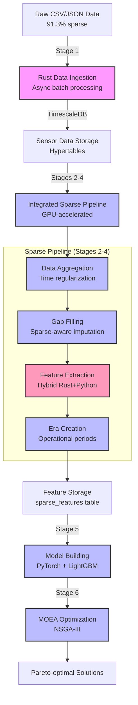

# Greenhouse Data Pipeline & Optimization Flow

## Overview

This document describes the complete data pipeline from raw sensor data to multi-objective optimization results. The pipeline is specifically designed to handle greenhouse sensor data with 91.3% missing values using a hybrid Rust+Python architecture.

## Current Architecture

### Pipeline Evolution
Due to the extreme sparsity of greenhouse data (91.3% missing values), the pipeline has evolved from a traditional multi-stage approach to an integrated sparse-aware pipeline that combines multiple processing steps for efficiency.

### Technology Stack
- **Rust**: High-performance data ingestion, sparse feature extraction (CPU-bound)
- **Python + CUDA**: GPU-accelerated feature extraction, model training
- **TimescaleDB**: Time-series data storage (PostgreSQL 16)
- **Docker Compose**: Service orchestration
- **NVIDIA CUDA**: GPU acceleration for compute-intensive operations

### Hybrid Execution Model
The enhanced sparse pipeline uses a hybrid approach where:
1. **Rust Binary** (`gpu_feature_extraction`): Orchestrates the entire pipeline
2. **Python Scripts**: Called via subprocess for GPU-intensive operations
3. **Communication**: JSON over stdin/stdout between Rust and Python
4. **Single Container**: Everything runs in one Docker container (no Docker-in-Docker)

## Pipeline Stages



Pink = Rust-based, Blue = GPU-accelerated, Orange = Hybrid Rust+Python

## Running the Pipeline

### Sparse Pipeline (Recommended for >90% missing data)

```bash
# Using the sparse pipeline configuration
cd DataIngestion

# Start infrastructure
docker compose -f docker-compose.sparse.yml up -d db redis

# Run complete enhanced pipeline (RECOMMENDED)
docker compose -f docker-compose.yml -f docker-compose.enhanced.yml up --build

# Or run with specific date range
START_DATE=2014-01-01 END_DATE=2014-06-30 \
docker compose -f docker-compose.yml -f docker-compose.enhanced.yml up --build
```

### Individual Stages

```bash
# Stage 1: Data Ingestion only
docker compose up rust_pipeline

# Stages 2-4: Enhanced Sparse Pipeline (Hybrid Rust+Python)
docker compose -f docker-compose.yml -f docker-compose.enhanced.yml up enhanced_sparse_pipeline

# Stage 5: Model Building only
docker compose up model_builder

# Stage 6: MOEA Optimization (choose one)
docker compose up moea_optimizer       # CPU version
docker compose -f docker-compose.yml -f docker-compose.prod.yml up moea_optimizer_gpu  # GPU version
```

### Enhanced Pipeline Details

The enhanced sparse pipeline (`docker-compose.enhanced.yml`) automatically:
- Runs in hybrid mode (`--hybrid-mode` flag)
- Uses Rust for orchestration and CPU operations
- Calls Python scripts for GPU-accelerated features
- Integrates stages 2-4 for efficiency
- Handles 91.3% sparse data optimally

## Stage Details

### Stage 1: Rust Data Ingestion
- **Purpose**: High-performance parsing and ingestion of CSV/JSON sensor data
- **Technology**: 
  - Rust with async Tokio for concurrent I/O
  - SQLx for compile-time checked SQL queries
  - Parallel batch processing
- **Key Features**:
  - Handles multiple data formats (Knudjepsen, Aarslev)
  - Validates data integrity
  - Batch inserts (1000+ rows) for performance
- **Output**: Raw sensor data in `sensor_data` hypertable

### Stages 2-4: Integrated Sparse Pipeline
The sparse nature of the data (91.3% missing) led to combining preprocessing, era detection, and feature extraction into a single optimized pipeline.

#### Sub-stage 2: Data Aggregation & Preprocessing
- **Purpose**: Handle extreme sparsity with intelligent aggregation
- **Technology**: 
  - Rust for data orchestration
  - GPU-accelerated pandas/CuDF for processing
- **Features**:
  - Time regularization with sparse-aware resampling
  - Gap analysis and statistics
  - External data integration (weather, energy prices)

#### Sub-stage 3: Feature Extraction
- **Purpose**: Extract meaningful features from sparse data
- **Technology**: 
  - **Hybrid Architecture**:
    - Rust: CPU-bound features (coverage, basic stats, domain logic)
    - Python: GPU-accelerated complex features (correlations, patterns)
  - CuDF/CuPy for GPU operations
  - Rayon for CPU parallelization
- **Sparse-Aware Features**:
  - Coverage metrics (% non-null per sensor)
  - Gap analysis (longest/average gaps)
  - Event-based features (changes, extremes)
  - Pattern detection despite gaps
  - Greenhouse-specific metrics
- **Output**: 50-100 features per sensor in `sparse_features` table

#### Sub-stage 4: Era Creation
- **Purpose**: Define operational periods for context
- **Technology**: Integrated into sparse pipeline
- **Approach**: Simplified era detection based on data availability patterns

### Stage 5: Model Building
- **Purpose**: Train surrogate models for optimization objectives
- **Technology**: 
  - PyTorch for LSTM models (GPU-accelerated)
  - LightGBM with GPU support
  - MLflow for experiment tracking
- **Models**:
  - Plant growth prediction (biomass, quality)
  - Energy consumption forecasting
  - Resource efficiency estimation
  - Climate stability metrics
- **Sparse Adaptations**:
  - Models trained on sparse-aware features
  - Confidence weighting based on coverage
  - Robust loss functions for missing data

### Stage 6: MOEA Optimization
- **Purpose**: Find Pareto-optimal greenhouse control strategies
- **Technology**: 
  - **CPU**: pymoo library (NSGA-III implementation)
  - **GPU**: Custom PyTorch-based NSGA-III
- **Objectives**:
  - Minimize energy consumption
  - Maximize plant growth
  - Minimize water usage
  - Maximize crop quality
  - Maintain climate stability
- **Sparse Considerations**:
  - Objectives weighted by data availability
  - Uncertainty quantification in predictions
  - Robust optimization over data gaps

## Sparse Feature Extraction Architecture

### Hybrid Processing Model
```
Sensor Data (91.3% sparse)
         │
    ┌────┴────┐
    │         │
Rust Engine  Python GPU
(CPU-bound)  (GPU-bound)
    │         │
    └────┬────┘
         │
   Feature Merge
         │
   Output Features
```

### Feature Categories
1. **Coverage Features**: Data availability metrics
2. **Sparse Statistics**: Stats computed on available data only
3. **Event Features**: Changes and anomalies in sparse data
4. **Pattern Features**: Temporal patterns despite gaps
5. **Domain Features**: Greenhouse-specific metrics
6. **Correlation Features**: Multi-sensor relationships

## GPU Services & Requirements

### GPU-Enabled Services
- `sparse_pipeline`: CUDA-accelerated feature extraction
- `model_builder`: GPU training for neural networks
- `moea_optimizer_gpu`: GPU-accelerated evolution

### GPU Configuration
```bash
# Minimum requirements
NVIDIA_VISIBLE_DEVICES=all
NVIDIA_DRIVER_CAPABILITIES=compute,utility
CUDA_VISIBLE_DEVICES=0

# Memory settings for large datasets
shm_size: '4gb'
ulimits:
  memlock: -1
  stack: 67108864
```

## Configuration & Environment

### Key Environment Variables
```bash
# Database
DATABASE_URL=postgresql://postgres:postgres@db:5432/postgres

# Sparse Pipeline
SPARSE_MODE=true
SPARSE_START_DATE=2014-01-01
SPARSE_END_DATE=2014-12-31
SPARSE_BATCH_SIZE=24
SPARSE_MIN_ERA_ROWS=10

# GPU Settings
DISABLE_GPU=false
CUDA_VISIBLE_DEVICES=0

# Model Training
USE_SPARSE_FEATURES=true
EPOCHS=50
BATCH_SIZE=32
LEARNING_RATE=0.001

# MOEA
CONFIG_PATH=/app/config/moea_config_gpu.toml
DEVICE=cuda
```

## Data Flow

### Tables & Storage
1. **Input**: `sensor_data` (raw time-series)
2. **External**: `external_weather_aarhus`, `external_energy_prices_dk`
3. **Features**: `sparse_features` (extracted features)
4. **Models**: File system (`/models` directory)
5. **Results**: `moea_results`, file exports

### Feature Schema
```sql
-- Sparse features table
CREATE TABLE sparse_features (
    time TIMESTAMPTZ,
    era_identifier TEXT,
    sensor_name TEXT,
    coverage_ratio FLOAT,
    longest_gap_hours FLOAT,
    sparse_mean FLOAT,
    sparse_std FLOAT,
    -- ... 50+ additional features
    features JSONB  -- Extended features
);
```

## Monitoring & Debugging

### Service Health
```bash
# Check all services
docker compose -f docker-compose.sparse.yml ps

# View logs
docker compose -f docker-compose.sparse.yml logs -f sparse_pipeline

# Database monitoring
pgAdmin at http://localhost:5050
```

### Performance Metrics
- **Data Ingestion**: ~10K rows/second
- **Sparse Feature Extraction**: ~1M samples/second (hybrid mode)
- **Model Training**: 5-10x speedup with GPU
- **MOEA Optimization**: 100-1000 solutions/generation

## Troubleshooting

### Common Issues

1. **GPU Memory Errors**
   - Reduce `SPARSE_BATCH_SIZE`
   - Enable mixed precision training
   - Use CPU fallback for testing

2. **Missing Data Handling**
   - Pipeline designed for 91.3% sparsity
   - Features degrade gracefully with more gaps
   - Minimum 10 rows per era (`SPARSE_MIN_ERA_ROWS`)

3. **Pipeline Failures**
   - Check dependencies: `docker compose ps`
   - Verify database connectivity
   - Review service logs for detailed errors

### Validation
```bash
# Test sparse feature extraction
docker compose -f docker-compose.sparse.yml run sparse_pipeline \
  --test-mode --start-date 2014-01-01 --end-date 2014-01-07

# Verify feature counts
docker compose exec db psql -U postgres -c \
  "SELECT COUNT(*), COUNT(DISTINCT sensor_name) FROM sparse_features;"
```

## Future Enhancements

1. **Streaming Processing**: Real-time feature updates
2. **Adaptive Sampling**: Dynamic adjustment to data density
3. **Multi-GPU Support**: Distributed feature extraction
4. **Online Learning**: Continuous model updates
5. **Uncertainty Quantification**: Bayesian approaches for sparse data