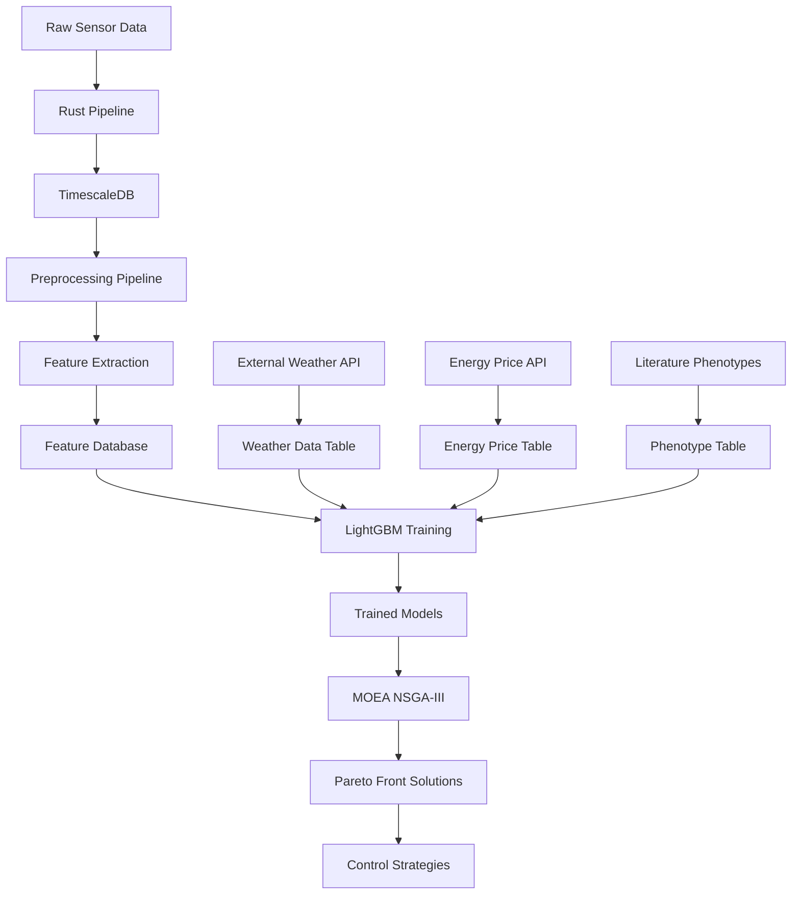

# Data Integration Analysis for LightGBM and MOEA NSGA-III

## Code Analysis Summary

### 1. **Critical Issues Found**

#### A. Import Path Errors
- **Location**: `train_all_objectives.py:34`
- **Issue**: Incorrect relative import path trying to access `config.moea_objectives`
- **Fix Required**: Update to correct path: `moea_optimizer.src.objectives.moea_objectives`

#### B. Missing SQL Injection Protection
- **Location**: `train_lightgbm_surrogate.py:183-186`
- **Issue**: Direct string interpolation in SQL queries without parameterization
- **Risk**: SQL injection vulnerability when table names come from config
- **Fix Required**: Use parameterized queries or whitelist validation

#### C. Missing Error Handling
- **Location**: Multiple database operations lack proper error handling
- **Issue**: No try-except blocks around database connections and queries
- **Impact**: Ungraceful failures that could corrupt state

#### D. Type Hints Inconsistency
- **Location**: Throughout the codebase
- **Issue**: Mixing old-style (`Optional[Type]`) and new-style (`Type | None`) annotations
- **Recommendation**: Standardize on Python 3.10+ union syntax

### 2. **Performance Concerns**

#### A. GPU Memory Management
- **Location**: `LightGBMTrainer.__init__`
- **Issue**: GPU test creates unnecessary data allocation
- **Optimization**: Use smaller test dataset or skip GPU test if env var confirms availability

#### B. Data Loading Inefficiency
- **Location**: `PostgreSQLDataLoader.load_features`
- **Issue**: Loading entire feature table into memory without pagination
- **Risk**: Memory overflow with large datasets
- **Solution**: Implement chunked loading or streaming

### 3. **Architecture Issues**

#### A. Tight Coupling
- **Problem**: Model trainer directly depends on specific database schema
- **Impact**: Hard to test and maintain
- **Solution**: Add data abstraction layer

#### B. Missing Dependency Injection
- **Location**: Database connection strings hardcoded in multiple places
- **Solution**: Use configuration management pattern

## Data Flow Architecture

### 1. **Data Sources Overview**



### 2. **Database Schema Integration**

#### A. Core Tables
```sql
-- 1. Sensor Data (Hypertable)
sensor_data (
    timestamp TIMESTAMPTZ,
    signal_name TEXT,
    value DOUBLE PRECISION,
    metadata JSONB
)

-- 2. Preprocessed Data (Hypertable)
preprocessed_greenhouse_data (
    timestamp TIMESTAMPTZ,
    era_id TEXT,
    -- 40+ normalized columns
    air_temp_c DOUBLE PRECISION,
    relative_humidity_percent DOUBLE PRECISION,
    co2_measured_ppm DOUBLE PRECISION,
    light_intensity_umol DOUBLE PRECISION,
    ...
)

-- 3. Era Labels (Detection Results)
era_label_level_a/b/c (
    signal_name TEXT,
    level TEXT,
    stage TEXT,
    start_time TIMESTAMPTZ,
    end_time TIMESTAMPTZ,
    era_id TEXT,
    era_rows BIGINT
)

-- 4. Feature Data
tsfresh_features (
    era_id TEXT,
    signal_name TEXT,
    -- 700+ tsfresh features per signal
    air_temp_c__mean DOUBLE PRECISION,
    air_temp_c__variance DOUBLE PRECISION,
    ...
    -- Target variables
    total_energy_kwh DOUBLE PRECISION,
    growth_rate DOUBLE PRECISION,
    water_consumption_l DOUBLE PRECISION
)

-- 5. External Data
external_weather_data (
    timestamp TIMESTAMPTZ,
    temperature_forecast_c DOUBLE PRECISION,
    sun_radiation_forecast_w_m2 DOUBLE PRECISION,
    ...
)

energy_prices (
    timestamp TIMESTAMPTZ,
    price_dk1 DOUBLE PRECISION,
    price_dk2 DOUBLE PRECISION
)

-- 6. Phenotype Data
phenotypes (
    plant_id TEXT,
    species TEXT,
    growth_parameters JSONB,
    environmental_optima JSONB,
    ...
)
```

### 3. **LightGBM Data Integration**

#### A. Feature Engineering Pipeline
```python
# Step 1: Load tsfresh features
features = pd.read_sql("""
    SELECT * FROM tsfresh_features 
    WHERE era_id IN (SELECT DISTINCT era_id FROM era_label_level_a)
    ORDER BY era_id
""", engine)

# Step 2: Enrich with external data
weather_features = aggregate_weather_by_era(external_weather_data)
energy_features = aggregate_energy_by_era(energy_prices)

# Step 3: Add phenotype features (if plant growth objective)
if target == "plant_growth":
    phenotype_features = encode_phenotype_features(phenotypes)
    features = features.merge(phenotype_features, on='plant_species')

# Step 4: Target variable selection
target_mapping = {
    "energy_consumption": "total_energy_kwh",
    "plant_growth": "growth_rate",
    "water_usage": "water_consumption_l",
    "temperature_stability": "temp_variance",
    "climate_stability": "climate_deviation_score",
    "crop_quality": "quality_index"
}
```

#### B. Feature Selection Strategy
1. **Base Features**: All tsfresh-generated features (~700 per signal)
2. **Domain Features**: Weather, energy prices, time-based features
3. **Phenotype Features**: Only for biological objectives
4. **Engineered Features**: Ratios, interactions, rolling statistics

### 4. **MOEA NSGA-III Integration**

#### A. Surrogate Model Interface
```python
class SurrogateObjective:
    def __init__(self, model_path: str, scaler_path: str):
        self.model = lgb.Booster(model_file=model_path)
        self.scaler = joblib.load(scaler_path)
    
    def evaluate(self, decision_variables: np.ndarray) -> float:
        # Transform decision variables to feature space
        features = self.transform_decisions_to_features(decision_variables)
        
        # Scale features
        features_scaled = self.scaler.transform(features)
        
        # Predict objective value
        return self.model.predict(features_scaled)[0]
```

#### B. Decision Variable Mapping
```yaml
decision_variables:
  - name: temperature_setpoint
    bounds: [18.0, 26.0]
    unit: "°C"
    
  - name: humidity_setpoint
    bounds: [60.0, 85.0]
    unit: "%"
    
  - name: co2_injection_rate
    bounds: [0.0, 1000.0]
    unit: "ppm/h"
    
  - name: light_intensity
    bounds: [0.0, 500.0]
    unit: "μmol/m²/s"
    
  - name: light_duration
    bounds: [0.0, 24.0]
    unit: "hours"
```

#### C. Multi-Objective Formulation
```python
# MOEA Problem Definition
class GreenhouseMOEAProblem:
    def __init__(self, surrogate_models: Dict[str, SurrogateObjective]):
        self.models = surrogate_models
        self.n_obj = len(surrogate_models)
        self.n_var = 5  # Number of decision variables
        
    def evaluate(self, X: np.ndarray) -> np.ndarray:
        # X shape: (population_size, n_var)
        # Returns: (population_size, n_obj)
        
        objectives = []
        for obj_name, model in self.models.items():
            obj_values = [model.evaluate(x) for x in X]
            objectives.append(obj_values)
        
        return np.column_stack(objectives)
```

### 5. **Data Quality Assurance**

#### A. Validation Checks
1. **Missing Data**: Forward-fill, interpolation, or model-based imputation
2. **Outliers**: IQR or isolation forest detection
3. **Temporal Consistency**: Era boundary validation
4. **Feature Scaling**: Robust scaling for outlier resistance

#### B. Cross-Validation Strategy
- **Time Series Split**: Respects temporal ordering
- **Era-based Split**: Ensures complete eras in train/test
- **Stratified by Season**: Accounts for seasonal variations

### 6. **Performance Optimizations**

#### A. GPU Acceleration
```python
# LightGBM GPU parameters
gpu_params = {
    'device': 'gpu',
    'gpu_platform_id': 0,
    'gpu_device_id': 0,
    'gpu_use_dp': False,  # Single precision for speed
    'max_bin': 63,  # Reduced for GPU efficiency
}
```

#### B. Batch Processing
- Feature extraction: Process multiple eras concurrently
- Model training: Parallel cross-validation folds
- MOEA evaluation: Vectorized objective calculations

### 7. **Monitoring and Logging**

#### A. MLflow Integration
- **Experiments**: Separate for each objective
- **Metrics**: RMSE, MAE, R², feature importance
- **Artifacts**: Models, scalers, plots, configs
- **Parameters**: All hyperparameters logged

#### B. Performance Tracking
```python
# Key metrics tracked
metrics = {
    "training_time": time_seconds,
    "gpu_memory_peak": memory_mb,
    "data_loading_time": time_seconds,
    "feature_extraction_time": time_seconds,
    "cross_validation_scores": cv_scores,
    "test_metrics": {
        "rmse": rmse,
        "mae": mae,
        "r2": r2,
        "mape": mape
    }
}
```

## Recommendations

### 1. **Immediate Fixes Required**
- Fix import paths in `train_all_objectives.py`
- Add SQL injection protection
- Implement proper error handling for database operations
- Add requirements.txt with all dependencies

### 2. **Architecture Improvements**
- Implement data abstraction layer
- Add configuration management (e.g., Hydra)
- Create unit tests for critical components
- Add data validation schemas

### 3. **Performance Enhancements**
- Implement chunked data loading
- Add caching for frequently accessed data
- Optimize GPU memory usage
- Parallelize feature extraction

### 4. **Documentation Needs**
- API documentation for model interfaces
- Data dictionary for all features
- Deployment guide with Docker
- Troubleshooting guide

## Conclusion

The current implementation provides a solid foundation for surrogate-based multi-objective optimization. However, several critical issues need immediate attention to ensure production readiness. The data flow from sensors through feature extraction to MOEA optimization is well-designed but requires better error handling, security improvements, and performance optimizations.