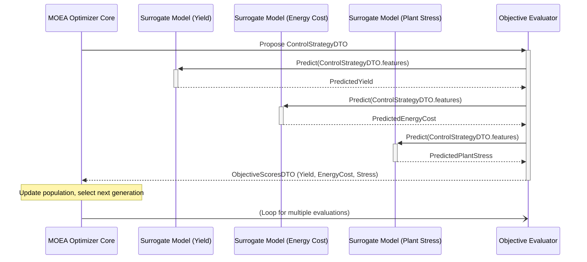

# System Architecture Overview (Enhanced Pipeline)

This document outlines the architecture of the Enhanced DataIngestion Pipeline, focusing on its runtime components as defined in `docker-compose.enhanced.yml` and the interactions between them. The diagrams are presented using MermaidJS syntax.

## 1. System Architecture Diagram

This diagram shows the high-level runtime components (Docker services) of the MVP, their primary connections, and data flows.

```mermaid
graph TD
    subgraph "External Environment"
        A1[Raw Sensor Data Files (.csv)]
        A2[External Data Sources (Weather APIs, Energy APIs, Phenotype Info)]
    end

    subgraph "Data Preparation (Conceptual - Before Docker Stack)"
        P["`feature_extraction/pre_process/` module<br/>(preprocess.py, SQL scripts)<br/>Tech: Python, SQL"] -- Fetches/Cleans --> ExtDataDB[(External Data Tables)]
        A2 --> P
    end

    subgraph "Dockerized Enhanced Pipeline Services"
        DB[(TimescaleDB<br/>PostgreSQL + TimescaleDB Extension<br/>`db` service)]
        RP[Rust Data Ingestion<br/>`rust_pipeline` service<br/>Tech: Rust]
        ESP[Enhanced Sparse Feature Extraction<br/>`enhanced_sparse_pipeline` service<br/>Tech: Rust (Polars, Custom CUDA), Python (RAPIDS, PyTorch)<br/>GPU Enabled]
        MB[Model Builder<br/>`model_builder` service<br/>Tech: Python (PyTorch Lightning, LightGBM, MLflow)<br/>GPU Enabled]
        MOEA[MOEA Optimizer<br/>`moea_optimizer` service<br/>Tech: Python<br/>GPU Enabled]
    end

    subgraph "Data & Model Storage (Volumes / DB)"
        ExtDataDB -- Initialized into --> DB
        RawSensorDataTable[(Raw Sensor Data Table)]
        FeaturesTable[(`enhanced_sparse_features`<br/>Feature Table)]
        TrainedModels[Trained Surrogate Models<br/>(Volume: `./model_builder/models`)]
        MLflowTracking[MLflow Tracking Data<br/>(Volume: `./model_builder/model_builder_mlflow_staging`)]
        OptimizationResults[Optimization Results<br/>(Volume: `./moea_optimizer/results`)]
    end

    A1 --> RP
    RP -- Writes Raw Sensor Data --> DB
    DB -- Contains --> RawSensorDataTable
    DB -- Contains --> ExtDataDB

    RawSensorDataTable -- Read by --> ESP
    ExtDataDB -- Read by --> ESP
    ESP -- Writes Features --> DB
    DB -- Contains --> FeaturesTable

    FeaturesTable -- Read by --> MB
    MB -- Saves --> TrainedModels
    MB -- Logs to --> MLflowTracking

    TrainedModels -- Loaded by --> MOEA
    FeaturesTable -- Potentially read by MOEA for initial state/context --> MOEA
    MOEA -- Writes --> OptimizationResults
    MOEA -- May write results/logs to --> DB

    classDef rust fill:#dea584,stroke:#333,stroke-width:2px;
    classDef python fill:#84deaa,stroke:#333,stroke-width:2px;
    classDef db fill:#84c9de,stroke:#333,stroke-width:2px;
    classDef gpu fill:#b484de,stroke:#333,stroke-width:2px;
    classDef conceptual fill:#lightgrey,stroke:#333,stroke-width:1px,stroke-dasharray: 5 5;

    class RP rust;
    class P python;
    class ESP,MB,MOEA python,gpu;
    class DB,RawSensorDataTable,ExtDataDB,FeaturesTable,OptimizationResults db;
    class TrainedModels,MLflowTracking conceptual;
```

**Key Data Flows & Interactions:**

1.  **External Data Preparation (Conceptual):** The `feature_extraction/pre_process/` module (Python scripts, SQL) fetches and cleans external data (weather, energy, phenotype), storing it in dedicated tables within the TimescaleDB. This step is a prerequisite for the main pipeline.
2.  **Raw Data Ingestion:** The `rust_pipeline` service (Rust) ingests raw sensor data from CSV files into the `db` (TimescaleDB).
3.  **Feature Extraction:** The `enhanced_sparse_pipeline` service (Hybrid Rust/Python, GPU-enabled) reads both raw sensor data and the prepared external data from `db`. It performs extensive feature engineering using Polars (Rust), custom CUDA kernels (Rust), RAPIDS (Python), and PyTorch (Python). The resulting `enhanced_sparse_features` are written back to `db`.
4.  **Model Building:** The `model_builder` service (Python, GPU-enabled) reads the `enhanced_sparse_features` from `db`. It trains surrogate models using PyTorch Lightning and LightGBM. Trained models are saved to a shared volume, and experiments are tracked with MLflow.
5.  **MOEA Optimization:** The `moea_optimizer` service (Python, GPU-enabled) loads the trained surrogate models. It may read current state or feature definitions from `db`. It performs multi-objective optimization and writes results to a volume and potentially back to `db`.

## 2. Simplified Database Schema Diagram (Key MVP Tables)

This diagram shows the conceptual structure of the main database tables used in the enhanced pipeline.

```mermaid
erDiagram
    RAW_SENSOR_DATA {
        timestamp TIMESTAMPTZ PK
        sensor_id TEXT PK
        value DOUBLE_PRECISION
        -- other metadata columns
    }

    EXTERNAL_WEATHER_DATA {
        timestamp TIMESTAMPTZ PK
        location_id TEXT PK
        temperature DOUBLE_PRECISION
        humidity DOUBLE_PRECISION
        solar_radiation DOUBLE_PRECISION
        -- other weather metrics
    }

    EXTERNAL_ENERGY_DATA {
        timestamp TIMESTAMPTZ PK
        region_id TEXT PK
        price DOUBLE_PRECISION
        -- other energy metrics
    }

    PLANT_PHENOTYPE_DATA {
        timestamp TIMESTAMPTZ PK
        plant_id TEXT PK
        leaf_area_index DOUBLE_PRECISION
        height DOUBLE_PRECISION
        gdd_cumulative DOUBLE_PRECISION
        -- other phenotype metrics
    }

    ENHANCED_SPARSE_FEATURES {
        era_id TEXT PK
        timestamp_start TIMESTAMPTZ
        timestamp_end TIMESTAMPTZ
        feature_name_1 DOUBLE_PRECISION
        feature_name_2 DOUBLE_PRECISION
        -- ... many other feature columns (~1200+)
        target_variable_1 DOUBLE_PRECISION
        -- other target variables for surrogate models
    }

    MODEL_REGISTRY_MLFLOW {
        model_name TEXT PK
        version INTEGER PK
        stage TEXT
        artifact_path TEXT
        -- other MLflow tracking columns
    }

    OPTIMIZATION_RESULTS {
        run_id TEXT PK
        solution_id INTEGER PK
        control_strategy_param_1 DOUBLE_PRECISION
        -- other control parameters
        objective_score_yield DOUBLE_PRECISION
        objective_score_energy_cost DOUBLE_PRECISION
        -- other objective scores
    }

    RAW_SENSOR_DATA ||--o{ ENHANCED_SPARSE_FEATURES : "feeds into (conceptually)"
    EXTERNAL_WEATHER_DATA ||--o{ ENHANCED_SPARSE_FEATURES : "enriches"
    EXTERNAL_ENERGY_DATA ||--o{ ENHANCED_SPARSE_FEATURES : "enriches"
    PLANT_PHENOTYPE_DATA ||--o{ ENHANCED_SPARSE_FEATURES : "enriches"
    ENHANCED_SPARSE_FEATURES ||--o{ MODEL_REGISTRY_MLFLOW : "used to train models tracked by"
    MODEL_REGISTRY_MLFLOW ||--o{ OPTIMIZATION_RESULTS : "models used for optimization runs logged in"

    %% Note: Actual foreign key relationships might be more complex or handled at the application level.
    %% This ERD focuses on conceptual data flow for the pipeline.
```

**Key Tables:**

*   `RAW_SENSOR_DATA`: Stores raw time-series data from greenhouse sensors.
*   `EXTERNAL_WEATHER_DATA`, `EXTERNAL_ENERGY_DATA`, `PLANT_PHENOTYPE_DATA`: Store pre-processed external contextual data.
*   `ENHANCED_SPARSE_FEATURES`: The main table holding the rich features generated by the `enhanced_sparse_pipeline`. This is the primary input for the `model_builder`.
*   `MODEL_REGISTRY_MLFLOW`: Represents how MLflow would track trained models, their versions, and artifacts (though MLflow uses its own backend, this conceptualizes the data).
*   `OPTIMIZATION_RESULTS`: Stores the outcomes of MOEA runs, including control strategies and objective scores.

## 3. Component Interaction Diagram for MOEA Optimizer

This diagram illustrates the core loop within the `moea_optimizer` service, showing how it interacts with the trained surrogate models.



**Interaction Flow:**

1.  The **MOEA Optimizer Core** generates a candidate `ControlStrategyDTO` (which includes parameters that can be translated into features for the models).
2.  It sends this to the **Objective Evaluator**.
3.  The **Objective Evaluator** uses the relevant features from the `ControlStrategyDTO` to get predictions from each **Surrogate Model** (e.g., for Yield, Energy Cost, Plant Stress).
    *   These surrogate models (e.g., `KalanchoeLightGBMModel` or a PyTorch model) were trained by the `model_builder` service.
4.  Each surrogate model returns its prediction.
5.  The **Objective Evaluator** aggregates these predictions into an `ObjectiveScoresDTO`.
6.  This DTO is returned to the **MOEA Optimizer Core**, which uses these scores to guide its evolutionary search (e.g., update population, select individuals for the next generation).
7.  This process loops for many evaluations until termination criteria are met.

This overview should provide a solid foundation for the Design section of your report.
