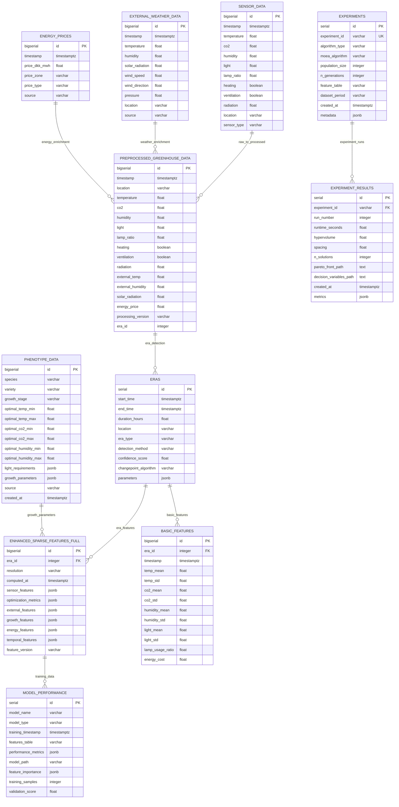

# Database Entity Relationship Diagram (ERD) Documentation

## Overview

This document provides a comprehensive Entity Relationship Diagram and schema documentation for all databases created in the Greenhouse Climate Optimization Pipeline. The system uses PostgreSQL 16 with TimescaleDB extension for time-series data management.

---

## Database Architecture Overview

```
┌─────────────────────────────────────────────────────────────────────┐
│                    GREENHOUSE OPTIMIZATION DATABASE                  │
├─────────────────────────────────────────────────────────────────────┤
│  Raw Data Layer → Processing Layer → Features Layer → Results Layer  │
└─────────────────────────────────────────────────────────────────────┘
```

### Primary Database: `postgres`
- **Host:** localhost:5432
- **Engine:** PostgreSQL 16 with TimescaleDB
- **Purpose:** Complete greenhouse optimization pipeline data storage
- **Extensions:** TimescaleDB, JSONB support

---

## Core Entity Relationship Diagram



---

## Detailed Table Schemas

### 1. Raw Data Layer Tables

#### SENSOR_DATA (Hypertable)
```sql
CREATE TABLE sensor_data (
    id BIGSERIAL PRIMARY KEY,
    timestamp TIMESTAMPTZ NOT NULL,
    temperature FLOAT,
    co2 FLOAT,
    humidity FLOAT,
    light FLOAT,
    lamp_ratio FLOAT,
    heating BOOLEAN,
    ventilation BOOLEAN,
    radiation FLOAT,
    location VARCHAR(50),
    sensor_type VARCHAR(50),
    raw_data JSONB,
    quality_flags JSONB,
    created_at TIMESTAMPTZ DEFAULT NOW()
);

-- TimescaleDB hypertable
SELECT create_hypertable('sensor_data', 'timestamp');

-- Indexes
CREATE INDEX idx_sensor_data_timestamp ON sensor_data (timestamp DESC);
CREATE INDEX idx_sensor_data_location ON sensor_data (location);
CREATE INDEX idx_sensor_data_location_time ON sensor_data (location, timestamp DESC);
```

**Purpose:** Stores raw greenhouse sensor measurements  
**Records:** 48,516 measurements (2013-2016)  
**Partitioning:** By timestamp (TimescaleDB)  

#### EXTERNAL_WEATHER_DATA (Hypertable)
```sql
CREATE TABLE external_weather_data (
    id BIGSERIAL PRIMARY KEY,
    timestamp TIMESTAMPTZ NOT NULL,
    temperature FLOAT,
    humidity FLOAT,
    solar_radiation FLOAT,
    wind_speed FLOAT,
    wind_direction FLOAT,
    pressure FLOAT,
    location VARCHAR(100),
    source VARCHAR(50),
    api_response JSONB,
    created_at TIMESTAMPTZ DEFAULT NOW()
);

SELECT create_hypertable('external_weather_data', 'timestamp');
CREATE INDEX idx_external_weather_timestamp ON external_weather_data (timestamp DESC);
```

**Purpose:** External weather data from Open-Meteo API  
**Update Frequency:** Hourly  
**Coverage:** Multiple greenhouse locations  

#### ENERGY_PRICES (Hypertable)
```sql
CREATE TABLE energy_prices (
    id BIGSERIAL PRIMARY KEY,
    timestamp TIMESTAMPTZ NOT NULL,
    price_dkk_mwh FLOAT NOT NULL,
    price_zone VARCHAR(10), -- DK1, DK2
    price_type VARCHAR(20), -- spot, day_ahead
    source VARCHAR(50),
    raw_data JSONB,
    created_at TIMESTAMPTZ DEFAULT NOW()
);

SELECT create_hypertable('energy_prices', 'timestamp');
CREATE INDEX idx_energy_prices_timestamp ON energy_prices (timestamp DESC);
CREATE INDEX idx_energy_prices_zone ON energy_prices (price_zone, timestamp DESC);
```

**Purpose:** Danish energy spot prices for cost optimization  
**Zones:** DK1, DK2 price areas  
**Update Frequency:** Hourly  

### 2. Processing Layer Tables

#### PREPROCESSED_GREENHOUSE_DATA (Hypertable)
```sql
CREATE TABLE preprocessed_greenhouse_data (
    id BIGSERIAL PRIMARY KEY,
    timestamp TIMESTAMPTZ NOT NULL,
    location VARCHAR(50),
    -- Sensor data (cleaned and validated)
    temperature FLOAT,
    co2 FLOAT,
    humidity FLOAT,
    light FLOAT,
    lamp_ratio FLOAT,
    heating BOOLEAN,
    ventilation BOOLEAN,
    radiation FLOAT,
    -- External enrichment
    external_temp FLOAT,
    external_humidity FLOAT,
    solar_radiation FLOAT,
    wind_speed FLOAT,
    -- Economic data
    energy_price FLOAT,
    -- Processing metadata
    processing_version VARCHAR(20),
    era_id INTEGER,
    data_quality_score FLOAT,
    imputation_flags JSONB,
    created_at TIMESTAMPTZ DEFAULT NOW()
);

SELECT create_hypertable('preprocessed_greenhouse_data', 'timestamp');
CREATE INDEX idx_preprocessed_timestamp ON preprocessed_greenhouse_data (timestamp DESC);
CREATE INDEX idx_preprocessed_era ON preprocessed_greenhouse_data (era_id);
CREATE INDEX idx_preprocessed_location_time ON preprocessed_greenhouse_data (location, timestamp DESC);
```

**Purpose:** Cleaned, validated, and enriched greenhouse data  
**Features:** Time regularization, missing value imputation, external data integration  
**Quality:** Data validation and quality scoring  

#### ERAS
```sql
CREATE TABLE eras (
    id SERIAL PRIMARY KEY,
    start_time TIMESTAMPTZ NOT NULL,
    end_time TIMESTAMPTZ NOT NULL,
    duration_hours FLOAT,
    location VARCHAR(50),
    era_type VARCHAR(50), -- operational, maintenance, seasonal
    detection_method VARCHAR(50), -- PELT, BOCPD, HMM
    confidence_score FLOAT,
    changepoint_algorithm VARCHAR(30),
    parameters JSONB,
    statistics JSONB,
    created_at TIMESTAMPTZ DEFAULT NOW()
);

CREATE INDEX idx_eras_time_range ON eras (start_time, end_time);
CREATE INDEX idx_eras_location ON eras (location);
CREATE INDEX idx_eras_detection_method ON eras (detection_method);
```

**Purpose:** Operational period segmentation using changepoint detection  
**Records:** 1,279 distinct eras identified  
**Algorithms:** PELT, BOCPD, HMM for era detection  

### 3. Features Layer Tables

#### ENHANCED_SPARSE_FEATURES_FULL
```sql
CREATE TABLE enhanced_sparse_features_full (
    id BIGSERIAL PRIMARY KEY,
    era_id INTEGER NOT NULL REFERENCES eras(id),
    resolution VARCHAR(10), -- 15min, 60min, 240min, 720min, 1440min
    computed_at TIMESTAMPTZ NOT NULL,
    
    -- Feature categories (JSONB for flexibility)
    sensor_features JSONB, -- Basic sensor statistics
    optimization_metrics JSONB, -- Multi-objective scores
    external_features JSONB, -- Weather coupling features
    growth_features JSONB, -- Plant phenotype features
    energy_features JSONB, -- Cost and efficiency features
    temporal_features JSONB, -- Time-based patterns
    stress_features JSONB, -- Plant stress indicators
    
    -- Metadata
    feature_version VARCHAR(20),
    processing_time_ms INTEGER,
    feature_count INTEGER,
    created_at TIMESTAMPTZ DEFAULT NOW()
);

CREATE INDEX idx_enhanced_features_era ON enhanced_sparse_features_full (era_id);
CREATE INDEX idx_enhanced_features_resolution ON enhanced_sparse_features_full (resolution);
CREATE INDEX idx_enhanced_features_computed ON enhanced_sparse_features_full (computed_at DESC);
CREATE INDEX idx_enhanced_features_era_res ON enhanced_sparse_features_full (era_id, resolution);

-- JSONB indexes for feature queries
CREATE INDEX idx_enhanced_sensor_features ON enhanced_sparse_features_full USING GIN (sensor_features);
CREATE INDEX idx_enhanced_optimization_metrics ON enhanced_sparse_features_full USING GIN (optimization_metrics);
```

**Purpose:** Comprehensive multi-resolution feature engineering  
**Records:** 223,825 feature vectors  
**Dimensions:** 78 features per vector  
**Resolutions:** 5 temporal scales (15min to 24h)  

**Example Feature Structure:**
```json
{
  "sensor_features": {
    "co2_mean_max": 860.6,
    "co2_mean_min": 631.2,
    "temp_mean_mean": 21.26,
    "light_mean_mean": 1834.32,
    "humidity_mean_std": 3.79
  },
  "optimization_metrics": {
    "growth_performance_score": 0.902,
    "energy_cost_efficiency": 0.0,
    "sustainability_score": 0.361,
    "obj1_minimize_energy_cost": 1.0,
    "obj2_maximize_growth_rate": 0.902
  }
}
```

#### BASIC_FEATURES
```sql
CREATE TABLE basic_features (
    id BIGSERIAL PRIMARY KEY,
    era_id INTEGER NOT NULL REFERENCES eras(id),
    timestamp TIMESTAMPTZ NOT NULL,
    temp_mean FLOAT,
    temp_std FLOAT,
    co2_mean FLOAT,
    co2_std FLOAT,
    humidity_mean FLOAT,
    humidity_std FLOAT,
    light_mean FLOAT,
    light_std FLOAT,
    lamp_usage_ratio FLOAT,
    energy_cost FLOAT,
    growth_indicator FLOAT,
    created_at TIMESTAMPTZ DEFAULT NOW()
);

CREATE INDEX idx_basic_features_era ON basic_features (era_id);
CREATE INDEX idx_basic_features_timestamp ON basic_features (timestamp DESC);
```

**Purpose:** Simple statistical features for baseline comparison  
**Dimensions:** 20 basic features  
**Use Case:** Algorithm comparison and validation  

### 4. Reference Data Tables

#### PHENOTYPE_DATA
```sql
CREATE TABLE phenotype_data (
    id BIGSERIAL PRIMARY KEY,
    species VARCHAR(100) NOT NULL, -- Kalanchoe blossfeldiana
    variety VARCHAR(100),
    growth_stage VARCHAR(50),
    
    -- Optimal ranges
    optimal_temp_min FLOAT,
    optimal_temp_max FLOAT,
    optimal_co2_min FLOAT,
    optimal_co2_max FLOAT,
    optimal_humidity_min FLOAT,
    optimal_humidity_max FLOAT,
    
    -- Complex parameters
    light_requirements JSONB, -- DLI, photoperiod, spectrum
    growth_parameters JSONB, -- GDD, stress thresholds
    economic_parameters JSONB, -- Value per gram, quality factors
    
    -- Metadata
    source VARCHAR(100), -- Literature reference
    confidence_score FLOAT,
    created_at TIMESTAMPTZ DEFAULT NOW()
);

CREATE INDEX idx_phenotype_species ON phenotype_data (species);
CREATE INDEX idx_phenotype_growth_stage ON phenotype_data (growth_stage);
```

**Purpose:** Plant-specific optimal growing conditions from literature  
**Species Focus:** Kalanchoe blossfeldiana  
**Sources:** Scientific literature and industry best practices  

### 5. Experiment Tracking Tables

#### EXPERIMENTS
```sql
CREATE TABLE experiments (
    id SERIAL PRIMARY KEY,
    experiment_id VARCHAR(255) UNIQUE NOT NULL,
    algorithm_type VARCHAR(50) NOT NULL, -- cpu, gpu
    moea_algorithm VARCHAR(50) NOT NULL, -- NSGA-II, NSGA-III
    population_size INTEGER NOT NULL,
    n_generations INTEGER NOT NULL,
    feature_table VARCHAR(255) NOT NULL,
    dataset_period VARCHAR(100) NOT NULL,
    created_at TIMESTAMPTZ DEFAULT NOW(),
    metadata JSONB -- Configuration details
);

CREATE INDEX idx_experiments_algorithm_type ON experiments (algorithm_type);
CREATE INDEX idx_experiments_created_at ON experiments (created_at DESC);
```

**Purpose:** Track MOEA experiment configurations  
**Scope:** CPU (NSGA-III) vs GPU (TensorNSGA3/fallback) performance comparison  
**Metadata:** Complete experiment parameters including algorithm fallback behavior  

#### EXPERIMENT_RESULTS
```sql
CREATE TABLE experiment_results (
    id SERIAL PRIMARY KEY,
    experiment_id VARCHAR(255) NOT NULL REFERENCES experiments(experiment_id),
    run_number INTEGER NOT NULL,
    runtime_seconds FLOAT NOT NULL,
    hypervolume FLOAT NOT NULL,
    spacing FLOAT NOT NULL,
    n_solutions INTEGER NOT NULL,
    pareto_front_path TEXT,
    decision_variables_path TEXT,
    created_at TIMESTAMPTZ DEFAULT NOW(),
    metrics JSONB, -- Detailed performance metrics
    UNIQUE(experiment_id, run_number)
);

CREATE INDEX idx_experiment_results_experiment_id ON experiment_results (experiment_id);
CREATE INDEX idx_experiment_results_runtime ON experiment_results (runtime_seconds);
CREATE INDEX idx_experiment_results_created_at ON experiment_results (created_at DESC);
```

**Purpose:** Store individual experiment run results  
**Metrics:** Runtime, solution quality, Pareto front characteristics  
**Files:** References to saved optimization results  

### 6. Model Management Tables

#### MODEL_PERFORMANCE
```sql
CREATE TABLE model_performance (
    id SERIAL PRIMARY KEY,
    model_name VARCHAR(100) NOT NULL,
    model_type VARCHAR(50) NOT NULL, -- lightgbm, pytorch, etc.
    training_timestamp TIMESTAMPTZ NOT NULL,
    features_table VARCHAR(100),
    performance_metrics JSONB, -- RMSE, R2, etc.
    model_path VARCHAR(255),
    feature_importance JSONB,
    training_samples INTEGER,
    validation_score FLOAT,
    hyperparameters JSONB,
    created_at TIMESTAMPTZ DEFAULT NOW()
);

CREATE INDEX idx_model_performance_name ON model_performance (model_name);
CREATE INDEX idx_model_performance_type ON model_performance (model_type);
CREATE INDEX idx_model_performance_training ON model_performance (training_timestamp DESC);
```

**Purpose:** Track trained model performance and metadata  
**Models:** LightGBM energy and growth surrogates  
**Metrics:** Training performance and feature importance  

---

## Database Relationships and Data Flow

### Primary Data Flow
```
Raw Sensors → Preprocessing → Era Detection → Feature Engineering → Model Training → MOEA Optimization
     ↓              ↓              ↓              ↓              ↓              ↓
sensor_data → preprocessed_ → eras → enhanced_sparse_ → model_ → experiment_
              greenhouse_data         features_full     performance   results
```

### Key Relationships

**1. Temporal Relationships:**
- All time-series tables partitioned by timestamp
- Era-based aggregation links preprocessing to features
- Experiment results track optimization over time

**2. Feature Relationships:**
- Enhanced features reference eras for temporal segmentation
- Multiple resolution levels for multi-scale analysis
- JSONB structure allows flexible feature schema evolution

**3. Experiment Relationships:**
- Experiments link to specific feature tables and time periods
- Multiple runs per experiment enable statistical analysis
- Results reference external files for detailed Pareto data

### Foreign Key Constraints

```sql
-- Era relationships
ALTER TABLE enhanced_sparse_features_full 
ADD CONSTRAINT fk_enhanced_features_era 
FOREIGN KEY (era_id) REFERENCES eras(id);

ALTER TABLE basic_features 
ADD CONSTRAINT fk_basic_features_era 
FOREIGN KEY (era_id) REFERENCES eras(id);

-- Experiment relationships
ALTER TABLE experiment_results 
ADD CONSTRAINT fk_experiment_results_experiment 
FOREIGN KEY (experiment_id) REFERENCES experiments(experiment_id);
```

---

## Data Volumes and Performance

### Table Sizes
| Table | Records | Size Est. | Growth Rate |
|-------|---------|-----------|-------------|
| sensor_data | 48,516 | ~50 MB | Historical |
| external_weather_data | ~35,000 | ~30 MB | 24/day |
| energy_prices | ~35,000 | ~25 MB | 24/day |
| preprocessed_greenhouse_data | 48,516 | ~75 MB | Historical |
| eras | 1,279 | ~1 MB | Stable |
| enhanced_sparse_features_full | 223,825 | ~500 MB | Batch |
| experiments | ~20 | <1 MB | Low |
| experiment_results | ~100 | ~5 MB | Medium |

### Performance Optimizations

**TimescaleDB Hypertables:**
- Automatic time-based partitioning
- Efficient time-range queries
- Compression for historical data

**JSONB Indexes:**
- GIN indexes on feature columns
- Fast queries on nested JSON structures
- Flexible schema evolution

**Composite Indexes:**
- Location + timestamp for sensor queries
- Era + resolution for feature queries
- Algorithm type + timestamp for experiments

---

## Database Access Patterns

### Common Query Patterns

**1. Time-Series Queries:**
```sql
-- Recent sensor data
SELECT * FROM sensor_data 
WHERE timestamp > NOW() - INTERVAL '24 hours'
ORDER BY timestamp DESC;

-- Era-based feature extraction
SELECT era_id, sensor_features, optimization_metrics
FROM enhanced_sparse_features_full 
WHERE era_id BETWEEN 100 AND 200
AND resolution = '60min';
```

**2. Feature Analysis:**
```sql
-- Extract specific features for MOEA
SELECT 
    era_id,
    sensor_features->>'co2_mean_max' as co2_max,
    optimization_metrics->>'growth_performance_score' as growth_score
FROM enhanced_sparse_features_full
WHERE resolution = '1440min';
```

**3. Experiment Analysis:**
```sql
-- Compare algorithm performance
SELECT 
    e.algorithm_type,
    AVG(er.runtime_seconds) as avg_runtime,
    AVG(er.hypervolume) as avg_hypervolume
FROM experiments e
JOIN experiment_results er ON e.experiment_id = er.experiment_id
GROUP BY e.algorithm_type;
```

### Access Control and Security

**Database Roles:**
- `greenhouse_admin`: Full access to all tables
- `greenhouse_reader`: Read-only access to processed data
- `experiment_runner`: Write access to experiment tables
- `api_user`: Limited access for application queries

**Connection Security:**
- SSL/TLS encryption for all connections
- Network isolation within Docker Compose
- Environment-based credential management

---

## Backup and Maintenance Strategy

### Backup Schedule
- **Daily:** Incremental backups of all operational tables
- **Weekly:** Full database backup
- **Monthly:** Archive compression of historical time-series data

### Maintenance Tasks
- **Continuous Aggregates:** TimescaleDB for common time-range queries
- **Data Retention:** Archive sensor data older than 5 years
- **Index Maintenance:** VACUUM and REINDEX on JSONB tables
- **Statistics Update:** ANALYZE after bulk feature generation

### Monitoring
- **Query Performance:** Track slow queries on feature tables
- **Storage Growth:** Monitor JSONB column sizes
- **Connection Pool:** Monitor concurrent access patterns
- **Backup Validation:** Regular restore testing

---

## Schema Evolution Strategy

### Version Control
- **Migration Scripts:** Numbered SQL migration files
- **Schema Versions:** Track schema version in metadata table
- **Rollback Plans:** Reversible migrations for all changes

### JSONB Schema Evolution
- **Backward Compatibility:** New features added without breaking existing
- **Feature Versioning:** Track feature engineering version in metadata
- **Gradual Migration:** Parallel old/new feature columns during transitions

### Future Enhancements
- **Multi-Greenhouse Support:** Partition by facility_id
- **Real-Time Streaming:** Add stream processing tables
- **ML Model Versioning:** Expand model tracking capabilities
- **Audit Logging:** Add change tracking for optimization decisions

---

This comprehensive ERD documentation provides a complete view of the database architecture supporting the greenhouse optimization pipeline, from raw sensor data through to experiment results and model performance tracking.
