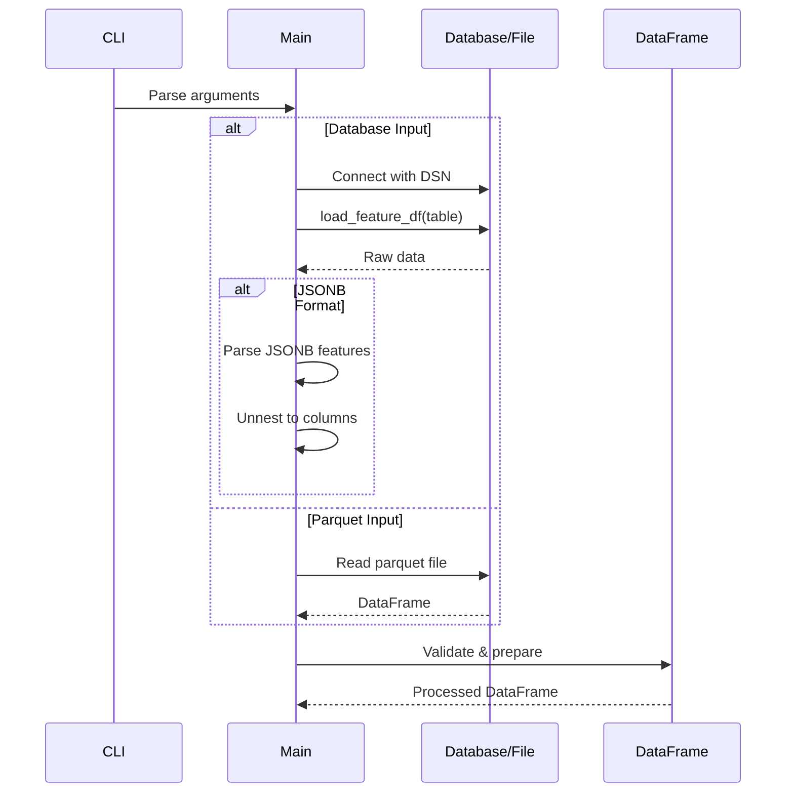
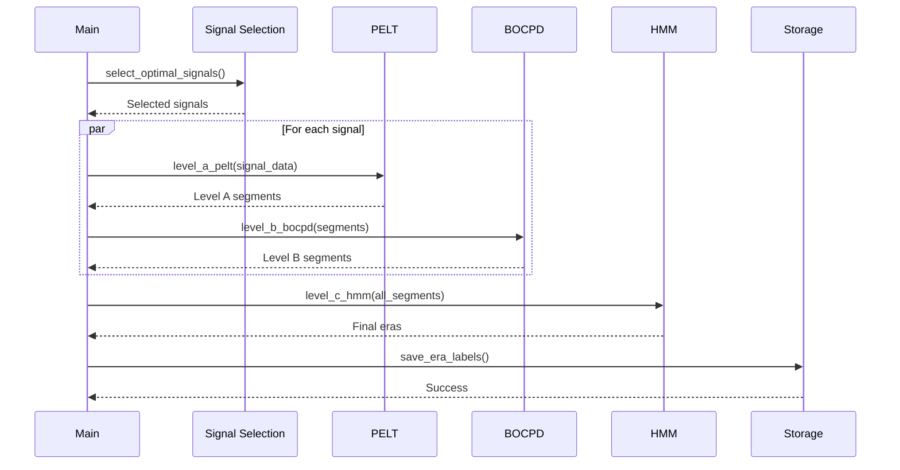
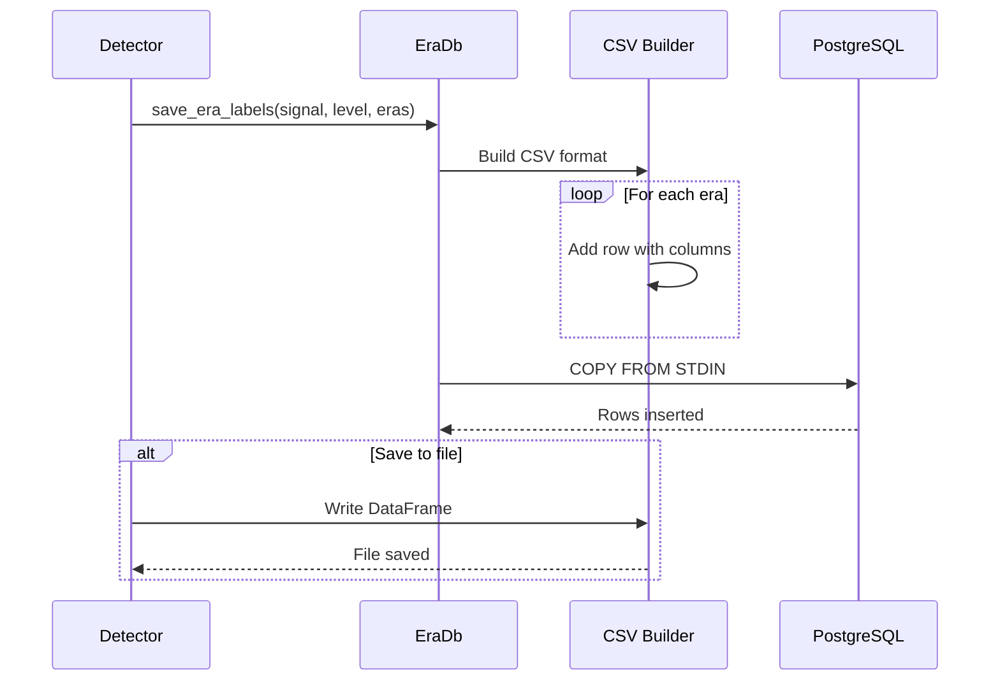

# Era Detection Operations Guide

## Table of Contents
1. [Overview](#overview)
2. [Architecture](#architecture)
3. [Core Components](#core-components)
4. [Algorithms](#algorithms)
5. [Data Flow](#data-flow)
6. [Sequence Diagrams](#sequence-diagrams)
7. [Implementation Details](#implementation-details)
8. [Database Schema](#database-schema)
9. [Migration Guide](#migration-guide)

## Overview

The Era Detection system identifies structural changes (changepoints) in greenhouse time-series data using multiple statistical algorithms. It segments continuous sensor data into distinct operational periods ("eras") that represent different growing conditions, control strategies, or system configurations.

### Key Features
- Multi-level changepoint detection (A, B, C)
- Multiple algorithm support (PELT, BOCPD, HMM)
- Automatic signal selection based on data quality
- Database and Parquet file input support
- Parallel processing with Rayon
- Hybrid storage support (JSONB and columnar)

## Architecture

```
┌─────────────────────────────────────────────────────────────────┐
│                        Era Detector                               │
├─────────────────────────────────────────────────────────────────┤
│                                                                   │
│  ┌──────────────┐  ┌──────────────┐  ┌──────────────┐          │
│  │   CLI Args   │  │   Database   │  │   Parquet    │          │
│  │   Parser     │  │  Connection  │  │    Reader    │          │
│  └──────┬───────┘  └──────┬───────┘  └──────┬───────┘          │
│         │                  │                  │                   │
│         v                  v                  v                   │
│  ┌────────────────────────────────────────────────────┐         │
│  │              Data Loading & Preprocessing           │         │
│  │  ┌─────────┐  ┌──────────┐  ┌─────────────────┐  │         │
│  │  │  JSONB  │  │  Column  │  │  Signal         │  │         │
│  │  │  Parser │  │  Select  │  │  Validation     │  │         │
│  │  └─────────┘  └──────────┘  └─────────────────┘  │         │
│  └────────────────────────────────────────────────────┘         │
│                                                                   │
│  ┌────────────────────────────────────────────────────┐         │
│  │           Changepoint Detection Algorithms          │         │
│  │  ┌─────────┐  ┌──────────┐  ┌─────────────────┐  │         │
│  │  │  PELT   │  │  BOCPD   │  │      HMM        │  │         │
│  │  │ Level A │  │ Level B  │  │    Level C      │  │         │
│  │  └─────────┘  └──────────┘  └─────────────────┘  │         │
│  └────────────────────────────────────────────────────┘         │
│                                                                   │
│  ┌──────────────┐  ┌──────────────┐  ┌──────────────┐          │
│  │   Database   │  │   Parquet    │  │     CSV      │          │
│  │   Storage    │  │   Output     │  │   Output     │          │
│  └──────────────┘  └──────────────┘  └──────────────┘          │
└─────────────────────────────────────────────────────────────────┘
```

## Core Components

### 1. Command Line Interface (`main.rs` / `main_optimized.rs`)

```rust
#[derive(Parser)]
struct Cli {
    /// Parquet file input (legacy mode)
    #[clap(long)]
    input_parquet: Option<PathBuf>,
    
    /// Database connection string
    #[clap(long, env = "DB_DSN")]
    db_dsn: Option<String>,
    
    /// Table name for database input
    #[clap(long, default_value = "preprocessed_features")]
    db_table: String,
    
    /// Minimum data coverage threshold (0.0-1.0)
    #[clap(long, default_value_t = 0.5)]
    min_coverage: f32,
    
    /// Minimum segment size for PELT
    #[clap(long, default_value_t = 48)]
    pelt_min_size: usize,
    
    /// Prior probability for BOCPD
    #[clap(long, default_value_t = 100.0)]
    bocpd_prior_a: f64,
    
    /// Explicit signal columns
    #[clap(long, value_delimiter = ',')]
    signal_cols: Vec<String>,
    
    /// Include time column in output
    #[clap(long, default_value_t = true)]
    include_time: bool,
}
```

### 2. Database Operations (`db_hybrid.rs`)

#### Connection Management
```rust
pub struct EraDb {
    pool: DbPool,
}

impl EraDb {
    pub fn new(dsn_override: Option<&str>) -> Result<Self> {
        // 1. Get DSN from parameter or environment
        // 2. Create connection pool with r2d2
        // 3. Initialize era_labels table
        // 4. Return wrapped pool
    }
}
```

#### Table Detection & Data Loading
```rust
pub fn load_feature_df(&self, table: &str, row_limit: Option<usize>) -> Result<DataFrame> {
    // 1. Check if table uses hybrid schema
    let is_hybrid = self.is_hybrid_table(table)?;
    
    // 2. Build appropriate query
    let query = if is_hybrid {
        // Direct column access
        "SELECT time, air_temp_c, relative_humidity_percent, ... FROM table"
    } else {
        // JSONB extraction
        "SELECT time, (features->>'air_temp_c')::float AS air_temp_c, ... FROM table"
    };
    
    // 3. Execute query and convert to Polars DataFrame
    // 4. Handle type conversions and null values
}
```

#### Era Label Storage
```rust
pub fn save_era_labels(&self, signal: &str, level: &str, stage: &str, eras: Vec<Era>) {
    // 1. Build CSV in memory
    // 2. Use COPY FROM for bulk insert
    // 3. Handle conflicts with ON CONFLICT DO NOTHING
}
```

### 3. Input/Output Operations (`io.rs`)

#### Parquet Reading
```rust
pub fn read_parquet_to_polars_df(path: &Path) -> Result<DataFrame> {
    LazyFrame::scan_parquet(path, Default::default())?
        .collect()
        .context("Failed to read parquet file")
}
```

#### DataFrame Writing
```rust
pub fn write_df_to_file(df: &DataFrame, path: &Path, format: FileFormat) -> Result<()> {
    match format {
        FileFormat::Parquet => {
            let file = File::create(path)?;
            ParquetWriter::new(file).finish(df)?;
        },
        FileFormat::Csv => {
            let file = File::create(path)?;
            CsvWriter::new(file).finish(df)?;
        }
    }
}
```

### 4. Changepoint Detection Algorithms

#### Level A: PELT (`level_a.rs`)
**Algorithm**: Pruned Exact Linear Time
**Purpose**: Fast detection of mean/variance changes
**Process**:
```rust
pub fn level_a_pelt_multi_signal(df: &DataFrame, signals: &[String], params: PeltParams) -> Result<DataFrame> {
    signals.par_iter().map(|signal| {
        // 1. Extract signal as Vec<f64>
        let data = extract_signal_data(df, signal)?;
        
        // 2. Configure BOCPD detector
        let detector = BocpdDetector::NormalGamma(NormalGamma::default());
        
        // 3. Run detection
        let changepoints = detector.run(&data);
        
        // 4. Convert to era segments
        let eras = changepoints_to_eras(changepoints, df.timestamps());
        
        // 5. Return labeled segments
        Ok(create_era_dataframe(signal, "A", "PELT", eras))
    }).collect()
}
```

**Parameters**:
- `min_size`: Minimum segment length (default: 48)
- `penalty`: Model complexity penalty (auto-calculated)
- `cost_function`: "normal_mean_var" for greenhouse data

#### Level B: BOCPD (`level_b.rs`)
**Algorithm**: Bayesian Online Changepoint Detection
**Purpose**: Online detection with uncertainty quantification
**Process**:
```rust
pub fn level_b_bocpd(signal_df: &DataFrame, params: BocpdParams) -> Result<Vec<Era>> {
    // 1. Initialize run-length distribution
    let mut run_length_dist = vec![1.0];
    
    // 2. For each observation
    for (t, value) in signal_df.iter() {
        // a. Calculate predictive probability
        let pred_prob = calculate_predictive(value, run_length_dist);
        
        // b. Update run-length distribution
        run_length_dist = update_run_length(pred_prob, params.hazard_rate);
        
        // c. Check for changepoint
        if is_changepoint(run_length_dist, params.threshold) {
            eras.push(Era { start: last_cp, end: t });
        }
    }
}
```

**Parameters**:
- `prior_a`, `prior_b`: Prior distribution parameters
- `hazard_rate`: Expected run length (1/100 default)
- `threshold`: Changepoint probability threshold

#### Level C: HMM (`level_c.rs`)
**Algorithm**: Hidden Markov Model
**Purpose**: State-based segmentation
**Process**:
```rust
pub fn level_c_hmm(level_b_segments: Vec<Segment>, params: HmmParams) -> Result<Vec<Era>> {
    // 1. Aggregate features per segment
    let features = segments.map(|seg| {
        vec![
            seg.duration(),
            seg.mean_value,
            seg.variance,
            seg.trend_slope
        ]
    });
    
    // 2. Fit HMM
    let hmm = HiddenMarkovModel::fit(features, params.n_states);
    
    // 3. Predict states
    let states = hmm.predict(features);
    
    // 4. Merge consecutive same-state segments
    let merged_eras = merge_by_state(segments, states);
    
    merged_eras
}
```

**Parameters**:
- `n_states`: Number of hidden states (3-5 typical)
- `covariance_type`: "full" or "diag"
- `n_iter`: EM algorithm iterations

### 5. Signal Selection (`main_optimized.rs`)

#### Optimal Signal Selection
```rust
pub fn select_optimal_signals(df: &DataFrame, cli: &Cli) -> Result<Vec<String>> {
    if !cli.signal_cols.is_empty() {
        // Use explicit signals
        validate_signals(df, &cli.signal_cols)
    } else {
        // Auto-select based on:
        // 1. Coverage (non-null percentage)
        // 2. Variance (information content)
        // 3. Domain knowledge (predefined optimal signals)
        
        let candidates = df.columns()
            .filter(|col| is_numeric(col) && coverage(col) > cli.min_coverage)
            .sorted_by_key(|col| signal_quality_score(col))
            .take(MAX_SIGNALS)
            .collect()
    }
}
```

**Quality Metrics**:
- Coverage: `(non_null_count / total_count)`
- Variance: Standard deviation / mean
- Autocorrelation: Lag-1 correlation
- Domain priority: Predefined signal importance

## Data Flow

### 1. Input Processing Flow



### 2. Era Detection Flow



### 3. Storage Flow



## Implementation Details

### Performance Optimizations

1. **Parallel Processing**:
```rust
use rayon::prelude::*;

signals.par_iter()
    .map(|signal| process_signal(signal))
    .collect::<Result<Vec<_>, _>>()?
```

2. **Batch Operations**:
```rust
// Batch database inserts
let batch_size = 10000;
for chunk in eras.chunks(batch_size) {
    insert_batch(chunk)?;
}
```

3. **Memory Efficiency**:
```rust
// Stream processing for large files
LazyFrame::scan_parquet(path)?
    .select([col("time"), col("signal")])
    .filter(col("signal").is_not_null())
    .collect()?
```

### Error Handling

1. **Result Type Usage**:
```rust
pub fn process() -> Result<DataFrame> {
    let df = load_data()
        .context("Failed to load data")?;
    
    let processed = transform(df)
        .context("Failed to transform")?;
    
    Ok(processed)
}
```

2. **Graceful Degradation**:
```rust
match run_detection(signal) {
    Ok(eras) => eras,
    Err(e) => {
        log::warn!("Detection failed for {}: {}", signal, e);
        vec![] // Empty result, continue with other signals
    }
}
```

### Logging Strategy

```rust
// Structured logging with levels
log::info!("Starting era detection for {} signals", signals.len());
log::debug!("Signal coverage: {:?}", coverage_map);
log::warn!("Low coverage for signal {}: {:.2}%", name, coverage * 100.0);
log::error!("Database connection failed: {}", error);
```

## Database Schema

### era_labels Table

```sql
CREATE TABLE era_labels (
    signal_name TEXT NOT NULL,
    level CHAR(1) NOT NULL CHECK (level IN ('A', 'B', 'C')),
    stage TEXT NOT NULL CHECK (stage IN ('PELT', 'BOCPD', 'HMM')),
    era_id INT NOT NULL,
    start_time TIMESTAMPTZ NOT NULL,
    end_time TIMESTAMPTZ NULL,
    rows INT NULL,
    -- Metadata
    mean_value DOUBLE PRECISION,
    std_value DOUBLE PRECISION,
    min_value DOUBLE PRECISION,
    max_value DOUBLE PRECISION,
    -- Constraints
    PRIMARY KEY (signal_name, level, stage, era_id, start_time)
);

-- Convert to hypertable
SELECT create_hypertable('era_labels', 'start_time', if_not_exists => TRUE);

-- Indexes for queries
CREATE INDEX idx_era_labels_signal ON era_labels(signal_name);
CREATE INDEX idx_era_labels_level_stage ON era_labels(level, stage);
CREATE INDEX idx_era_labels_time_range ON era_labels(start_time, end_time);
```

## Migration Guide

### To C# Implementation

#### 1. Core Types
```csharp
public record Era(
    DateTime StartTime,
    DateTime? EndTime,
    int Rows,
    double? MeanValue = null,
    double? StdValue = null
);

public interface IChangePointDetector
{
    Task<List<Era>> DetectAsync(
        double[] signal, 
        DateTime[] timestamps,
        Dictionary<string, object> parameters);
}

public class EraDetectionPipeline
{
    private readonly IDataSource _dataSource;
    private readonly IEraStorage _storage;
    private readonly ILogger _logger;
    
    public async Task<EraDetectionResult> RunAsync(DetectionConfig config)
    {
        // Load data
        var data = await _dataSource.LoadAsync(config.Table);
        
        // Select signals
        var signals = SelectOptimalSignals(data, config);
        
        // Run detection in parallel
        var tasks = signals.Select(signal => 
            DetectErasForSignalAsync(data[signal], config));
        
        var results = await Task.WhenAll(tasks);
        
        // Save results
        await _storage.SaveErasAsync(results);
        
        return new EraDetectionResult(results);
    }
}
```

#### 2. Algorithm Implementations

**PELT Implementation**:
```csharp
public class PeltDetector : IChangePointDetector
{
    public async Task<List<Era>> DetectAsync(
        double[] signal, 
        DateTime[] timestamps,
        Dictionary<string, object> parameters)
    {
        var minSize = (int)parameters["minSize"];
        var penalty = CalculatePenalty(signal.Length);
        
        // Dynamic programming for changepoints
        var costs = new double[signal.Length + 1];
        var lastChange = new int[signal.Length + 1];
        
        for (int end = minSize; end <= signal.Length; end++)
        {
            costs[end] = double.MaxValue;
            
            for (int start = Math.Max(0, end - maxSegmentLength); 
                 start < end - minSize + 1; start++)
            {
                var segmentCost = CalculateSegmentCost(signal, start, end);
                var totalCost = costs[start] + segmentCost + penalty;
                
                if (totalCost < costs[end])
                {
                    costs[end] = totalCost;
                    lastChange[end] = start;
                }
            }
        }
        
        // Backtrack to find changepoints
        var changepoints = BacktrackChangepoints(lastChange);
        return ConvertToEras(changepoints, timestamps);
    }
}
```

**BOCPD Implementation**:
```csharp
public class BocpdDetector : IChangePointDetector
{
    private readonly double _hazardRate;
    private readonly NormalGammaPrior _prior;
    
    public async Task<List<Era>> DetectAsync(
        double[] signal,
        DateTime[] timestamps,
        Dictionary<string, object> parameters)
    {
        var runLengthProbs = new List<double> { 1.0 };
        var changepoints = new List<int>();
        
        for (int t = 0; t < signal.Length; t++)
        {
            // Calculate predictive probabilities
            var predProbs = CalculatePredictive(signal[t], runLengthProbs);
            
            // Update run length distribution
            runLengthProbs = UpdateRunLength(predProbs, _hazardRate);
            
            // Detect changepoint
            if (runLengthProbs[0] > 0.5) // Probability of run length 0
            {
                changepoints.Add(t);
            }
        }
        
        return ConvertToEras(changepoints, timestamps);
    }
}
```

#### 3. Database Operations

```csharp
public class TimescaleEraStorage : IEraStorage
{
    private readonly string _connectionString;
    
    public async Task SaveErasAsync(IEnumerable<EraSet> eraSets)
    {
        using var connection = new NpgsqlConnection(_connectionString);
        await connection.OpenAsync();
        
        using var writer = connection.BeginBinaryImport(
            @"COPY era_labels (signal_name, level, stage, era_id, 
                              start_time, end_time, rows) 
              FROM STDIN (FORMAT BINARY)");
        
        foreach (var eraSet in eraSets)
        {
            foreach (var era in eraSet.Eras)
            {
                await writer.StartRowAsync();
                await writer.WriteAsync(eraSet.SignalName);
                await writer.WriteAsync(eraSet.Level);
                await writer.WriteAsync(eraSet.Stage);
                await writer.WriteAsync(era.Id);
                await writer.WriteAsync(era.StartTime);
                await writer.WriteAsync(era.EndTime);
                await writer.WriteAsync(era.Rows);
            }
        }
        
        await writer.CompleteAsync();
    }
}
```

#### 4. Signal Selection

```csharp
public class SignalSelector
{
    private readonly SignalQualityMetrics _metrics;
    
    public List<string> SelectOptimalSignals(
        DataFrame data, 
        DetectionConfig config)
    {
        if (config.ExplicitSignals?.Any() == true)
        {
            return ValidateSignals(data, config.ExplicitSignals);
        }
        
        // Auto-selection based on quality metrics
        return data.Columns
            .Where(col => IsNumeric(col) && !IsMetadata(col))
            .Select(col => new
            {
                Name = col.Name,
                Quality = _metrics.CalculateQuality(col)
            })
            .Where(x => x.Quality.Coverage > config.MinCoverage)
            .OrderByDescending(x => x.Quality.Score)
            .Take(config.MaxSignals ?? 10)
            .Select(x => x.Name)
            .ToList();
    }
}
```

### Key Migration Considerations

1. **Concurrency Model**:
   - Rust: Rayon for data parallelism
   - C#: Task Parallel Library (TPL) or PLINQ

2. **Memory Management**:
   - Rust: Ownership system prevents data races
   - C#: Use immutable structures or concurrent collections

3. **Error Handling**:
   - Rust: Result<T, E> with ? operator
   - C#: Async methods with proper exception hierarchy

4. **Performance**:
   - Rust: Zero-cost abstractions
   - C#: Use Span<T>, Memory<T> for efficient slicing

5. **Dependencies**:
   - Polars → Microsoft.Data.Analysis or custom DataFrame
   - changepoint crate → ML.NET or custom implementation
   - r2d2 → Built-in connection pooling in .NET

This guide provides complete implementation details for recreating the era detection system in any language, with special focus on strongly-typed languages like C#.