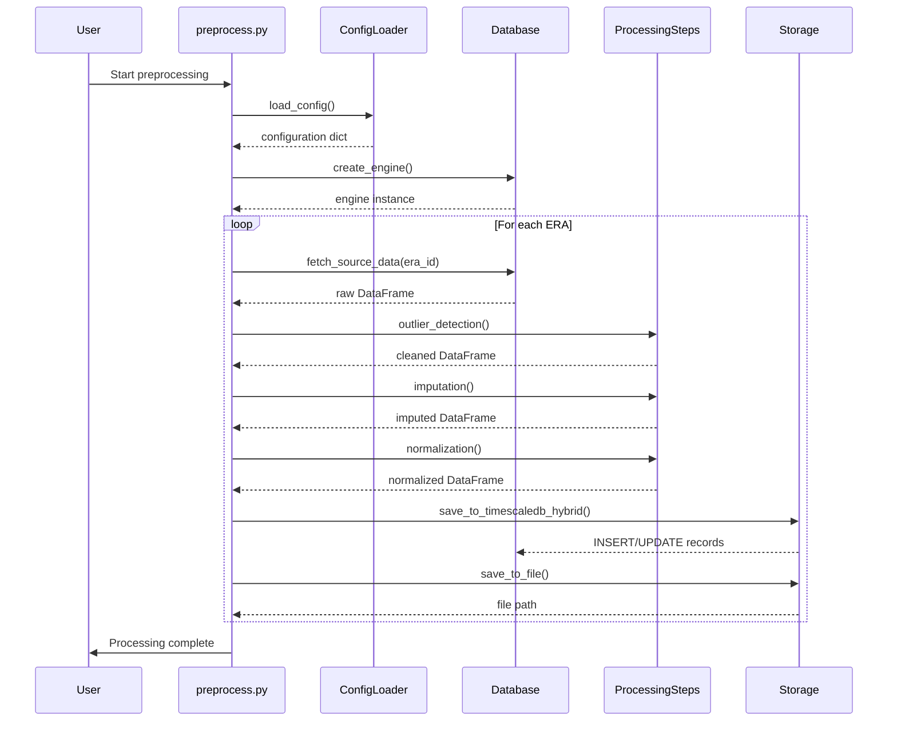
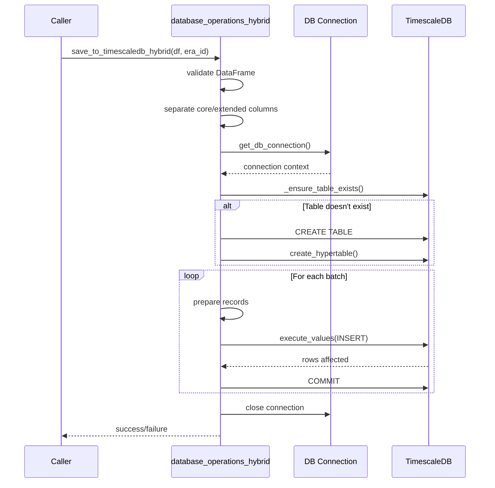
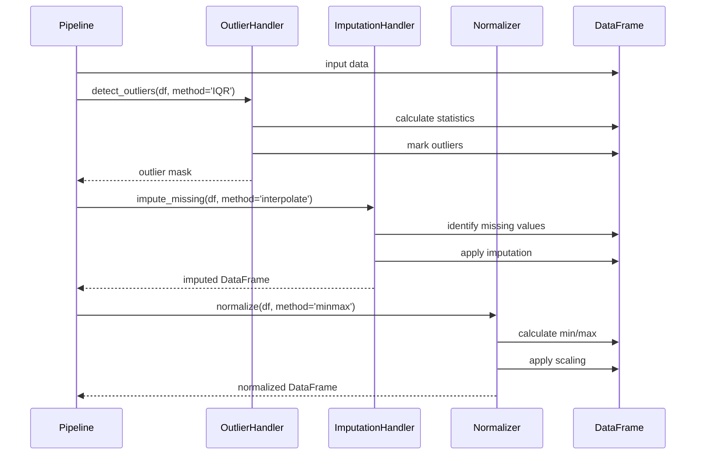

# Preprocessing Operations Guide

## Table of Contents
1. [Overview](#overview)
2. [Architecture](#architecture)
3. [Core Components](#core-components)
4. [Data Flow](#data-flow)
5. [Sequence Diagrams](#sequence-diagrams)
6. [Implementation Details](#implementation-details)
7. [Database Schema](#database-schema)
8. [Migration Guide](#migration-guide)

## Overview

The preprocessing pipeline transforms raw greenhouse sensor data into cleaned, normalized, and feature-ready datasets. It handles time-series data from multiple sources, performs quality checks, and prepares data for machine learning models.

### Key Responsibilities
- Data ingestion from TimescaleDB
- Time regularization and resampling
- Outlier detection and handling
- Missing value imputation
- Data normalization and scaling
- Feature generation
- Era-based segmentation
- External data enrichment (weather, energy prices)

## Architecture

```
┌─────────────────────────────────────────────────────────────────┐
│                     Preprocessing Pipeline                        │
├─────────────────────────────────────────────────────────────────┤
│                                                                   │
│  ┌──────────────┐  ┌──────────────┐  ┌──────────────┐          │
│  │   Database   │  │    Config    │  │  External    │          │
│  │  Operations  │  │   Loader     │  │   Sources    │          │
│  └──────┬───────┘  └──────┬───────┘  └──────┬───────┘          │
│         │                  │                  │                   │
│         v                  v                  v                   │
│  ┌────────────────────────────────────────────────────┐         │
│  │              Main Preprocessing Engine              │         │
│  │  ┌─────────┐  ┌──────────┐  ┌─────────────────┐  │         │
│  │  │ Outlier │  │Imputation│  │ Normalization   │  │         │
│  │  │ Handler │  │ Handler  │  │ & Scaling       │  │         │
│  │  └─────────┘  └──────────┘  └─────────────────┘  │         │
│  └────────────────────────────────────────────────────┘         │
│                                                                   │
│  ┌──────────────┐  ┌──────────────┐  ┌──────────────┐          │
│  │    Data      │  │   Database   │  │   Summary    │          │
│  │   Output     │  │   Storage    │  │   Reports    │          │
│  └──────────────┘  └──────────────┘  └──────────────┘          │
└─────────────────────────────────────────────────────────────────┘
```

## Core Components

### 1. Configuration Management (`data_preparation_utils.py`)

#### `load_config(config_path: str) -> dict`
**Purpose**: Loads and validates JSON configuration
**Input**: Path to JSON config file
**Output**: Dictionary with validated configuration
**Key Operations**:
- File existence check
- JSON parsing with error handling
- Schema validation
- Default value injection

```python
# Configuration Structure
{
    "database_connection": {
        "host": "string",
        "port": "string|int",
        "user": "string",
        "password": "string",
        "dbname": "string"
    },
    "preprocessing_steps": {
        "outlier_detection": {
            "enabled": "boolean",
            "method": "string",
            "params": {}
        },
        "imputation": {
            "enabled": "boolean",
            "method": "string",
            "params": {}
        },
        "normalization": {
            "enabled": "boolean",
            "method": "string"
        }
    },
    "era_definitions": {},
    "common_settings": {
        "time_col": "string",
        "save_to_db": "boolean"
    }
}
```

### 2. Database Operations (`database_operations.py` & `database_operations_hybrid.py`)

#### `fetch_source_data(era_identifier, era_config, global_config, engine) -> DataFrame`
**Purpose**: Retrieves time-series data for a specific era
**Process**:
1. Extract database parameters from config
2. Build SQL query with time bounds
3. Execute query with proper connection handling
4. Return DataFrame with timestamp index

**SQL Pattern**:
```sql
SELECT * FROM {table_name}
WHERE {time_column} >= '{start_date}'
  AND {time_column} <= '{end_date}'
ORDER BY {time_column}
```

#### `save_to_timescaledb_hybrid(df, era_identifier, db_config, table_name, batch_size)`
**Purpose**: Saves processed data using hybrid schema (columns + JSONB)
**Process**:
1. Validate DataFrame has time column/index
2. Separate core columns from extended features
3. Build records with proper type conversion
4. Execute batch inserts with conflict handling
5. Handle transaction management

**Core Columns** (stored as native PostgreSQL columns):
- `air_temp_c`, `relative_humidity_percent`, `co2_measured_ppm`
- `light_intensity_umol`, `radiation_w_m2`, `total_lamps_on`
- `dli_sum`, `vpd_hpa`, `heating_setpoint_c`, `co2_status`
- `source_file`, `format_type`

**Extended Features**: Stored in JSONB column for flexibility

### 3. Processing Steps (`processing_steps.py`)

#### `OutlierHandler`
**Methods**:
- **IQR (Interquartile Range)**:
  - Calculate Q1 (25th percentile) and Q3 (75th percentile)
  - IQR = Q3 - Q1
  - Lower bound = Q1 - 1.5 * IQR
  - Upper bound = Q3 + 1.5 * IQR
  - Mark values outside bounds as outliers

- **Z-Score**:
  - Calculate mean (μ) and standard deviation (σ)
  - Z-score = (x - μ) / σ
  - Mark values where |Z-score| > threshold (default: 3)

- **Isolation Forest** (machine learning approach):
  - Build random trees to isolate anomalies
  - Anomalies require fewer splits to isolate
  - Contamination parameter controls outlier percentage

#### `ImputationHandler`
**Methods**:
- **Forward Fill**: Use last valid observation
- **Backward Fill**: Use next valid observation
- **Mean**: Replace with column mean
- **Median**: Replace with column median
- **Interpolation**: Linear/polynomial interpolation between valid points
- **KNN**: Use K-nearest neighbors based on other features

#### `DataSegmenter`
**Purpose**: Splits data into train/validation/test sets
**Methods**:
- Time-based splitting (respects temporal order)
- Random splitting (for non-temporal features)
- Stratified splitting (maintains class distribution)

### 4. Data Enrichment (`data_enrichment_utils.py`)

#### Weather Data Enrichment
**Process**:
1. Calculate location bounding box
2. Query external weather API/database
3. Align timestamps with sensor data
4. Interpolate missing weather observations
5. Add weather features to main dataset

#### Energy Price Enrichment
**Process**:
1. Query energy price database by region
2. Match hourly prices to sensor timestamps
3. Handle timezone conversions
4. Add price features for optimization

### 5. Main Preprocessing Engine (`preprocess.py`)

The main orchestrator that:
1. Loads configuration
2. Establishes database connections
3. Processes each era sequentially
4. Applies preprocessing steps
5. Saves results to database and files

## Sequence Diagrams

### 1. Main Preprocessing Flow



### 2. Database Operations Flow



### 3. Processing Steps Flow



## Implementation Details

### Error Handling Strategy

1. **Database Errors**:
   - Connection failures: Retry with exponential backoff
   - Query timeouts: Implement query timeout limits
   - Transaction failures: Rollback and log

2. **Data Quality Errors**:
   - Missing required columns: Skip era with warning
   - Invalid data types: Attempt type conversion
   - Empty datasets: Log and continue

3. **Configuration Errors**:
   - Missing config: Use defaults
   - Invalid JSON: Fail fast with clear error
   - Missing required fields: Validate and report

### Performance Optimizations

1. **Batch Processing**:
   - Default batch size: 10,000 records
   - Configurable based on memory constraints
   - Use `execute_values` for PostgreSQL

2. **Memory Management**:
   - Process data in chunks
   - Clear intermediate DataFrames
   - Use generators for large datasets

3. **Query Optimization**:
   - Create indexes on time columns
   - Use hypertables for time-series
   - Partition by time ranges

## Database Schema

### preprocessed_features Table

```sql
CREATE TABLE preprocessed_features (
    time TIMESTAMPTZ NOT NULL,
    era_identifier TEXT NOT NULL,
    -- Core sensor columns
    air_temp_c REAL,
    relative_humidity_percent REAL,
    co2_measured_ppm REAL,
    light_intensity_umol REAL,
    radiation_w_m2 REAL,
    total_lamps_on REAL,
    dli_sum REAL,
    vpd_hpa REAL,
    heating_setpoint_c REAL,
    co2_status INTEGER,
    -- Metadata
    source_file TEXT,
    format_type TEXT,
    -- Extended features
    extended_features JSONB,
    PRIMARY KEY (time, era_identifier)
);

-- Convert to hypertable
SELECT create_hypertable('preprocessed_features', 'time', 
                        if_not_exists => TRUE, 
                        chunk_time_interval => INTERVAL '7 days');

-- Indexes for performance
CREATE INDEX idx_preprocessed_features_era ON preprocessed_features(era_identifier);
CREATE INDEX idx_preprocessed_features_extended ON preprocessed_features 
    USING GIN (extended_features);
```

## Migration Guide

### To C# Implementation

#### 1. Configuration Management
```csharp
public class PreprocessingConfig
{
    public DatabaseConfig Database { get; set; }
    public Dictionary<string, EraConfig> EraDefinitions { get; set; }
    public PreprocessingSteps Steps { get; set; }
    public CommonSettings Common { get; set; }
    
    public static PreprocessingConfig LoadFromFile(string path)
    {
        var json = File.ReadAllText(path);
        return JsonSerializer.Deserialize<PreprocessingConfig>(json);
    }
}
```

#### 2. Database Operations
```csharp
public interface IDataRepository
{
    Task<DataFrame> FetchSourceDataAsync(string era, DateTime start, DateTime end);
    Task SaveProcessedDataAsync(DataFrame data, string era);
}

public class TimescaleDbRepository : IDataRepository
{
    private readonly string _connectionString;
    
    public async Task<DataFrame> FetchSourceDataAsync(string era, DateTime start, DateTime end)
    {
        using var conn = new NpgsqlConnection(_connectionString);
        var sql = @"SELECT * FROM sensor_data 
                    WHERE time >= @start AND time <= @end 
                    ORDER BY time";
        
        using var cmd = new NpgsqlCommand(sql, conn);
        cmd.Parameters.AddWithValue("start", start);
        cmd.Parameters.AddWithValue("end", end);
        
        // Read into DataFrame equivalent
        return await ReadToDataFrameAsync(cmd);
    }
}
```

#### 3. Processing Steps
```csharp
public interface IProcessingStep
{
    DataFrame Process(DataFrame input, Dictionary<string, object> parameters);
}

public class OutlierHandler : IProcessingStep
{
    public DataFrame Process(DataFrame input, Dictionary<string, object> parameters)
    {
        var method = parameters["method"].ToString();
        
        return method switch
        {
            "IQR" => ApplyIQR(input, parameters),
            "ZScore" => ApplyZScore(input, parameters),
            _ => throw new NotSupportedException($"Method {method} not supported")
        };
    }
    
    private DataFrame ApplyIQR(DataFrame df, Dictionary<string, object> parameters)
    {
        // Implementation
    }
}
```

#### 4. Pipeline Orchestration
```csharp
public class PreprocessingPipeline
{
    private readonly IDataRepository _repository;
    private readonly List<IProcessingStep> _steps;
    private readonly PreprocessingConfig _config;
    
    public async Task RunAsync()
    {
        foreach (var era in _config.EraDefinitions)
        {
            // Fetch data
            var data = await _repository.FetchSourceDataAsync(
                era.Key, 
                era.Value.StartDate, 
                era.Value.EndDate);
            
            // Apply processing steps
            foreach (var step in _steps.Where(s => IsEnabled(s)))
            {
                data = step.Process(data, GetStepParameters(step));
            }
            
            // Save results
            await _repository.SaveProcessedDataAsync(data, era.Key);
        }
    }
}
```

### Key Considerations for Migration

1. **Data Structures**:
   - Python DataFrame → .NET DataFrame.NET or custom implementation
   - NumPy arrays → System.Numerics or MathNet.Numerics
   - Pandas operations → LINQ or specialized libraries

2. **Async Operations**:
   - Python's synchronous DB operations → C# async/await
   - Batch processing → Task.WhenAll for parallelism

3. **Type Safety**:
   - Dynamic Python typing → Strong C# typing
   - JSON handling → System.Text.Json with POCOs

4. **Dependencies**:
   - psycopg2 → Npgsql
   - pandas → DataFrame.NET or Microsoft.Data.Analysis
   - scikit-learn → ML.NET or Accord.NET

5. **Error Handling**:
   - Python exceptions → C# exception hierarchy
   - Try-except → Try-catch with specific exception types

This guide provides a complete blueprint for understanding and migrating the preprocessing pipeline to any strongly-typed language like C#.