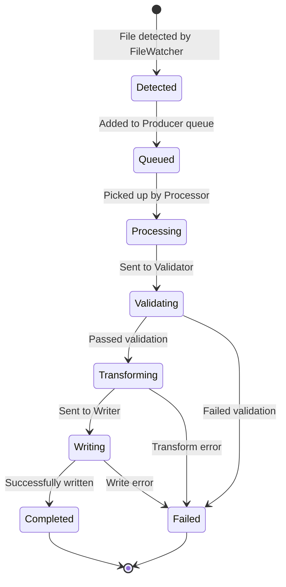
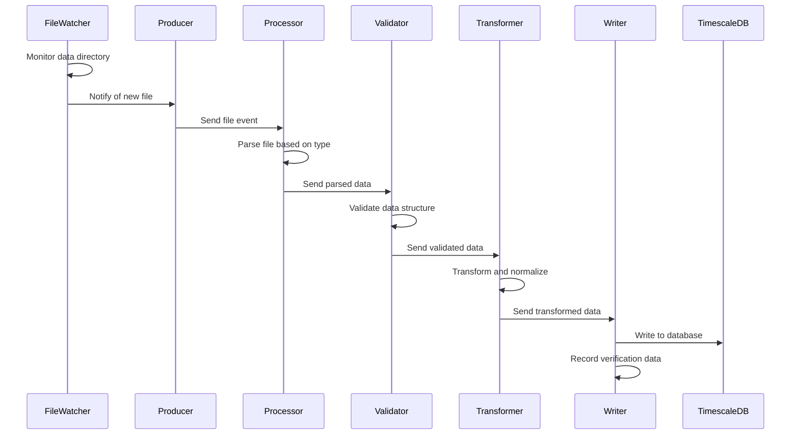

# Elixir Ingestion Service

This service is responsible for ingesting data from various file formats (CSV, JSON, Excel) into a TimescaleDB database. It uses Elixir's GenStage for building a concurrent, back-pressured data processing pipeline.

## Architecture Overview

The ingestion service is built as a pipeline of stages, where each stage is a GenStage process that can consume events from upstream stages and produce events for downstream stages. This architecture provides natural back-pressure and efficient resource utilization.

### State Diagram

### Sequence Diagram

## Component Descriptions

### Pipeline Components

#### FileWatcher (`file_watcher.ex`)

- Monitors the data directory for new files
- Uses file system events to detect changes
- Notifies the Producer when new files are detected
- Handles file type detection based on extensions

#### Producer (`producer.ex`)

- Receives file notifications from FileWatcher
- Maintains a queue of files to be processed
- Dispatches file events to appropriate Processors based on file type
- Implements demand-based flow control

#### Processor (`processor.ex`)

- Consumes file events from the Producer
- Parses files based on their type (CSV, JSON, Excel)
- Extracts data and metadata from files
- Forwards parsed data to the Validator
- Handles file-specific parsing errors

#### Validator (`validator.ex`)

- Consumes parsed data from all Processors
- Validates data structure and content
- Performs schema validation and data type checking
- Forwards validated data to the Transformer
- Records validation errors for reporting

#### Transformer (`transformer.ex`)

- Consumes validated data from the Validator
- Transforms data into a normalized format
- Applies business rules and data transformations
- Handles data type conversions and normalization
- Forwards transformed data to the Writer

#### Writer (`writer.ex`)

- Consumes transformed data from the Transformer
- Writes data to TimescaleDB
- Handles database transactions and error recovery
- Records write operations for verification
- Generates metrics about ingested data

#### Supervisor (`supervisor.ex`)

- Manages the lifecycle of all pipeline components
- Handles process restarts and error recovery
- Configures the pipeline topology
- Ensures proper initialization order

### API Controllers

#### PipelineController (`pipeline_controller.ex`)

- Provides API endpoints for pipeline management
- Returns pipeline status and metrics
- Handles manual pipeline control operations
- Exposes configuration endpoints

#### FileController (`file_controller.ex`)

- Manages file upload and processing
- Provides file status information
- Handles file reprocessing requests
- Exposes file metadata endpoints

#### MetricsController (`metrics_controller.ex`)

- Exposes metrics about the ingestion process
- Provides performance statistics
- Returns error rates and processing times
- Supports monitoring and alerting

#### StatusController (`status_controller.ex`)

- Returns overall service health status
- Provides component-level status information
- Exposes diagnostic endpoints
- Supports health checks

### Utility Modules

#### CSVSeparators (`utils/csv_separators.ex`)

- Detects CSV file separators (comma, tab, semicolon)
- Analyzes file content to determine the most likely separator
- Supports automatic separator detection

## Configuration

The service is configured through environment variables and configuration files in the `config` directory. Key configuration options include:

- Database connection settings
- File monitoring directories
- Processing options and limits
- Validation rules and schemas

## Deployment

The service is containerized using Docker and can be deployed as part of the data ingestion stack using Docker Compose. See the `Dockerfile` for build instructions and the parent `docker-compose.yml` for deployment configuration.

## Development

### Prerequisites

- Elixir 1.18+
- Erlang/OTP 24+
- PostgreSQL with TimescaleDB extension
- Redis

### Setup

1. Install dependencies: `mix deps.get`
2. Compile the application: `mix compile`
3. Run the service: `mix phx.server`

### Testing

- Run tests: `mix test`
- Generate test coverage: `mix test --cover`

## Performance Considerations

The ingestion service is designed for high throughput and reliability:

- Parallel processing of files using GenStage
- Back-pressure to handle varying load
- Efficient resource utilization
- Graceful error handling and recovery
- Metrics collection for performance monitoring
