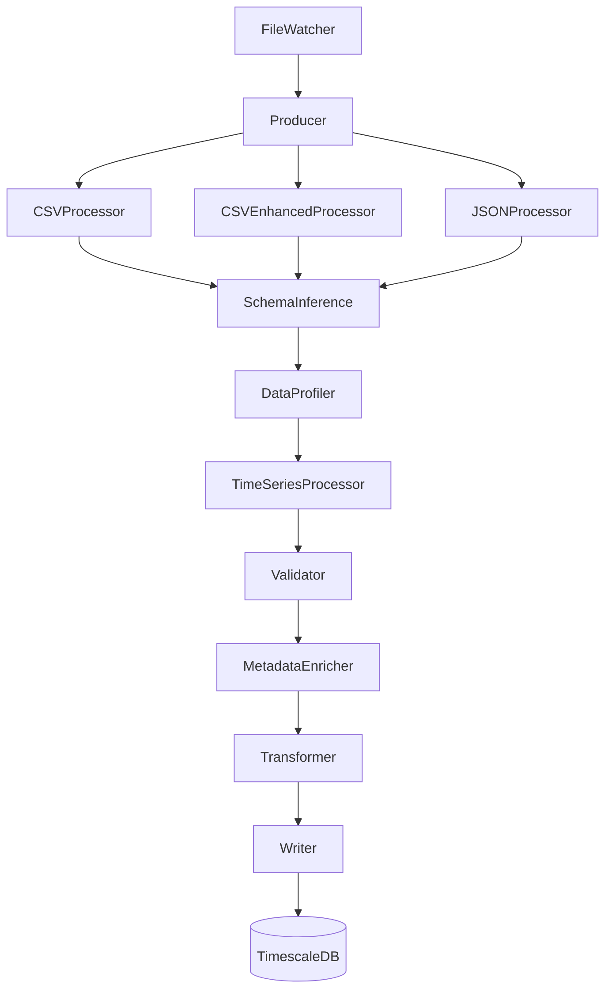

# Enhanced Elixir Ingestion System

## Overview

The Enhanced Elixir Ingestion System is a robust data ingestion pipeline built with Elixir that serves as the entry point for data into the larger data processing ecosystem. This document describes the architecture, features, and integration points of the enhanced system, as well as recommendations for system optimization.

## System Architecture

### Core Components

The Elixir Ingestion System is built on a pipeline architecture using Elixir's GenStage for concurrent, back-pressured data processing:

### Key Components and Responsibilities

1. **FileWatcher**: Monitors directories for new data files
2. **Producer**: Queues files and dispatches to appropriate processors
3. **Processors (CSV, Enhanced CSV, JSON)**: Parse files based on their format
4. **SchemaInference**: Detects and adapts to varying schema structures
5. **DataProfiler**: Assesses data quality metrics
6. **TimeSeriesProcessor**: Specializes in handling time series data
7. **Validator**: Validates data against business rules
8. **MetadataEnricher**: Enriches data with metadata and catalogs datasets
9. **Transformer**: Normalizes and transforms data for storage
10. **Writer**: Persists data to TimescaleDB

### Enhanced Features

The system has been enhanced with several key features:

#### 1. Adaptive Schema Inference

- Automatically detects and adapts to varying schema formats
- Handles schema evolution over time
- Maps detected schemas to standardized formats
- Provides schema versioning and tracking

#### 2. Enhanced CSV Processing

- Multi-format automatic delimiter detection (comma, tab, semicolon)
- Encoding detection and normalization
- Header inference and validation
- Type detection and conversion
- Enhanced error handling for malformed files

#### 3. Error Resilience with Circuit Breaker

- Prevents cascading failures in the pipeline
- Automatically detects and handles recurrent errors
- Provides graceful degradation under load
- Implements backoff strategies for external dependencies

#### 4. Data Profiling

- Comprehensive data quality assessment
- Metrics for completeness, consistency, timeliness, validity, accuracy, and uniqueness
- Aggregate scoring mechanism for overall data quality
- Anomaly detection in data patterns

#### 5. Time Series Processing

- Specialized handling for time-based data
- Timestamp normalization and standardization
- Missing value detection and imputation
- Time-based feature generation
- Anomaly detection in time series

#### 6. Dynamic Pipeline Configuration

- Runtime pipeline modification capabilities
- Customizable processing stages
- Dynamic resource allocation
- Pipeline health monitoring and self-healing

#### 7. Metadata Enrichment and Catalog Integration

- Comprehensive dataset registration and tracking
- Schema and metadata storage
- Data lineage tracking
- Dataset discovery and search capabilities
- Tagging and annotation support

#### 8. Enhanced Monitoring and Observability

- Comprehensive telemetry integration
- Performance metrics collection
- Health status monitoring
- Error tracking and alerting
- Integration with Redis for real-time metrics

## Integration with the Broader System

The Elixir Ingestion Service is a critical component of the larger data processing ecosystem:

### Upstream Integrations

- **Data Sources**: Connects to CSV, JSON, and Excel files from various sources
- **API Endpoints**: Provides REST APIs for data upload and pipeline management

### Downstream Integrations

- **TimescaleDB**: Serves as the primary data store, with tables in the staging schema
- **Metadata Catalog**: Registers datasets with the central metadata service
- **Redis**: Stores real-time metrics and operational data

### Parallel Services

- **Data Processing Service**: Consumes data from staging tables for further processing
- **Quality Monitor**: Consumes quality metrics for monitoring and alerting
- **Airflow DAGs**: Orchestrates the overall pipeline flow and dependencies

## API Endpoints

The system exposes several RESTful API endpoints:

### Pipeline Management

- `GET /api/status`: Current pipeline status
- `GET /api/metrics`: Operational metrics

### Metadata Catalog

- `GET /api/metadata`: List all datasets
- `GET /api/metadata/:id`: Get dataset by ID
- `POST /api/metadata`: Register a new dataset
- `PUT /api/metadata/:id`: Update dataset metadata
- `DELETE /api/metadata/:id`: Delete a dataset
- `GET /api/metadata/search`: Search for datasets
- `GET /api/metadata/:id/lineage`: Get dataset lineage
- `POST /api/metadata/lineage`: Record lineage between datasets

## Database Schema

The system uses the following database schemas:

### Metadata Tables

- `metadata_datasets`: Stores dataset information and metadata
- `metadata_lineage`: Tracks relationships between datasets

### Processing Tables

- `staging.*`: Raw ingested data with minimal transformations
- `timeseries.*`: Processed time series data
- `features.*`: Extracted features from time series data

## System Benefits

The enhanced Elixir Ingestion System provides several key benefits:

1. **Robustness**: Fault tolerance through circuit breakers and resilient design
2. **Flexibility**: Adaptability to various data formats and schemas
3. **Data Quality**: Comprehensive profiling and validation
4. **Observability**: Detailed metrics and monitoring
5. **Metadata Management**: Complete dataset tracking and lineage
6. **Performance**: Optimized concurrent processing with back-pressure

## Recommendations for System Integration

### What Can Be Removed or Changed

Based on the analysis of the DataIngestion folder and the enhanced system capabilities:

1. **Redundant Metadata Systems**:
   - The separate `metadata_catalog` service may be redundant with the enhanced metadata capabilities now present in the Elixir service
   - Consider consolidating metadata management within the Elixir service or creating clear boundaries

2. **Processing Overlap**:
   - Some processing in the `data_processing` service may duplicate efforts now handled by the enhanced Elixir ingestion
   - Review and refactor the data_processing service to focus on advanced transformations rather than basic data cleaning

3. **Quality Monitoring Consolidation**:
   - The quality metrics now generated by the DataProfiler could feed directly into the quality_monitor service
   - Standardize the quality metrics format and integrate real-time alerting

4. **Airflow DAG Simplification**:
   - The ingestion DAG can be simplified to leverage the enhanced capabilities of the Elixir service
   - Focus DAGs on orchestrating between services rather than individual file processing

5. **Configuration Management**:
   - Consolidate configuration between services to ensure consistency
   - Consider a central configuration service or repository

6. **Verification Workflow**:
   - The verification directory mounted to the Elixir service could be replaced with direct database verification
   - Use the metadata catalog to track verification status instead of separate files

### Integration Improvements

1. **Event-Based Architecture**:
   - Implement event notifications for pipeline stages to reduce polling
   - Use Redis pub/sub or similar mechanism for inter-service communication

2. **API Gateway**:
   - Consider an API gateway to unify access to all services
   - Standardize authentication and authorization across services

3. **Container Optimization**:
   - Review container dependencies and sizes
   - Implement multi-stage builds to reduce image sizes

4. **Monitoring Enhancement**:
   - Implement a unified monitoring dashboard across all services
   - Set up alerting based on the enhanced telemetry

5. **Database Access Patterns**:
   - Review and optimize database access patterns
   - Implement connection pooling and query optimization

6. **Test Data Flow**:
   - Create a test data flow process to validate the entire pipeline
   - Implement continuous testing of pipeline health

## Conclusion

The Enhanced Elixir Ingestion System represents a significant improvement in data ingestion capabilities with its adaptive schema handling, comprehensive data profiling, time series specialization, metadata enrichment, and robust error handling. By serving as the entry point to the data processing ecosystem, it ensures data quality and integrity from the start, while providing the necessary metadata and observability for downstream processes.

Further integration and consolidation of overlapping services will lead to an even more efficient and maintainable system, reducing complexity and improving overall reliability.
