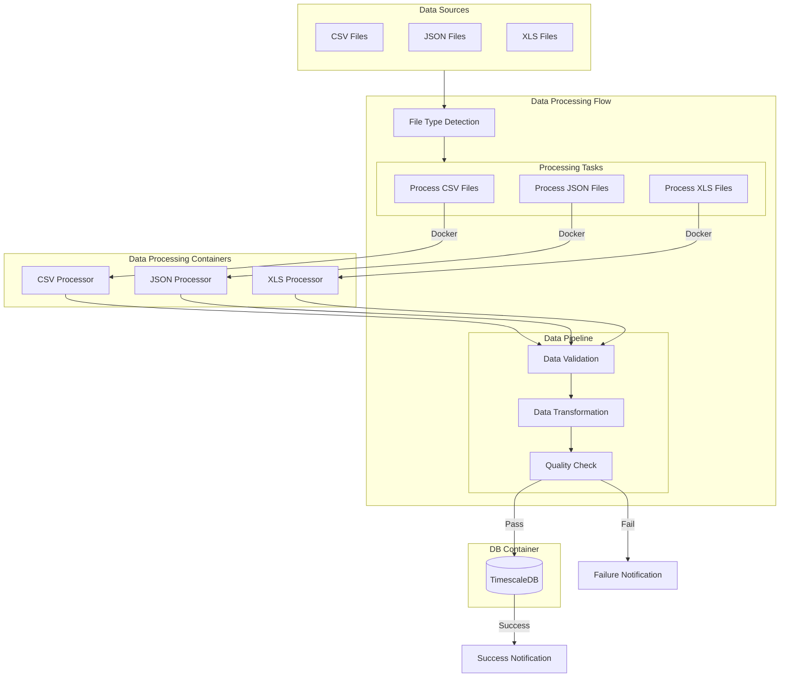

# Data Ingestion Diagram

```mermaid  
flowchart TB
    subgraph Sources[Data Sources]
        direction TB
        CSV[CSV Files]
        JSON[JSON Files]
        XLS[XLS Files]
    end

    subgraph Processing[Data Processing Flow]
        direction TB
        FD[File Type Detection]
        
        subgraph Processors[Processing Tasks]
            direction LR
            PCSV[Process CSV Files]
            PJSON[Process JSON Files]
            PXLS[Process XLS Files]
        end
        
        subgraph Validation[Data Pipeline]
            direction TB
            DV[Data Validation]
            DT[Data Transformation]
            QC[Quality Check]
        end
    end

    subgraph Containers[Data Processing Containers]
        direction TB
        C1[CSV Processor]
        C2[JSON Processor]
        C3[XLS Processor]
    end

    subgraph Output[DB Container]
        direction TB
        DB[(TimescaleDB)]
    end

    Sources --> FD
    FD --> Processors
    
    PCSV --> |Docker| C1
    PJSON --> |Docker| C2
    PXLS --> |Docker| C3
    
    C1 & C2 & C3 --> DV
    DV --> DT
    DT --> QC
    QC -->|Pass| DB --> |Success| Success[Success Notification]
    QC -->|Fail| Fail[Failure Notification]
```
