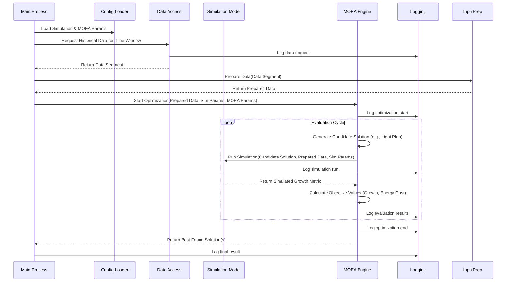

# Software Architecture Document (SAD)

**Project:** Simulation-Based Greenhouse Climate Control Optimization System
**Version:** 1.0
**Date:** April 12, 2025
**Status:** Draft
**Prepared by:** Fnux8890

---

## Table of Contents

1. [Introduction](#1-introduction)
2. [Architectural Goals and Constraints](#2-architectural-goals-and-constraints)
3. [System Context and Stakeholders](#3-system-context-and-stakeholders)
4. [Architectural Views](#4-architectural-views)
    * [Logical View](#41-logical-view)
    * [Process View](#42-process-view)
5. [System Components](#5-system-components)
6. [Data Architecture](#6-data-architecture)
7. [Interface Specifications](#7-interface-specifications)
8. [Quality Attributes](#8-quality-attributes)
9. [Security Architecture](#9-security-architecture)
10. [Deployment View](#10-deployment-view)
11. [Development and Technical Considerations](#11-development-and-technical-considerations)
12. [Conclusion and Future Considerations](#12-conclusion-and-future-considerations)
13. [References](#13-references)

---

## 1. Introduction

### 1.1 Purpose

This SRS document provides a complete description of the requirements for the Simulation-Based Greenhouse Climate Control Optimization System. The purpose of the system is to explore strategies for balancing energy efficiency and simulated plant growth in greenhouses, building upon concepts from the DynaGrow project. It leverages ingested historical environmental data and uses plant growth simulation coupled with multi-objective optimization algorithms to determine potentially cost-effective control strategies. This document outlines the functional and non-functional requirements for this Master's thesis project, intended for the student developer and supervisor (Jan Corfixen Sørensen).

### 1.2 Scope

The system leverages pre-ingested historical greenhouse data and simulation to explore optimal control strategies, building on concepts from DynaGrow. The architecture supports:

* **Historical Data Access:** Reading and preparing environmental data (temperature, humidity, CO₂, etc.) from a TimescaleDB database.
* **Plant Growth Simulation:** Implementing a model (e.g., photosynthesis-based) to simulate plant responses to environmental conditions.
* **Multi-Objective Optimization:** Utilizing an MOEA to find trade-offs between minimizing estimated energy cost and maximizing simulated plant growth.
* **Control Recommendation Generation:** Outputting optimized control plans (e.g., light schedules) based on simulation results.
* **Logging:** Recording essential data for analysis and debugging.

*Out of Scope:* Direct hardware interaction, real-time data streams (unless optional FRs are implemented later), complex UI, development of novel algorithms.

### 1.3 Definitions, Acronyms, and Abbreviations

* **SRS:** Software Requirements Specification
* **MOEA:** Multi-Objective Evolutionary Algorithm
* **FR:** Functional Requirement
* **NFR:** Non-Functional Requirement
* **DB:** Database (specifically TimescaleDB in this project)
* **PAR:** Photosynthetically Active Radiation (relevant context from DynaGrow)
* **DLI:** Daily Light Integral (relevant context from DynaGrow)

### 1.4 References

* *Problem statement - masters thesis in Software engineering-6.pdf* (Defines initial objectives)
* *DynGrowManual.pdf* (Provides context on system being enhanced, example models/specs)
* *Dynagrow - multiobjective.pdf* (Details MOEA approach, objectives used in DynaGrow)
* *(Potentially)* *thesis.pdf* (AGFACAND thesis - for implementation concepts like MOEA structure, model handling)

### 1.5 Overview of the Document

This document is structured as follows:

* **Section 2:** Provides an overall description of the system including its context, functions, and operational environment.
* **Section 3:** Details the specific functional and non-functional requirements.
* **Section 4:** Lists any ancillary information such as appendices.

---

## 2. Architectural Goals and Constraints

### 2.1 Architectural Goals

The primary goals for the system architecture are:

* **Modularity & Extensibility (NFR-3, NFR-4):** Design a modular architecture allowing the simulation model and MOEA components to be potentially swapped or modified via clear interfaces.
* **Maintainability (NFR-4):** Ensure the codebase is understandable and well-structured to facilitate development and debugging within the project timeline.
* **Reliability (NFR-5):** Ensure robust handling of potential errors in data access, simulation, and optimization phases.
* **Performance (NFR-1):** Achieve reasonable execution time for the simulation-optimization cycle to allow for sufficient experimentation.
* **Validity (NFR-6):** Facilitate the validation of the simulation component against known principles.

### 2.2 Architectural Constraints

The following constraints must be observed:

* **Project Constraints:**
  * Adherence to the Master's thesis timeline.
  * Focus on applying existing, established techniques for simulation and optimization.
* **Technical Constraints:**
  * Reliance on the quality and characteristics of the pre-ingested historical data in TimescaleDB.
  * Computational performance limited by the development machine resources.
  * Primary programming language is Python for development speed and library availability (Data Access, Prep, MOEA, initial Simulation). Rust is a potential fallback for performance-critical simulation components.
* **Environmental Constraints:** Not applicable as this is a simulation-based system operating in a standard development environment.
* **Business Constraints:** Not applicable beyond delivering the thesis project requirements.

---

## 3. System Context and Stakeholders

### 3.1 System Context

The system operates primarily on stored data and configuration, producing analysis results. The following context diagram describes these interactions:

```mermaid
graph LR
    sub Input Sources
        HistDB[(TimescaleDB Historical Data)]
        Config[Configuration Files (Sim Params, MOEA Params)]
    end

    sub Core System
        DA[Data Access & Prep]
        Sim[Plant Simulation]
        Opt[MOEA Engine]
        Log[Logging]
    end

    sub Output
        Results[Result Files / Console Output (Optimized Plans, Logs)]
    end

    HistDB --> DA
    Config --> DA
    Config --> Sim
    Config --> Opt
    DA --> Sim
    DA --> Opt
    Sim --> Opt
    Opt --> Sim  // During evaluation loop
    Opt --> Log
    Opt --> Results
```

Diagram showing configuration files and historical database feeding into the core system (data access, simulation, optimization, logging), which produces results files/console output.
3.2 Stakeholders

    Student Developer (Fnux8890): Primary user, responsible for implementation and testing. Requires clear interfaces, testability, maintainability.
    Supervisor (Jan Corfixen Sørensen): Needs to understand the architecture, evaluate the implementation against requirements, and assess results. Requires clear documentation and logging/outputs for analysis.
    (Secondary) Future Researchers: Might benefit from a modular design and clear documentation if the work is extended.

4. Architectural Views
4.1 Logical View

The logical view outlines the primary software modules and their conceptual layering:

```mermaid
graph TD
    sub Configuration
        SimConfig[Simulation Config]
        MOEAConfig[MOEA Config]
    end

    sub Core Logic Layer
        DataAccess[Data Access Module]
        InputPrep[Input Preparation Module]
        Simulation[Plant Simulation Module]
        MOEA[MOEA Module]
        Objectives[Objective Functions]
        Logging[Logging Module]
    end

    sub Data Storage
        TSDB[(TimescaleDB)]
        OutputFiles[Output Files (Results/Logs)]
    end

    SimConfig --> Simulation
    MOEAConfig --> MOEA

    DataAccess --> InputPrep
    InputPrep --> Simulation
    InputPrep --> Objectives

    Simulation -.-> Objectives  // Provides growth metric
    MOEA -- uses --> Objectives
    MOEA -- uses --> Simulation // For evaluation

    Logging -- receives from --> DataAccess
    Logging -- receives from --> Simulation
    Logging -- receives from --> MOEA

    DataAccess -- reads --> TSDB
    Logging -- writes --> OutputFiles
    MOEA -- writes --> OutputFiles // Final results
```

Diagram showing configuration feeding into Simulation and MOEA. Data Access feeds Input Prep, which feeds Simulation and Objectives. MOEA uses Simulation and Objectives. Logging receives info from multiple modules and writes to Output Files, along with final MOEA results.
4.2 Process View

Illustrates a typical simulation-optimization run:



5. System Components

Based on the logical view and FRs:
5.1 Data Access & Preparation (FR-2)

    Data Access Service: Connects to TimescaleDB (using `psycopg2`/`sqlalchemy`), retrieves data based on time windows. Handles DB connection errors (NFR-5.1).
    Input Preparation Service: Takes raw DB data, calculates/extracts specific features (using `pandas`/`polars`) needed by simulation and objectives.

5.2 Plant Growth Simulation (FR-3)

    Simulation Core: Implemented initially in Python (using `numpy`, etc.). Takes environmental inputs and parameters, returns growth metric(s). Handles invalid inputs (NFR-5.2). If performance becomes critical (violates NFR-1.1), this core logic may be reimplemented in Rust and called via FFI.
    Parameter Loader (Python): Reads simulation parameters from configuration.
    (Future) Validation Module: Component/process for executing validation checks (NFR-6.1).

5.3 Multi-Objective Optimization Engine (FR-4)

    MOEA Implementation (Python): Uses a library like `pymoo`. Contains the core logic (population management, selection, variation operators). Manages the evaluation loop. Handles convergence issues (NFR-5.3).
    Objective Function Module (Python): Implements the specific functions to calculate energy cost and use the simulation output for the growth objective.
    Parameter Loader (Python): Reads MOEA parameters from configuration.
    Solution Representation: Defines how a control strategy (e.g., light plan) is encoded.

5.4 Logging & Output (FR-5)

    Logging Service (Python): Uses Python's `logging` module. Provides a centralized way for modules to log information. Writes logs to console or files.
    Result Output Service (Python): Formats and outputs the final recommended control strategy from the MOEA (e.g., using `pandas` or `csv` module).

5.5 Configuration Management

    Configuration Loader (Python): Reads parameters for different modules (DB connection, simulation, MOEA) from files (e.g., TOML using `tomli` or YAML using `PyYAML`).

6. Data Architecture

    Data Flow: Historical environmental time-series data flows from TimescaleDB via the Data Access module to Input Preparation, then to the Simulation module. Control strategies proposed by MOEA are evaluated using simulation results. Configuration data flows from files to relevant modules. Log data and final results flow to output files/console.
    Data Storage Strategy:
        TimescaleDB: Stores the primary input dataset (historical sensor readings). Schema defined during ingestion (FR-1).
        Configuration Files: Store parameters for simulation and MOEA.
        Output Files: Store detailed logs and final optimization results/recommendations.
    Data Security: As the system runs locally on development machine using pre-existing data, security focuses on standard coding practices to prevent accidental data corruption during processing. No sensitive external data transfer is planned initially.

7. Interface Specifications
7.1 External Interfaces

    None in the core scope (unless optional FR-1.5 is implemented later, requiring APIs for weather/energy services).

7.2 Internal Interfaces

    Module APIs: Python classes and function signatures will define interactions between the main components (Data Access, Input Prep, Simulation, MOEA, Objectives, Logging). Clear APIs are key to NFR-3 (Extensibility) and NFR-4 (Modularity). A potential Python-Rust FFI interface might be needed later for the simulation core.
    Configuration Interface: A defined format (e.g., JSON schema) for configuration files used by the Parameter Loaders.

7.3 User Interface

    Command-line interface (CLI) for initiating runs and specifying configuration files.
    Direct interaction via configuration file editing.
    Output via console messages and generated log/result files.

8. Quality Attributes

The architecture addresses the key NFRs:

    Performance (NFR-1): Addressed by choosing reasonably efficient simulation models and MOEA algorithms, and potentially optimizing implementation details. Performance target (< 5 min cycle) guides algorithm choice and implementation effort.
    Scalability (NFR-2): Considered in module design, but large-scale scalability is not the primary focus of this simulation-based phase.
    Extensibility (NFR-3): Addressed through defined interfaces between Simulation/MOEA components and the rest of the system.
    Maintainability & Modularity (NFR-4): Addressed by separating concerns into distinct components (Section 5) and defining clear interfaces (Section 7.2). Documentation is crucial.
    Reliability (NFR-5): Addressed through specific error handling requirements within data access, simulation, and optimization components.
    Validity (NFR-6): Addressed by requiring a validation step for the simulation model, although the specific architectural support for this is TBD (could be separate scripts or a dedicated module).

9. Security Architecture

    Not a primary focus for this simulation-based Master's project running locally. Standard secure coding practices should be followed, but no specific security components (authentication, authorization, network security beyond OS level) are planned.

10. Deployment View
10.1 Deployment Strategy

    The Python application (handling data access, prep, simulation, optimization, logging) will be deployed and run on the student's development machine, likely managed via a virtual environment (`uv venv`).
    The TimescaleDB database runs within a Docker container, managed via docker-compose (as per Issue #5).

10.2 Deployment Diagram

```mermaid
graph TD
    sub Development Machine
        App[Simulation/Optimization Application (Python)]
        PythonEnv[Python Environment (uv)]
        Docker[Docker Engine]
    end
    sub Docker Container
        DB[(TimescaleDB)]
    end

    App --> PythonEnv
    PythonEnv --> Docker
    Docker -- contains --> DB
```

10.3 Considerations

    Ensure sufficient RAM and CPU resources on the development machine for simulation and MOEA execution.
    Dependency management for the chosen programming language (Python) and any external libraries.

11. Development and Technical Considerations
11.1 Coding Standards and Practices

    Adhere to standard Python coding conventions (PEP 8). Use type hints.
    Utilize version control (Git/GitHub).
    Prioritize clear, modular Python code design (NFR-4.1).
    Include reasonable docstrings and comments (NFR-4.2).
    Unit/integration tests using `pytest` are recommended.

11.2 Continuous Integration / Continuous Deployment (CI/CD)

    Out of scope for this project phase. Manual builds and tests are sufficient.

11.3 Technical Debt and Future Enhancements

    Monitoring Technical Debt: Maintain Python code quality through self-review and adherence to modular design principles. Be mindful of potential complexity added if a Rust FFI component becomes necessary for simulation.
    Roadmap for Enhancements: Potential future work (beyond thesis scope) could include implementing optional FRs (real-time data, external APIs), adding more sophisticated simulation models, or exploring hardware integration.

12. Conclusion and Future Considerations

This SAD outlines an architecture focused on achieving the goals of the initial problem statement using a simulation-based approach with multi-objective optimization. It prioritizes modularity and rapid development suitable for a Master's thesis project, leveraging Python's mature ecosystem for data handling and optimization, while reserving Rust as a targeted option for simulation performance. Key Python components include data access, input preparation, plant simulation (initial), MOEA, and logging, designed to work together on a single development machine interacting with a containerized database.

Future considerations beyond this project scope could involve implementing real-time capabilities, deploying to a more scalable infrastructure, or integrating with physical greenhouse hardware.
13. References

    Problem statement - masters thesis in Software engineering-6.pdf
    DynGrowManual.pdf
    Dynagrow - multiobjective.pdf
    (Relevant literature for chosen simulation model and MOEA algorithm)

**Approval and Sign-Off**

*(Placeholders for supervisor sign-off)*

| Name                  | Title      | Signature | Date     |
| :-------------------- | :--------- | :-------- | :------- |
| Jan Corfixen Sørensen | Supervisor |           |          |
|                       |            |           |          |
