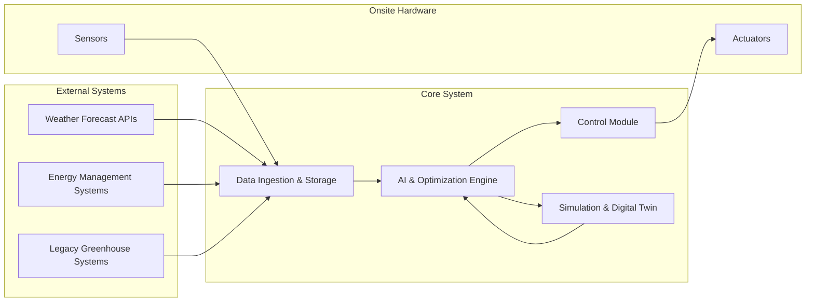
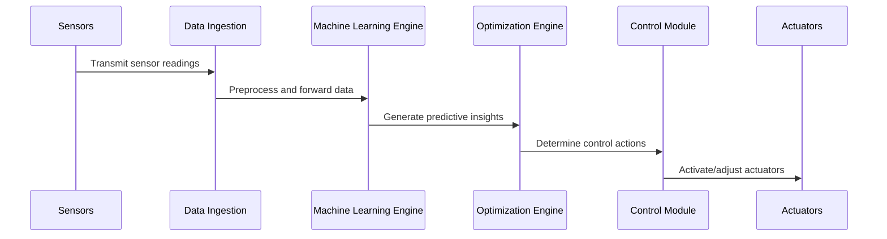
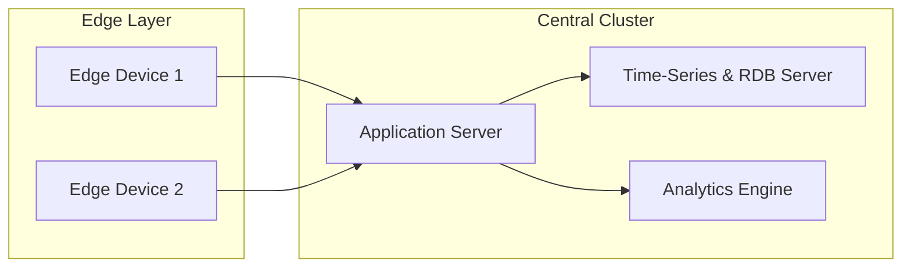

# Software Architecture Document (SAD)

**Project:** Data-Driven Greenhouse Climate Control System  
**Version:** 1.0  
**Date:** [Insert Date]  
**Status:** Draft  
**Prepared by:** [Your Team/Name]

---

## Table of Contents

1. [Introduction](#introduction)
2. [Architectural Goals and Constraints](#architectural-goals-and-constraints)
3. [System Context and Stakeholders](#system-context-and-stakeholders)
4. [Architectural Views](#architectural-views)
   - [Logical View](#logical-view)
   - [Process View](#process-view)
5. [System Components](#system-components)
6. [Data Architecture](#data-architecture)
7. [Interface Specifications](#interface-specifications)
8. [Quality Attributes](#quality-attributes)
9. [Security Architecture](#security-architecture)
10. [Deployment View](#deployment-view)
11. [Development and Technical Considerations](#development-and-technical-considerations)
12. [Conclusion and Future Considerations](#conclusion-and-future-considerations)
13. [References](#references)

---

## 1. Introduction

### 1.1 Purpose

This document describes the overall architecture of the Data-Driven Greenhouse Climate Control System. Its goal is to offer an in-depth understanding of the system’s structure, component interactions, data flows, and external interfaces. This document is intended for system architects, developers, operators, and other technical stakeholders, serving as a guide for implementation, integration, and future extension.

### 1.2 Scope

The system is designed to leverage real-time sensor data, historical trends, and predictive modeling (via AI and genetic algorithms) to optimize greenhouse climate conditions. The architecture supports:

- **Real-Time and Historical Data Collection:** Gathering and processing environmental data (temperature, humidity, CO₂, lighting, etc.).
- **Predictive Analytics:** Utilizing machine learning and genetic optimization to forecast climate conditions and derive control strategies.
- **Actuation and Control:** Dynamically adjusting greenhouse systems (heating, ventilation, etc.) based on predictive insights.
- **Simulation and Digital Twin Integration:** Creating virtual models for testing and validation without affecting live operations.
- **External Integration:** Connecting with weather services, energy management systems, and existing greenhouse platforms.

### 1.3 Document Organization

After this introduction, the document details:

- The key architectural goals and constraints.
- An overview of the overall system context and an identification of stakeholders.
- Various architectural views (logical, process) to illustrate system components and interactions.
- A detailed discussion on system components, data management, interfaces, and quality attributes.
- Security, deployment considerations, and technical recommendations.
- A conclusion with future considerations and references.

---

## 2. Architectural Goals and Constraints

### 2.1 Architectural Goals

The primary goals for the system architecture are:

- **Modularity & Extensibility:**  
  Design a modular architecture to allow integration of additional sensors, actuators, or predictive models without substantial rework.

- **Scalability:**  
  Ensure the system can support multiple greenhouses and an increasing number of sensor nodes and control units.

- **Real-Time Performance:**  
  Provide timely processing of sensor data and control decision outputs with minimal latency.

- **Fault Tolerance & Reliability:**  
  Maintain high system availability (target: 99.9% uptime) and robust data integrity, even when individual components fail.

- **Interoperability:**  
  Seamlessly integrate with third-party weather forecast APIs, legacy greenhouse systems, and external energy management services.

### 2.2 Architectural Constraints

The following constraints must be observed:

- **Technical Constraints:**
  - Limited processing capabilities on edge devices.
  - Variability in network quality within greenhouse environments.
  - Required compatibility with legacy systems (e.g., DynaGrow, IntelliGrow, ETMPC).

- **Environmental Constraints:**
  - Harsh greenhouse conditions, including significant temperature and humidity variations.
  - Possible electromagnetic interference affecting sensor reliability.

- **Business Constraints:**
  - Cost considerations related to hardware and infrastructure.
  - High availability and minimal downtime due to 24/7 greenhouse operations.
  - Adherence to data security and environmental regulatory standards.

---

## 3. System Context and Stakeholders

### 3.1 System Context

The Greenhouse Climate Control System interacts with a variety of external systems and hardware. The following context diagram (Figure 1) describes these interactions:



### 3.2 Stakeholders

- **Greenhouse Operators:**  
  Concerned with the system’s ease of use, reliability, and real-time performance. They need an intuitive dashboard and simplified controls.

- **System Administrators:**  
  Focused on maintainability, system monitoring, and operational security.

- **Developers:**  
  Require a well-documented, modular, and testable codebase enabling future enhancements.

- **Business Leaders:**  
  Interested in cost efficiency, scalability, and potential return on investment.

- **Researchers:**  
  Look for detailed analytics, simulation outputs, and data for further agricultural studies.

---

## 4. Architectural Views

### 4.1 Logical View

The logical view outlines the primary software components and their interactions:

```mermaid
graph TD
    subgraph Presentation Layer
        UI[User Interface (Dashboard)]
        API[API Gateway]
    end

    subgraph Business Layer
        OE[Optimization Engine]
        ML[Machine Learning Engine]
        CM[Control Module]
        SM[Simulation/Digital Twin]
    end

    subgraph Data Layer
        TS[Time-Series Database]
        RDB[Relational Database]
        Cache[In-Memory Cache]
    end

    UI --> API
    API --> OE
    API --> ML
    OE --> SM
    ML --> CM
    SM --> CM
    CM --> TS
    CM --> RDB
    CM --> Cache
```

### 4.2 Process View

The process flow illustrates the key data processing and control cycles:



---

## 5. System Components

### 5.1 Data Ingestion and Management

- **Data Collection Service:**  
  Responsible for real-time acquisition of sensor data (temperature, humidity, CO₂, lighting, etc.) via protocols such as MQTT or HTTP.

- **Data Storage:**  
  Utilizes a time-series database for high-frequency data and a relational database for long-term storage and analysis.

### 5.2 AI and Optimization Engine

- **Machine Learning Module:**  
  Processes historical and current sensor data to forecast environmental conditions.

- **Optimization Module:**  
  Applies genetic algorithms and multi-objective optimization to compute the best control strategies.

### 5.3 Control Module

- **Actuation Service:**  
  Interfaces with greenhouse actuators (e.g., fans, heaters, lights) to implement control actions.  
- **Override Mechanism:**  
  Provides a manual override through the UI to allow operator intervention when necessary.

### 5.4 Simulation and Digital Twin

- **Simulation Framework:**  
  Models various greenhouse scenarios to evaluate proposed control strategies without risk to live operations.
- **Digital Twin Interface:**  
  Synchronizes live sensor data with a virtual model for continuous simulation and scenario testing.

---

## 6. Data Architecture

- **Data Flow:**  
  Continuous ingestion of sensor data, processing for ML prediction, and storage for historical analysis.

- **Data Storage Strategy:**
  - **Time-Series Data:** Stored in a specialized database to support fast query responses for recent sensor data.
  - **Structured Data:** Historical logs, configuration, and control decision logs stored in a relational database.
  - **Caching:** Utilization of in-memory caches to accelerate real-time processing and analytics.

- **Data Security:**  
  All data transfers are encrypted (TLS/SSL) with robust access control policies applied to all storage layers.

---

## 7. Interface Specifications

### 7.1 External Interfaces

- **Sensor Interfaces:**  
  Connect using MQTT/HTTP protocols with standardized data formats (e.g., JSON, XML).

- **API Integration:**  
  RESTful APIs are provided for communication with external systems like weather services and legacy control systems.

### 7.2 Internal Interfaces

- **Service APIs:**  
  Modules (Data Ingestion, ML Engine, Optimization, Control) expose service endpoints to support internal interactions and data sharing.

- **User Interface:**  
  A browser-based dashboard utilizing responsive design principles to display real-time metrics, historical trends, and control overrides.

---

## 8. Quality Attributes

- **Performance:**  
  - The system must process incoming sensor data and execute control decisions within a 5‑second window.
  - Designed to handle high data throughput and concurrent sensor streams.

- **Reliability and Availability:**  
  - Goal of 99.9% uptime for critical components.
  - Redundancy and failover mechanisms integrated within the data storage and processing layers.

- **Extensibility and Maintainability:**  
  - Modular design permits easy upgrades (e.g., additional sensors or control strategies).
  - Comprehensive documentation and well-defined APIs facilitate ongoing maintenance.

- **Security:**  
  - Data encryption in transit and at rest.
  - Role-based access control and audit logging are implemented throughout the system.

- **Usability:**  
  - The user interface is designed with simplicity and clarity to support non-technical users.
  - Detailed system logs and monitoring tools provide necessary insights for system administrators.

---

## 9. Security Architecture

- **Data Encryption:**  
  Ensure that all communications (internal and external) use TLS/SSL encryption.

- **Authentication and Authorization:**  
  Implement robust mechanisms using industry standards (OAuth, JWT) to secure access to APIs and the user interface.

- **Audit Logging:**  
  Record all operations, configuration changes, and control decisions, ensuring traceability and compliance with regulatory standards.

- **Network Security:**  
  Apply firewalls, intrusion detection systems, and secure communication channels between all system components.

---

## 10. Deployment View

### 10.1 Deployment Strategy

- **Edge Deployment:**  
  Lightweight data collectors and preliminary processing run on edge devices colocated within the greenhouse, ensuring low-latency communication with sensors and actuators.

- **Centralized Processing:**  
  Advanced analytics, optimization, and simulation services are deployed on a centralized server (or cloud-based infrastructure) with high processing power to manage heavy computational loads.

### 10.2 Deployment Diagram



### 10.3 Considerations

- **Scalability:**  
  Use container orchestration (e.g., Kubernetes) to facilitate horizontal scaling as the number of greenhouses grows.

- **Monitoring:**  
  Continuous monitoring and centralized logging are employed to maintain visibility and detect faults early.

---

## 11. Development and Technical Considerations

### 11.1 Coding Standards and Practices

- Follow best practices for code quality, including modular design, unit testing, and proper documentation.
- Emphasize API contract stability, ensuring that internal interfaces remain consistent over time.

### 11.2 Continuous Integration / Continuous Deployment (CI/CD)

- Establish automated pipelines for build, test, and deployment.
- Utilize containerization and orchestration tools to streamline releases and updates.

### 11.3 Technical Debt and Future Enhancements

- **Monitoring Technical Debt:**  
  Regular code reviews and architectural assessments will be conducted.
- **Roadmap for Enhancements:**  
  Future work may include integration of additional climate control parameters (e.g., CO₂ management, irrigation), adoption of reinforcement learning techniques, and expanding support for more advanced digital twin features.

---

## 12. Conclusion and Future Considerations

This Software Architecture Document defines a robust, modular, and scalable system designed for proactive greenhouse climate control. The architecture balances real-time data processing, predictive analytics, and robust interfaces to meet both current operational needs and future extensions.

Future enhancements include:

- Expanding sensor types and data sources.
- Integrating more advanced predictive models.
- Enhancing simulation capabilities for extensive testing of novel climate control strategies.

---

## 13. References

- [Greenhouse Climate Control Overview Document]
- [Industry Standards on IoT and Smart Agriculture]
- [Legacy System Documentation: DynaGrow, IntelliGrow, ETMPC]
- [Security and Compliance Standards]

---

*Approval:*  
By signing this document, all stakeholders confirm that the outlined architecture meets the agreed requirements and design principles for the Data-Driven Greenhouse Climate Control System.

| **Name**           | **Role**          | **Signature** | **Date**  |
|--------------------|-------------------|---------------|-----------|
| [Stakeholder 1]    | [Role/Position]   |               |           |
| [Stakeholder 2]    | [Role/Position]   |               |           |

---

This complete document serves as a reference for all phases of development, implementation, and future scaling of the greenhouse climate control system.
