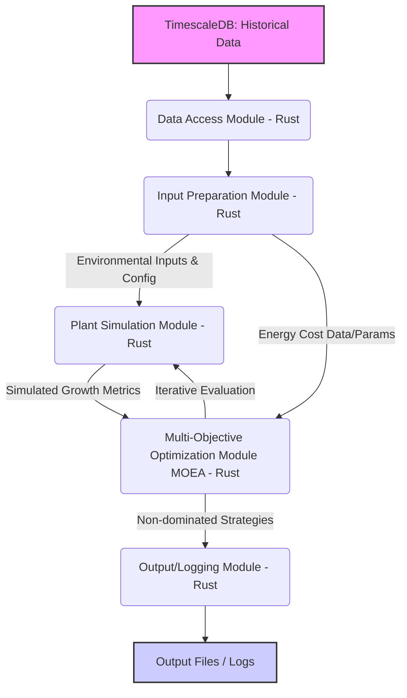
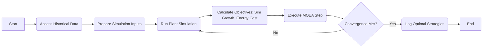

# High-Level Design Document (HLD)

## Document Information

- **Title:** High-Level Design Document
- **Project:** Simulation-Based Greenhouse Control Optimization
- **Version:** 1.1 (Draft based on Facilitation Report)
- **Last Updated:** [Insert Date - e.g., Today's Date]

---

## 1. Introduction

### 1.1 Purpose

This document outlines the high-level design of the Simulation-Based Greenhouse Control Optimization system. It bridges the gap between the project's refined requirements (derived from the initial problem statement and facilitation report) and the detailed technical implementation. It describes the major system components, their interactions, and the data flows required to evaluate optimized greenhouse control strategies using simulation and multi-objective optimization techniques.

### 1.2 Scope

This HLD covers:

- The core software components and their responsibilities (Data Access, Input Preparation, Simulation, MOEA, Logging).
- Interactions between these internal components.
- The principal data flows, focusing on the use of historical data and simulation results.
- An overview of the primary technologies (Rust, TimescaleDB, Docker) and algorithmic approaches (Plant Simulation, MOEA).
- Key architectural decisions aligned with an iterative development methodology.

---

## 2. System Overview

### 2.1 System Context

The Simulation-Based Greenhouse Control Optimization system operates primarily on historical data stored in a TimescaleDB database. It aims to find potentially optimal control strategies (e.g., lighting plans) by simulating plant growth responses and balancing them against estimated energy costs.

- **Input:** Historical environmental data (temperature, humidity, CO₂, lighting, potentially energy prices) from TimescaleDB.
- **Processing:** A Rust application orchestrates data retrieval, simulation execution, and multi-objective optimization.
- **Output:** A set of non-dominated control strategies representing trade-offs between energy cost and simulated plant growth, along with process logs.
- **Environment:** Designed to run within Docker containers for consistency and portability.

This system does *not* directly interact with live sensors or actuators in a real greenhouse. Its focus is on *offline analysis and strategy evaluation* based on past data and simulation.

### 2.2 Design Goals

The design aims to:

- Implement a modular and testable architecture suitable for iterative development.
- Ensure efficient processing of historical data and execution of simulation/optimization tasks.
- Integrate established concepts for plant growth simulation and multi-objective evolutionary algorithms (MOEAs).
- Provide clear logging for analyzing the simulation and optimization process.
- Address the core project aim: demonstrating trade-offs between energy cost and simulated plant growth.
- Adhere strictly to the defined scope for a Master's thesis project, acknowledging limitations (e.g., qualitative simulation validation).

---

## 3. Process Flow Diagrams

### 3.1 Core Data & Processing Flow

The following diagram represents the primary data and processing flow within the system:



*Diagram Interpretation:* Historical data is accessed and prepared. The simulation module uses environmental inputs to generate simulated growth metrics. The MOEA module uses these metrics and energy cost data to evaluate potential control strategies, iteratively calling the simulation. Finally, the MOEA outputs a set of optimal trade-off strategies, which are logged.

### 3.2 High-Level Iteration Loop (Conceptual)



*Diagram Interpretation:* This shows the conceptual flow within the optimization process, highlighting the loop between simulation, objective calculation, and the MOEA until convergence criteria are met.

---

## 4. UML Diagrams (Illustrative)

### 4.1 Component Diagram (Simplified)

```mermaid
graph TD
    subgraph Rust Application
        DataAccess[Data Access]
        InputPrep[Input Preparation]
        Simulation[Plant Simulation]
        MOEA[Optimization MOEA]
        Logging[Logging/Output]
    end

    TimescaleDB[(TimescaleDB)]
    FileSystem[/Output Files/]

    DataAccess -- Reads --> TimescaleDB;
    InputPrep -- Uses --> DataAccess;
    Simulation -- Uses --> InputPrep;
    MOEA -- Uses --> Simulation;
    MOEA -- Uses --> InputPrep; # For Energy Cost Data
    Logging -- Collects from --> MOEA;
    Logging -- Writes to --> FileSystem;

    InputPrep --> Simulation : Prepared Data/Config;
    Simulation --> MOEA : Simulated Growth;
    InputPrep --> MOEA : Energy Data;
    MOEA --> Simulation : Control Strategy Candidate;
    MOEA --> Logging : Final Strategies & Logs;

```

*Diagram Interpretation:* Shows the main software components within the Rust application and their primary dependencies and interactions with the database and file system.

*(Note: Sequence diagrams would be more detailed and likely defined during implementation iterations)*

---

## 5. Subsystem Descriptions

### 5.1 Data Access Subsystem

- **Objective:** Retrieve required historical environmental and potentially energy cost data from the TimescaleDB database.
- **Key Components:** Database connection logic, SQL query execution, data deserialization.
- **Technologies:** Rust, `sqlx` (or similar), TimescaleDB client libraries.
- **Technologies:** Python, `psycopg2` (or `sqlalchemy`), TimescaleDB client libraries.

### 5.2 Input Preparation Subsystem

- **Objective:** Transform raw historical data into the format required by the simulation and MOEA modules. Handle configuration parameters for simulation and optimization objectives.
- **Key Components:** Data filtering, aggregation, interpolation (if needed), parameter loading/parsing.
- **Technologies:** Rust standard library, potentially data manipulation crates.
- **Technologies:** Python, `pandas` or `polars` for data manipulation, standard library for parameter parsing (e.g., using `tomli` or `PyYAML`).

### 5.3 Plant Simulation Subsystem

- **Objective:** Simulate plant growth responses (e.g., based on photosynthesis models) using prepared environmental inputs and candidate control strategies (from MOEA).
- **Key Components:** Core simulation model logic (adapted from established concepts), state management, calculation of growth metrics.
- **Technologies:** Rust, numerical computing concepts. (Avoids complex physics engines; focuses on biological response models).
- **Technologies:** Initially Python (using standard library, `numpy`, etc.). The core numerical logic might be migrated to Rust (and called via FFI) if performance profiling indicates a need to meet NFR-1.1. Avoids complex physics engines; focuses on biological response models.

### 5.4 Multi-Objective Optimization (MOEA) Subsystem

- **Objective:** Implement an established MOEA (e.g., NSGA-II, SPEA2) to find non-dominated control strategies balancing simulated plant growth and energy cost.
- **Key Components:** MOEA algorithm implementation (potentially using a library), objective function calculation, population management, convergence checks.
- **Technologies:** Rust, potentially an MOEA library (e.g., `argmin`, `metaheuristics-rs`, or custom implementation based on standard algorithms).
- **Technologies:** Python, using an established MOEA library (e.g., `pymoo`).

### 5.5 Logging/Output Subsystem

- **Objective:** Record the set of non-dominated solutions (optimal strategies) found by the MOEA. Log key process information for analysis and debugging.
- **Key Components:** Formatting results, writing to output files (e.g., CSV, JSON), structured logging.
- **Technologies:** Rust file I/O, logging crates (e.g., `tracing`, `log`).
- **Technologies:** Python file I/O, standard `logging` module, potentially `pandas` or `csv` module for results formatting.

---

## 6. Data Design

### 6.1 Key Data Structures

- **Historical Environmental Data:** Represents time-series records from TimescaleDB (timestamp, temperature, humidity, CO2, light levels, potentially energy price).
- **Simulation Input:** Structured data required by the simulation model for a given time step or period.
- **Simulation Output:** Metrics representing simulated plant growth (e.g., biomass accumulation rate).
- **Control Strategy Representation:** Defines the parameters being optimized (e.g., a schedule for supplemental lighting intensity/duration).
- **Optimization Result:** A set of non-dominated control strategies, each associated with its objective values (simulated growth, energy cost).
- **Configuration Data:** Parameters for the simulation model, MOEA (population size, generations, etc.), and objective functions (e.g., energy cost calculation).

### 6.2 Data Flow Strategy

- **Batch Processing:** The system operates primarily in a batch mode, processing chunks of historical data to evaluate strategies over a defined period.
- **Internal Data Passing:** Data flows between Rust modules primarily through in-memory structures (structs, enums).
- **Input/Output:** Input is read from TimescaleDB; Configuration potentially from files (e.g., TOML, YAML); Output is written to log files and result files.
- **Data Persistence:** The primary persistent store is TimescaleDB for input. Intermediate states within the optimization are generally transient. Final results are persisted to files.

---

## 7. Interface Design

### 7.1 External Interfaces

- **TimescaleDB Interface:** The primary external interface for reading historical data. Defined by SQL queries.
- **File System Interface:** For reading configuration files and writing output logs/results.

*(Note: No direct interfaces to external weather services, energy grids, live sensors, or actuators are within the scope of this simulation-based system).*

### 7.2 Internal Interfaces (Module APIs)

- **Data Access -> Input Prep:** Provides raw time-series data.
- **Input Prep -> Simulation:** Provides structured environmental data and configuration for a simulation run.
- **Input Prep -> MOEA:** Provides energy cost data/parameters.
- **Simulation -> MOEA:** Returns simulated growth metrics for a given strategy candidate.
- **MOEA -> Simulation:** Provides a control strategy candidate to be simulated.
- **MOEA -> Logging:** Provides the final set of non-dominated solutions and intermediate logging information.

*These internal APIs will be defined more concretely during implementation, likely as Rust function signatures and struct definitions.*

---

## 8. Non-Functional Aspects

### 8.1 Performance

- **Processing Time:** Optimization runs should complete within a reasonable timeframe suitable for research and analysis (specifics TBD, depends on data size, simulation complexity, MOEA parameters).
- **Resource Utilization:** Should operate within typical constraints of a modern development machine or server environment (memory, CPU).

### 8.2 Reliability & Robustness

- **Error Handling:** Graceful handling of database connection issues, file I/O errors, invalid configuration, and potential numerical issues in simulation/optimization.
- **Reproducibility:** Given the same input data, configuration, and software version, the optimization process should yield comparable results (acknowledging the stochastic nature of MOEAs).

### 8.3 Maintainability & Testability

- **Modularity:** Adherence to the modular design to facilitate testing and future modifications.
- **Code Quality:** Follow Rust best practices (idiomatic code, documentation, testing).
- **Testing:** Unit tests for core logic (simulation, objective functions) and integration tests between modules are essential. End-to-end tests using specific historical data scenarios will validate overall functionality.

### 8.4 Simulation Validity (NFR-6)

- **Qualitative Validation:** The simulation model's behavior will be validated qualitatively against established horticultural principles and literature (e.g., response to light, temperature). Quantitative calibration against specific, real plant growth data is *out of scope*. Model limitations will be documented.

---

## 9. Deployment Considerations

### 9.1 Environment

- **Primary Deployment:** Docker containers to ensure a consistent runtime environment for the Rust application and its dependencies.
- **Development:** Local development environment with Rust, Docker, and access to a TimescaleDB instance (local or remote).

### 9.2 Dependencies

- Rust compiler and toolchain.
- Python runtime and package manager (e.g., `uv`).
- TimescaleDB database.
- Docker runtime.
- Required Rust crates (database access, logging, potentially MOEA/numerical libraries).
- TimescaleDB database (likely run via Docker).
- Docker runtime.
- Required Python packages (e.g., `psycopg2`, `pandas`/`polars`, `pymoo`, `tomli`/`PyYAML`).
- Potentially Rust compiler and toolchain if simulation core needs optimization via FFI.

---

## 10. Future Considerations (Beyond Project Scope)

- **Quantitative Simulation Validation:** Calibrating and validating the simulation model against real experimental plant data.
- **Real-time Integration:** Adapting the system to operate with live data streams and potentially control real actuators.
- **Advanced Simulation Models:** Incorporating more complex plant physiology or environmental interactions.
- **Broader Optimization Objectives:** Including other factors like water usage, nutrient levels, or different cost models.
- **User Interface:** Developing a GUI for easier configuration, execution, and visualization of results.

---

## Appendices

*(Appendices will be developed during the project)*

- **Appendix A:** Technology Stack Details (Specific crate versions, etc.)
- **Appendix B:** API Specifications (Detailed internal Rust APIs)
- **Appendix C:** Data Schema Documentation (TimescaleDB schema details, output file formats)
- **Appendix D:** Configuration File Formats
