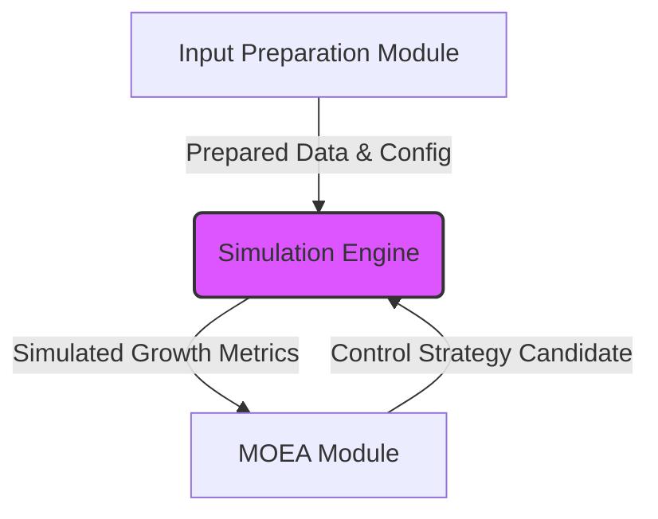

# Simulation Model Design Document

## Document Information

- **Title:** Simulation Model Design Document
- **Project:** Simulation-Based Greenhouse Control Optimization
- **Version:** 1.0 (Based on Facilitation Report)
- **Last Updated:** [Date]

---

## 1. Introduction

### 1.1 Purpose

This document details the design of the plant simulation model used within the Simulation-Based Greenhouse Control Optimization system. It provides guidance on how the simulation model is structured, integrated with historical data, and used to evaluate potential greenhouse control strategies based on simulated plant growth responses.

### 1.2 Scope

This document encompasses:

- The simulation model architecture and its role within the optimization workflow.
- Key components of the simulation model (environmental inputs, plant growth logic).
- Integration with the Input Preparation and MOEA modules.
- Testing scenarios and the qualitative validation approach for the simulation model.
- Performance considerations for running simulations within the MOEA loop.

---

## 2. Simulation Architecture

### 2.1 High-Level Architecture

The simulation model receives prepared historical data and candidate control strategies to predict plant growth metrics, which are then used by the MOEA.



### 2.2 Core Components

1. **Environmental Input Handler:**
    - Processes structured historical data (temperature, humidity, CO₂, light) provided by the Input Preparation module for specific time steps or periods.
    - Incorporates parameters from the candidate control strategy (e.g., supplemental lighting schedule).

2. **Plant Growth Model:**
    - Implements core logic based on established concepts (e.g., photosynthesis-driven growth) adapted from relevant literature (e.g., DynaGrow documentation).
    - Calculates growth metrics (e.g., biomass accumulation rate) based on the environmental inputs and internal plant state (if any).
    - Designed for qualitative accuracy rather than quantitative calibration (Ref: NFR-6).

---

## 3. Simulation Components

### 3.1 Environmental Simulation Aspects

The simulation uses historical environmental data as direct inputs, modified by the control strategy being evaluated.

```python
import pandas as pd
import numpy as np
from dataclasses import dataclass
from typing import List, Dict, Any

# Conceptual representation of input data (could be DataFrame rows or dicts)
# For performance, using NumPy arrays directly is often better
@dataclass
class SimulationTimeStepInput:
    timestamp: pd.Timestamp # Or similar datetime object
    temperature: float
    humidity: float
    co2: float
    light_level: float # Potentially adjusted by control strategy
    # Other relevant environmental factors...

# Conceptual Python class for the simulation runner
class PlantSimulator:
    def __init__(self, params: Dict[str, Any]):
        # Model parameters loaded from config
        self.params = params
        # Internal state if the model is stateful
        # self.current_state = self._initialize_state()

    def run_simulation(self, inputs: pd.DataFrame) -> 'SimulationOutput': # Or using List[SimulationTimeStepInput], or NumPy arrays
        """Runs the simulation over a period defined by the input data."""
        simulated_growth = 0.0
        # Logic to iterate through inputs (e.g., DataFrame rows or NumPy arrays),
        # update internal state (if any), and calculate growth based on self.params
        # Example placeholder:
        for index, row in inputs.iterrows(): # Note: iterrows is slow, prefer vectorized ops
            # growth_increment = self._calculate_step_growth(row, self.current_state)
            # simulated_growth += growth_increment
            # self.current_state = self._update_state(row, self.current_state)
            pass # Replace with actual vectorized logic
        
        # Placeholder - actual calculation needed
        simulated_growth = np.random.rand() # Replace with real result

        return SimulationOutput(total_simulated_growth=simulated_growth)

    # Placeholder methods for stateful models
    # def _calculate_step_growth(self, input_row, current_state):
    #     pass
    # def _update_state(self, input_row, current_state):
    #     pass
    # def _initialize_state(self):
    #     pass

@dataclass
class SimulationOutput:
    total_simulated_growth: float
    # Other relevant output metrics...

# ControlStrategy could be a simple list/array of parameters
# Example: control_strategy = [light_intensity, light_duration]

```

*(Note: The specific model equations and state variables will be determined during implementation based on selected established concepts.)*

### 3.2 Plant Growth Model Component

- **Objective:** To provide a quantitative estimate of plant growth based on environmental inputs, suitable for use as an objective in the MOEA.
- **Approach:** Adapt existing models (e.g., focusing on light use efficiency, temperature response curves, CO₂ effects on photosynthesis) rather than developing a novel model.
- **Inputs:** Time-series environmental data (light, temp, CO₂, etc.) from the Input Preparation module.
- **Outputs:** A primary growth metric (e.g., relative growth rate, accumulated biomass proxy) passed to the MOEA.
- **Validation:** Qualitative validation against horticultural principles (NFR-6). Does the model show increased growth with more light (up to saturation)? Does it show reduced growth at extreme temperatures?

---

## 4. Integration with Other Modules

### 4.1 Data Flow

- **Input Preparation -> Simulation:** Provides `Vec<SimulationTimeStepInput>` and potentially static `SimulationParameters`.
- **MOEA -> Simulation:** Provides `ControlStrategy` (or its effects are already baked into the inputs by Input Prep). The MOEA *calls* the simulation execution function.
- **Simulation -> MOEA:** Returns `SimulationOutput` containing the growth metric(s).

### 4.2 Simulation Execution Protocol

- The MOEA module invokes the simulation model's primary execution function (e.g., `run_simulation`) for each candidate control strategy it needs to evaluate.
- The simulation runs for a defined historical period using the corresponding prepared input data.
- The resulting growth metric is returned synchronously to the MOEA.

---

## 5. Test Scenarios

### 5.1 Basic Scenarios

1. **Baseline Historical Data:** Run simulation with unmodified historical environmental data to establish baseline growth.
2. **Varying Control Strategies:** Run simulation with different lighting schedules (as defined by `ControlStrategy` candidates) applied to the same historical data period to observe impact on simulated growth.
3. **Parameter Sensitivity:** Test the simulation's response to changes in key `SimulationParameters` (if configurable).

### 5.2 Edge Cases / Robustness Checks

1. **Extreme Environmental Inputs:** Test simulation behavior with historical data periods containing unusually high/low temperatures, light levels, etc. (Ensure numerical stability).
2. **Missing/Interpolated Data:** Evaluate impact if the Input Preparation module provides interpolated data points.

---

## 6. Validation Framework

### 6.1 Validation Approach (Qualitative - NFR-6)

- Focus on verifying that the simulation model exhibits behavior consistent with general horticultural knowledge and the principles underlying the chosen model concepts.
- **Method:**
  - Run simulations under controlled, varying input conditions (e.g., step changes in light, temperature ramps).
  - Plot simulated growth response against the varying input.
  - Compare the shape and direction of the response curve to expected behavior based on literature (e.g., light saturation curve, temperature optimum curve).
  - Document findings and model limitations clearly.

### 6.2 Validation Metrics (Qualitative Assessment)

- **Consistency with Principles:** Does the model adhere to expected biological/physical responses? (Yes/No/Partially, with justification).
- **Sensitivity Analysis:** Does the output change reasonably with input variations?
- **Stability:** Does the simulation run without numerical errors across expected input ranges?

---

## 7. Performance Requirements

### 7.1 Simulation Performance

- **Execution Speed:** Individual simulation runs (for one candidate strategy over the evaluation period) using the Python implementation must be fast enough to meet NFR-1.1 (e.g., allowing thousands of simulations within the MOEA loop to complete in under 5 minutes total). Performance will be profiled. If the Python implementation proves insufficient, the core logic may be rewritten in Rust/FFI. Target execution time per *individual* run TBD based on MOEA needs and model complexity.
- **Resource Utilization:** Must operate within typical CPU and memory constraints of a standard development machine.

---

## 8. Implementation Guidelines

### 8.1 Technology Stack

- **Primary Language:** Python.
- **Libraries:** Standard Python library, `numpy` for numerical operations, potentially `pandas` for data structures (though NumPy arrays might be faster for core loops). No external physics engines. Rust/FFI (`pyo3`) is a fallback for performance if needed.

### 8.2 Development Workflow

1. **Model Selection/Adaptation:** Choose and adapt established model equations.
2. **Implementation:** Code the core simulation logic in Python, prioritizing vectorized operations with `numpy` where possible for performance.
3. **Unit Testing:** Test individual calculation functions and model components using `pytest`.
4. **Integration Testing:** Test the `run_simulation` method with sample inputs (e.g., DataFrames or NumPy arrays) and expected outputs.
5. **Qualitative Validation:** Perform validation tests as described in Section 6.
6. **Profiling:** Measure the performance of the Python simulation within the MOEA loop. Decide if Rust/FFI optimization is required based on NFR-1.1.
7. **Integration with MOEA:** Ensure the Python simulation class/method can be called correctly by the Python MOEA module (`pymoo`).

---

## 9. Monitoring and Analysis (During Development/Experimentation)

### 9.1 Monitoring Metrics

- **Simulation Execution Time:** Track time taken per `run_simulation` call.
- **Input/Output Values:** Log key inputs and resulting growth metrics for debugging and analysis.
- **Parameter Values:** Record configuration parameters used for each run.

### 9.2 Analysis Tools

- **Plotting:** Use external tools (Python scripts with Matplotlib/Seaborn, Gnuplot, etc.) to visualize simulation outputs for validation and analysis of results from MOEA runs.
- **Logging:** Utilize Rust logging crates (`tracing`, `log`) to capture execution flow and potential errors.

---

## Appendices

*(Appendices will be developed during the project)*

- **Appendix A:** Detailed Simulation Model Equations (References and adaptations)
- **Appendix B:** Qualitative Validation Test Results
- **Appendix C:** Performance Benchmarks (Execution time measurements)
