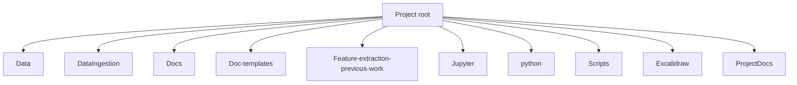

# Directory Overview

This section outlines the purpose of each major folder and notable files in the repository.

## Root level

- **Data** – raw sensor datasets used for analysis and model training.
- **DataIngestion** – pipeline for ingesting and processing data, including several Docker compose setups.
- **Docs** – research notes and planning documents.
- **Doc-templates** – templates for software engineering documentation (architecture, requirements, etc.).
- **Feature-extraction-previous-work** – legacy code and notes on earlier feature extraction efforts.
- **Jupyter** – notebooks for exploratory data analysis.
- **python** – small helper scripts.
- **scripts** – utilities for document conversion and related Docker setup.
- **excalidraw** – diagrams created with Excalidraw.
- **ProjectDocs** – this documentation.

Other files:

- **README.md** – project overview.
- **LICENSE** – license information.
- **.gitignore** – git exclusion rules.
- **test_run_log.txt** – log output from prior runs.

## Important subfolders

### DataIngestion

This folder contains several components:

- **rust_pipeline** – Rust-based data pipeline with its own Docker setup.
- **simulation_data_prep** – Prefect-based data preparation pipeline.
- **feature_extraction** – scripts and Dockerfiles for extracting ML features.
- **model_builder** – training code for surrogate models.
- Additional helper scripts like `run_flow.sh` and `run_tests.sh`.

### Docs

Contains a variety of markdown files detailing data strategy, requirements, and experimental notes. There is also a `Work-days` directory with daily logs.

### Jupyter

Notebooks are organized by topic: `classes`, `data_analysis`, `initial`, and `loading`.

