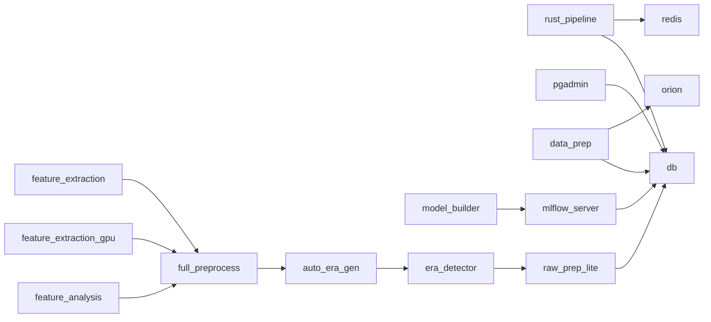

# Docker Compose Services

This section lists the services defined across the various `docker-compose.yml` files. The project uses multiple compose files located in the `DataIngestion` and `scripts` directories.

## DataIngestion/docker-compose.yml

Services:
- `rust_pipeline`
- `redis`
- `db`
- `pgadmin`
- `data-prep`
- `orion`
- `mlflow-server`
- `test`
- `prefect-deployer`
- `model_builder`
- `raw_prep_lite`
- `era_detector`
- `auto_era_gen`
- `full_preprocess`
- `feature_extraction`
- `feature_extraction_gpu`
- `feature_analysis`

## DataIngestion/rust_pipeline/docker-compose.yml

Services:
- `rust_pipeline`
- `redis`
- `db`
- `pgadmin`

## DataIngestion/simulation_data_prep/docker-compose.yml

Services:
- `data-prep`
- `orion`
- `mlflow-server`
- `db`
- `test`

## scripts/docker-compose.yml

Services:
- `pdf_to_md` – utility container for converting PDFs to markdown.

