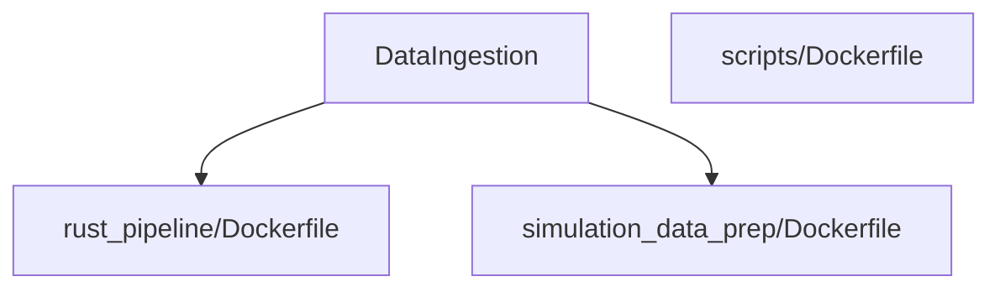

# Docker Images

Several directories provide Dockerfiles to build project images.

- `DataIngestion/rust_pipeline/Dockerfile` – builds the Rust-based ingestion pipeline.
- `DataIngestion/simulation_data_prep/Dockerfile` – environment for Prefect-based preparation.
- `scripts/Dockerfile` – minimal image for PDF and spreadsheet converters.

