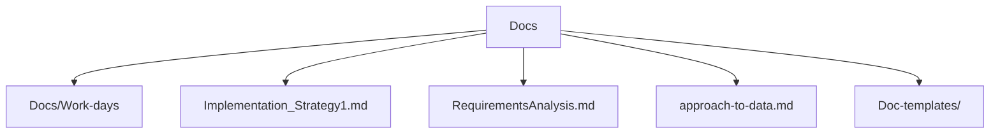

# Documentation Resources

The repository contains many reference documents. Key locations are highlighted below.

- **Docs/** – research notes and requirements analysis (14 markdown files).
- **Doc-templates/** – templates for SRS, architecture and testing documents.
- Additional design diagrams are kept under `excalidraw/`.

