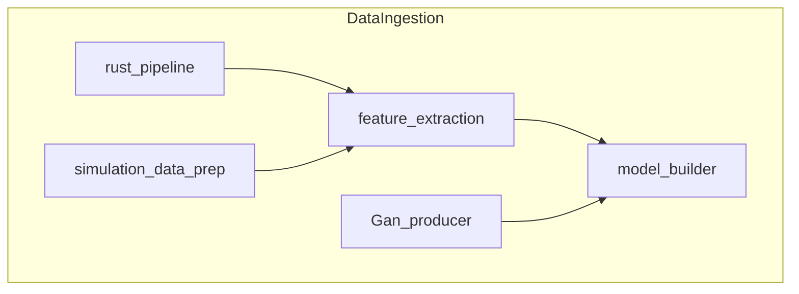

# Data Ingestion Pipelines

This document outlines the main pipelines and supporting directories in the `DataIngestion` folder. The pipelines mix Rust and Python services orchestrated via Docker Compose.

- **rust_pipeline** – core data ingestion written in Rust.
- **feature_extraction** – Python utilities for preprocessing and feature engineering.
- **model_builder** – scripts for training models with MLflow integration.
- **simulation_data_prep** – containers for preparing simulated datasets with Prefect flows.
- **Gan_producer** – prototype GAN-based data generation.

