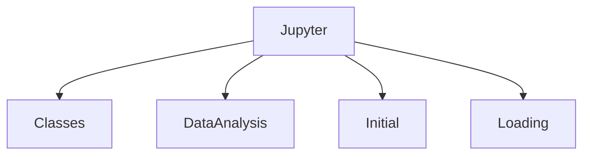

# Notebook Collections

Exploratory work is organised inside the `Jupyter` directory. Notebooks are grouped by purpose.

- **classes** – custom utilities like data availability analyzers and DB exploration helpers.
- **data_analysis** – scripts for metadata extraction and analysis utilities.
- **initial** – first-pass exploration notebooks and related Python scripts.
- **loading** – example code for loading datasets via Feast.

