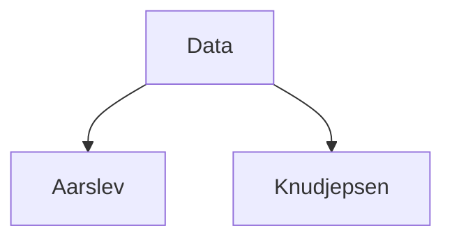

# Raw Data Summary

The `Data` folder stores sensor and climate logs used for experiments. It contains two main subfolders with CSV files and occasional JSON metadata.

- **Data/aarslev** – historical climate records (62 CSV/JSON files).
- **Data/knudjepsen** – nutrient and lamp group logs (4 CSV files).
- **Total files** – 66 `.csv`/`.json` items (excluding any `*.json.csv` artifacts).

