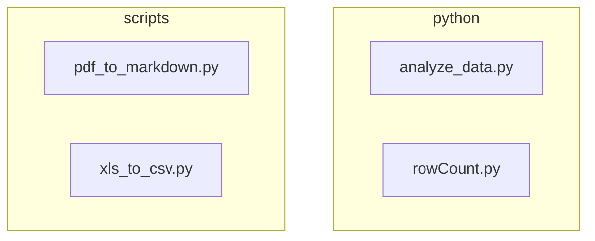

# Scripts and Utilities

Several small utilities live in the `python` and `scripts` directories.

- **python/** – standalone analysis helpers (`analyze_data.py`, `rowCount.py`).
- **scripts/** – containerized utilities for converting PDFs and spreadsheets.
- `scripts/docker-compose.yml` runs a lightweight service named `pdf_to_md`.

